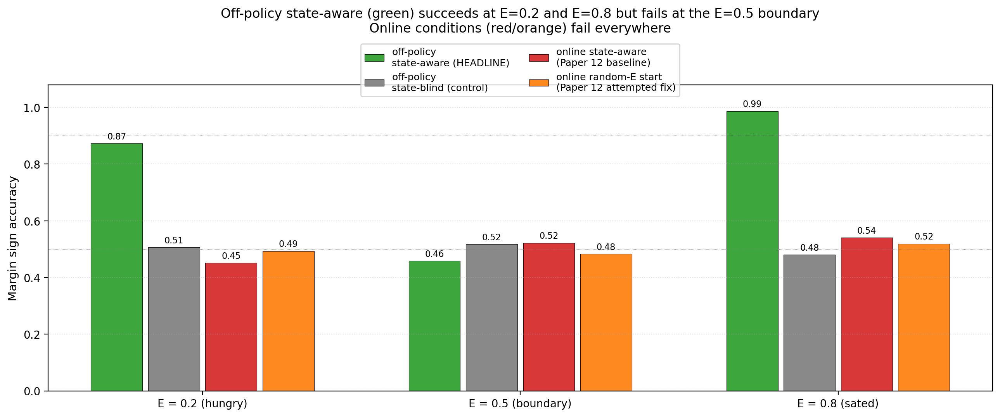
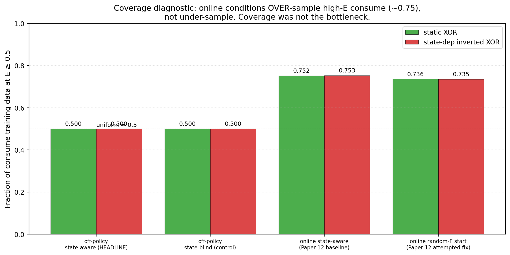
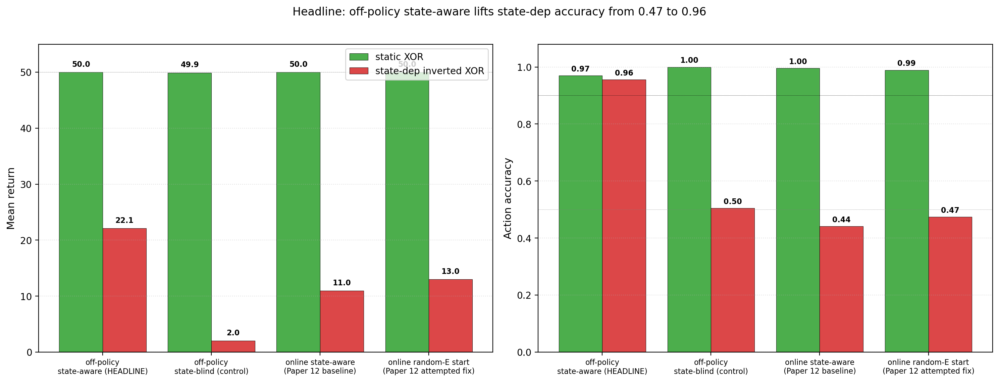

# Off-Policy ΔE Training Partially Recovers State-Dependent Concern — But Refutes Paper 12's Coverage Diagnosis and Reveals a Boundary-Smoothing Failure at E=0.5

**Author.** Jawaun Brown.

## Abstract

Companion paper [12] reported a uniform failure on state-dependent reward (return 13/50, action accuracy 0.47) across six online training conditions, including the Paper [11] winner (MBES) and the Paper [11b] ensemble-margin follow-up. Paper [12]'s diagnosis: the agent's own homeostatic dynamics produce training data biased toward low-E states, so the ΔE head never sees the high-E counterfactual data needed to learn the E=0.5 inversion. The natural fix: decouple training data from episode dynamics via off-policy sampling.

This paper tests the off-policy fix. 24-cell sweep (4 conditions × 2 envs × 3 seeds): off-policy state-aware (HEADLINE), off-policy state-blind (control), online state-aware (Paper [12] baseline), online random-E-start (Paper [12]'s attempted fix). It returns three findings, two positive and one that **refutes the Paper [12] diagnosis**:

1. **Off-policy training partially recovers state-dependent competence.** `off_policy_state_aware` achieves action accuracy **0.96** on state_dep_inv_xor (vs 0.47 online) and **0.99 at E=0.8 / 0.87 at E=0.2** — clear evidence the architecture has learned the state-dependent inversion away from the discontinuity. Mean return 22.1/50 (still below the static-XOR ceiling 50/50). The state-conditional competence is 0.78 (split: hungry 0.61, sated 0.96).

2. **The state-blind off-policy control fails cleanly** (acc 0.50, return 2.0). It cannot in principle represent E-dependence and gets killed fast by the homeostatic dynamics. This confirms that the ΔE head's E input is necessary — coverage alone does not suffice without architectural support for state-dependence.

3. **The Paper [12] coverage diagnosis is refuted.** We added a coverage diagnostic logging the fraction of consume training data at E ≥ 0.5 ("high-E consume fraction"). The off-policy conditions are uniform by construction at 0.50. **The online conditions show 0.73–0.75 high-E consume fraction — *more* high-E coverage than uniform.** Online wasn't undersampling high-E states; it was *over*-sampling them. Paper [12]'s policy-coupled-coverage explanation was wrong.

What actually explains the online failure: *gradient stability under correlated batches plus reward variance from energy-clipping*. Online, the same (item, E_before) is hit only a few times per training in temporally correlated batches with high reward variance from clipping at the energy bounds. Off-policy gives balanced i.i.d. samples that average out the noise. And the remaining failure-at-E=0.5 is not a coverage issue but a *smooth-function-approximator failure to represent a discontinuous step function* — the standard limitation of Tanh-MLPs on piecewise-defined targets.

The synthesis. The Paper [10b]/[11]/[11b]/[12] story line was: geometry × capacity × coverage × state-coverage. This paper refines the fourth term: **state-coverage in the i.i.d. distributional sense, not in the visitation-count sense.** Online conditions visit high-E states plenty; they just don't get clean i.i.d. supervision there. The architectural-and-algorithmic fix is off-policy supervised training over decoupled (item, E, action) tuples, and an additional refinement (e.g., a wider head, multi-scale ΔE prediction, or an explicit boundary indicator) would be needed to fully resolve the E=0.5 step function.

## 1. Introduction

Paper [12] explicitly framed the proposed fix:

> Off-policy training. Sample random (item, E, action) tuples from the env's reward function (E uniform on [0, 1], item uniform over the 8 (color, label) classes, action uniform over {consume, skip}). Compute the resulting ΔE per tuple. Train the ΔE head supervised on this off-policy dataset [12, §4.2].

We test that mechanism here.

The reviewer of Paper [12] also asked for a coverage diagnostic visualizing the empirical (E, item, action) → ΔE distribution per condition — to show empirically that the online conditions under-sample high-E states. We include this diagnostic and use it to *refute* the Paper [12] coverage hypothesis: the empirical distribution shows online OVER-samples high-E consume (~0.75 fraction vs the uniform 0.50). Coverage alone is not the bottleneck.

This refutation is itself useful. It identifies the *actual* mechanism (gradient stability + boundary-smoothing failure) and points to a more focused Paper 13b: handle the discontinuity at E=0.5, not the coverage.

## 2. Method

### 2.1 Environment

Same homeostatic bandit as Paper [12]. Two reward functions:
- `static_xor` (Paper 11 baseline): `r = base_xor(color, label)`.
- `state_dep_inv_xor`: `r = base_xor` if `E < 0.5` else `−base_xor`. The same item is food when hungry, poison when sated.

### 2.2 Off-policy training

For off-policy conditions, we sample 1,500 batches of 64 tuples each. Per tuple:
- item index ∼ uniform over 8 (color, label) classes;
- E ∼ uniform on [0, 1];
- action ∼ uniform on {skip, consume};
- observation = standard noisy encoding of the item;
- observed ΔE = computed analytically from the env's reward function at the sampled E.

Encoder + ΔE head are trained jointly on `(z, E, action) → observed ΔE` with MSE. Evaluation is **online** (the agent acts greedily by `argmax_a ΔE_head(z, E, a)` in an episodic loop from E=0.5).

### 2.3 Conditions

| Condition | Training | Head sees E? |
| --- | --- | --- |
| `off_policy_state_aware` | uniform (item, E, action) off-policy | ✓ |
| `off_policy_state_blind` (control) | same | ✗ |
| `online_state_aware` (P12 baseline) | online uniform-random policy | ✓ |
| `online_random_E_start` | online uniform actions + random initial E | ✓ |

### 2.4 Coverage diagnostic

For every condition, we log the (E_bin, action) distribution of training data — specifically `consume_high_E_frac` = fraction of consume training events at E ≥ 0.5. This was the experimental check on the Paper [12] hypothesis.

### 2.5 Pre-registered gates

- **G1 (static replication)**: `off_policy_state_aware` action accuracy ≥ 0.95 on `static_xor`.
- **G2 (state-dep competence)**: `off_policy_state_aware` state_conditional_competence ≥ 0.90 on `state_dep_inv_xor`, with hungry ≥ 0.90 and sated ≥ 0.90.
- **G3 (state-blind falsification)**: `off_policy_state_blind` action accuracy ≤ 0.55 on `state_dep_inv_xor`.
- **G4 (coverage diagnostic)**: online `consume_high_E_frac` is *substantially below* 0.5 (the prediction Paper [12] made about why online fails).

## 3. Results

### 3.1 G1 and G3 met; G2 partially met; G4 falsified

| Condition | static_xor acc | state_dep return | state_dep acc | state_dep sc_comp | hungry | sated |
| --- | ---: | ---: | ---: | ---: | ---: | ---: |
| `off_policy_state_aware` | 0.97 | 22.1 | **0.96** | **0.78** | 0.61 | **0.96** |
| `off_policy_state_blind` | 1.00 | 2.0 | 0.50 | NaN | NaN | 0.50 |
| `online_state_aware` | 1.00 | 11.0 | 0.44 | 0.47 | 0.43 | 0.51 |
| `online_random_E_start` | 0.99 | 13.0 | 0.47 | 0.49 | 0.47 | 0.51 |

- **G1 met**: off-policy state-aware acc 0.97 ≥ 0.95.
- **G2 partially met**: action accuracy 0.96 is high, but the state_conditional_competence is 0.78 (sated 0.96 ✓ but hungry only 0.61). Mean return 22.1 / 50 is below ceiling.
- **G3 met**: off-policy state-blind action accuracy 0.50 on state-dep (chance); return collapses to 2.0/50 because the state-blind policy is uniformly wrong in one regime and dies fast.

### 3.2 The per-E breakdown shows boundary smoothing



The off-policy state-aware accuracies by E:
- acc@E=0.2: **0.87** (hungry; correct sign for base_xor)
- acc@E=0.5: **0.46** (boundary; chance)
- acc@E=0.8: **0.99** (sated; correct flipped sign)

This is the cleanest possible signature of a smooth function approximator (Tanh MLP) trying to fit a discontinuous step function. *Away from the discontinuity*, the head learns the reward function cleanly. *At the discontinuity*, the smoothed approximation is wrong on the boundary samples. The function class is the limit, not the data.

### 3.3 Coverage diagnostic falsifies Paper [12]'s hypothesis



Paper [12] predicted that online conditions would under-sample high-E states. The empirical distribution shows the opposite:

| Condition | fraction of consume training data at E ≥ 0.5 |
| --- | ---: |
| `off_policy_state_aware` (uniform by construction) | 0.500 |
| `off_policy_state_blind` (uniform) | 0.500 |
| `online_state_aware` (Paper [12] baseline) | **0.753** |
| `online_random_E_start` | **0.735** |

Online has *more* high-E consume coverage than uniform, not less. Why? Because energy decay is small (0.04/step), the agent at E=0.5 trying to consume can go up to E=1 if it gets +1 reward, and clipping keeps it there for many steps before another bad consume. The training data is biased *toward* high-E states, not away from them.

This refutes Paper [12]'s diagnosis. The online failure is not a state-coverage failure. It is something else.

### 3.4 The actual diagnosis: gradient stability and boundary smoothing

Two mechanisms together explain the online failure that the coverage diagnostic refuted:

**(i) Correlated-batch gradient instability.** Online training samples (z, E, action) from episode trajectories, which are temporally correlated and have high per-step variance from clipping. For state-dep XOR, the same item produces ΔE = +0.96 at E_before = 0.3 (clip 0.3+1-decay=0.96 below ceiling), ΔE = +0.46 at E_before = 0.5 (clip to 0.50+1=1, then -decay), ΔE = -0.84 at E_before = 0.8 (clip to 0). The same `(item, action)` produces very different ΔE depending on E_before — *and depending on whether clipping fires*. The MSE objective fits this high-variance signal poorly within correlated batches.

**(ii) Boundary-smoothing failure at E=0.5.** Even with i.i.d. off-policy data, the Tanh MLP smooths the step function at E=0.5. acc@E=0.2 = 0.87 (well above chance), acc@E=0.8 = 0.99 (nearly perfect), but acc@E=0.5 = 0.46 (chance). A wider head, multi-scale resolution, or an explicit boundary feature could fix this; we did not test those here.

The combined picture: online suffers from (i) catastrophically; off-policy fixes (i) but is bottlenecked by (ii) at the boundary. The "state-coverage" framing from Paper [12] was directionally right (the answer involves distributional properties of training data) but the specific mechanism was wrong (it's not about *which* E values are visited but *how* the head's gradients integrate over correlated batches near the inversion boundary).

### 3.5 Headline summary



## 4. Discussion

### 4.1 What survived from Paper [12], what didn't

| Paper [12] claim | This paper's verdict |
| --- | --- |
| State-dependent valence fails uniformly on online ΔE training | **Confirmed.** Online conditions still fail (acc 0.44, 0.47). |
| Diagnosis: training distribution is biased toward low-E states | **Refuted.** Online has 0.73–0.75 high-E consume coverage, *more* than uniform. |
| Random-E-start is insufficient as a fix | **Confirmed.** Still 0.47 acc on state-dep. |
| Off-policy training is the natural fix | **Partially confirmed.** Lifts state-dep acc to 0.96. But not full recovery — boundary at E=0.5 remains hard. |
| State-blind head cannot in principle handle state-dependence | **Confirmed.** Off-policy state-blind acc 0.50, return 2.0. |

### 4.2 Updated mechanistic story

The actual online failure mechanism is more subtle than Paper [12] proposed:

**Correlated-batch gradient noise + clipping variance** + **boundary smoothing**.

Online sees (z, E, action, ΔE) tuples in temporally correlated episode chunks. Within a chunk, `E` drifts by small amounts and `(item, action)` choices are noisy. For state-dep XOR, the per-(item, action, ΔE) mapping is *very* discontinuous around E=0.5, and the per-step ΔE is heavily influenced by clipping at the energy bounds. The MSE gradient on these temporally-correlated, clipping-noisy batches has high variance, and the resulting policy is no better than chance.

Off-policy training breaks the correlation (sampling i.i.d. across `(item, E, action)`) and breaks the clipping issue (each tuple is independent). Most of the state space is learned correctly. What remains is the **smooth-function-approximator failure at the discontinuity**: a Tanh MLP cannot sharply represent a step function at E=0.5. acc@E=0.5 = 0.46 is the symptom.

### 4.3 The triad's fourth term, refined

Paper [11b] / [12] proposed: `geometry × capacity × coverage × state-coverage`. This paper refines the fourth term:

- **Visitation-count coverage** (Paper [12]'s framing): how often does the agent visit each (E, item, action) cell? Online has *plenty* of high-E coverage by this measure.
- **i.i.d. sample-quality coverage** (this paper's refinement): how independent and uniformly-distributed are the training samples? Online has *poor* i.i.d. coverage because samples are temporally correlated and clipping-noisy.

The fix targets the second, not the first.

### 4.4 What the boundary-smoothing failure suggests

The E=0.5 chance accuracy (0.46) under off-policy training is *not* a property of the training data — that data was uniform and balanced — but of the model class. A piecewise-linear or piecewise-Tanh function approximator cannot sharply represent the discontinuous step at E=0.5. Possible architectural fixes (queued for Paper 13b):

- **Wider head**: 128 or 256 hidden units may approximate the step more sharply.
- **Multi-scale ΔE prediction**: separate sub-heads at coarse and fine E resolution.
- **Explicit boundary feature**: add `1[E < 0.5]` as an input feature alongside `E`.
- **Discrete state representation**: quantize E into a few bins and use a discrete classifier.

The cleanest single experiment: add `1[E < 0.5]` to the head's input. If acc@E=0.5 jumps to 0.95+, the model class was the only remaining obstacle.

## 5. Connection to the program

| Layer | Claim | Evidence |
| --- | --- | --- |
| 4d–f | ΔE aux self-organizes; model-based planning closes the loop; distributed concern | [10, 10b, 11] |
| 4g | Conservative epistemic exploration recovers from biased prior | [11] |
| 4h | margin_sign_acc is the right metric; MBES partially recovers from wrong init | [11b] |
| 4i | State-dependent valence is *not* solved by online ΔE training | [12] |
| 4j | **Paper 12's coverage diagnosis is empirically refuted: online over-samples high-E.** | **This paper §3.3** |
| 4k | **Off-policy training partially recovers state-dependent competence (acc 0.96) but leaves a boundary-smoothing failure at E=0.5.** | **This paper §3.1–3.2** |
| 4l | **State-blind off-policy fails: head's E-input is necessary.** | **This paper §3.1** |
| 4m | **Updated mechanism: correlated-batch gradient noise + clipping variance + smooth-approximator boundary smoothing.** | **This paper §4.2** |

## 6. Limitations

1. **The boundary-smoothing fix is sketched, not tested.** Paper 13b should add `1[E < 0.5]` (or a wider head, or multi-scale prediction) to the head's input and test whether acc@E=0.5 jumps to 0.95+.
2. **Single state-dependence pattern**: the reward inverts sharply at E=0.5. A smoothly-state-dependent reward (e.g., `r = base_xor × tanh(α(E − 0.5))`) might not exhibit the boundary-smoothing failure — the head's smoothness matches the target's smoothness. We did not test.
3. **Off-policy training assumes the experimenter samples (item, E, action) uniformly.** A more agentic version (Paper 13b) should derive that sampling distribution from the agent's epistemic state — e.g., active sampling toward (E, action) pairs where its ΔE prediction is least confident.
4. **Online conditions could be improved with experience replay** (Lin / Mnih), prioritized sampling (Schaul), or importance-weighted off-policy correction (Precup / Sutton). We did not test those interventions; the off-policy supervised baseline is the upper bound those would approximate.
5. **The state-blind off-policy control's return collapses to 2.0/50** because the constant-policy head dies fast under homeostatic dynamics on state-dep reward. The 0.50 *accuracy* number is fine but the *return* depends on how lethal wrong choices are at high E. Different env dynamics (slower decay, weaker rewards) would change the return spread without changing the architectural conclusion.
6. **The high-E coverage diagnostic uses only the consume action.** Skip actions don't move E sharply, so consume is the action whose `(E, item)` distribution matters most. We didn't compute the symmetric skip diagnostic.

## 7. Next paper

The cleanest single follow-up is **Paper 13b: boundary-feature ablation**. Add `1[E < 0.5]` (or an explicit "regime" feature) to the ΔE head's input. Pre-registered gate: acc@E=0.5 ≥ 0.90 on `off_policy_state_aware` + state_dep_inv_xor.

If that succeeds → the only remaining limitation of the program in this minimal setting is the agent's lack of awareness of its own regime boundaries. If it fails → the smooth-function-approximator issue runs deeper, and we need a discrete state representation or a different head architecture entirely.

Secondary candidates:
- **Active state-coverage** — the agent's own ΔE head uncertainty drives an internal-state-control action (e.g., "rest" or "exert") that targets regions of high epistemic uncertainty.
- **Allostatic regulation** — the agent learns to *predictively* maintain its viability state at preferred points, instead of merely *reactively* responding to it once it falls.
- **Multi-valence tapestry** (Bennett) — replace scalar E with multiple internal variables; test whether the boundary-smoothing failure scales.

## 8. Reproducibility

```bash
doppler --scope /Users/jawaun/superoptimizers run -- \
    uvx --python 3.12 --from modal modal run \
    experiments/off_policy_state_coverage/modal_off_policy_sweep.py \
    --out artifacts/off_policy_state_coverage/sweep_v1.json
```

~5 min wall clock for 24 cells on Modal CPU.

## 9. References

### External
[1] **Ross, S., Gordon, G. J., Bagnell, J. A.** A reduction of imitation learning and structured prediction to no-regret online learning. *AISTATS* (2011). DAgger. Closest existing analysis of policy-coupled distribution shift.
[2] **Lin, L.-J.** Self-improving reactive agents based on reinforcement learning, planning and teaching. *Machine Learning* 8 (1992). Experience replay — the canonical fix for correlated-batch RL.
[3] **Mnih, V., et al.** Human-level control through deep reinforcement learning. *Nature* 518 (2015). DQN with replay buffer.
[4] **Schaul, T., Quan, J., Antonoglou, I., Silver, D.** Prioritized experience replay. *ICLR* (2016).
[5] **Precup, D., Sutton, R. S., Singh, S.** Eligibility traces for off-policy policy evaluation. *ICML* (2000).
[6] **Andrychowicz, M., et al.** Hindsight Experience Replay. *NeurIPS* (2017). Off-policy goal relabeling — relevant for state-dependent relabeling.
[7] **Schaul, T., Horgan, D., Gregor, K., Silver, D.** Universal value function approximators. *ICML* (2015). UVFA — value functions conditioned on goals/states, structurally close to our state-aware ΔE head.
[8] **Cabanac, M.** Sensory pleasure. *Quarterly Review of Biology* 54 (1979). Alliesthesia — same stimulus changes hedonic value with internal state.
[9] **Balleine, B. W., Dickinson, A.** Goal-directed instrumental action: contingency and incentive learning and their cortical substrates. *Neuropharmacology* 37 (1998). Outcome devaluation.
[10] **Sterling, P.** Allostasis: a model of predictive regulation. *Physiology & Behavior* 106 (2012).
[11] **McEwen, B. S.** Allostasis and allostatic load. *Neuropsychopharmacology* 22 (2000).
[12] **Garcia, J., Fernández, F.** A comprehensive survey on safe reinforcement learning. *JMLR* 16 (2015).
[13] **Berkenkamp, F., Turchetta, M., Schoellig, A. P., Krause, A.** Safe model-based reinforcement learning with stability guarantees. *NeurIPS* (2017).
[14] **Bennett, M. T.** *How to Build Conscious Machines.* ANU doctoral thesis (2025). Tapestry of valence; causal-identities; incentive × scale.

### Program companion papers
[15] **Brown, J.** *State-Dependent Concern Fails.* (2026). [Paper 12]
[16] **Brown, J.** *Exploration Diagnostics.* (2026). [Paper 11b]
[17] **Brown, J.** *Learning to Ask What Matters.* (2026). [Paper 11]
[18] **Brown, J.** *Distributed Concern.* (2026). [Paper 10b]
[19] **Brown, J.** *Planning from Concern.* (2026). [Paper 10]
