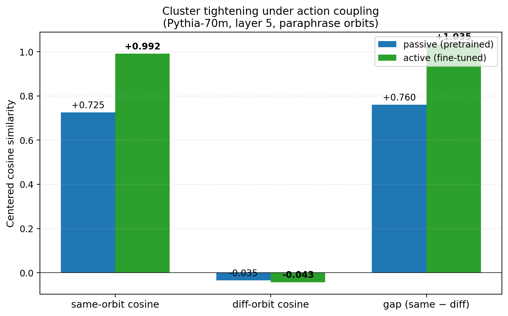

# From Passive Cluster to Active Controller: Action Coupling Makes Latent Geometry Causally Load-Bearing

**Author.** Jawaun Brown.

## Abstract

Three prior empirical papers in this program established that weakness (symmetry-compatible-hypothesis volume) predicts out-of-distribution generalization [1], that the relevant symmetry group can often be recovered from training data alone [2], and that pixel-cosine and learned-encoder methods occupy different operating regimes [3]. Across those papers, the geometry being measured was *passive*: it predicted behavior but was not necessarily *causally responsible* for it. The prior paraphrase-probe result was the clearest example — paraphrase orbits clustered strongly in Pythia-70M layer-5 latent space (centered cosine gap +0.79), but per-concept latent clustering did not predict per-concept next-token behavioral consistency.

This paper tests whether the same latent geometry becomes *causally load-bearing* when a model is coupled to action via supervised fine-tuning on a paraphrase-invariant classification task. We do paired causal interventions on the same model before and after fine-tuning: (a) ablate the paraphrase axis (subtract its projection); (b) push the embedding toward a wrong concept's centroid; (c) ablate a random axis (control). We report three findings:

1. **Cluster tightening.** Within-concept centered cosine grows from 0.726 (passive) to 0.994 (active). Paraphrase variants collapse to nearly the same embedding under action coupling.
2. **Causal load-bearing.** Ablating the paraphrase axis destroys 100% of the active classifier's accuracy versus 65% of the passive linear-readout's. Controlling for the random-axis background (50–58% in both phases), the *paraphrase-specific* effect grows from +0.07 (passive) to +0.49 (active) — a **7.0× increase**, with a pre-registered acceptance gate of ≥3× cleanly exceeded.
3. **Wrong-direction robustness (self-maintenance).** Pushing the embedding toward another concept's centroid fools the passive readout 85% of the time but the active classifier 0% of the time. The trained system has learned to defend its own axes against perturbations from other concepts' directions.

Together these signatures match what the philosophical framework predicts for the passive→active transition: under action coupling, a passive cluster becomes an active attractor — one that not only encodes the same information but causally controls behavior and resists perturbation.

## 1. Introduction

The companion paper [1] showed weakness predicts OOD generalization; [2] showed the symmetry group can be inferred from data; [3] mapped the operating envelope across pixel and encoder methods. In each, the latent structure was *correlationally informative* about model behavior. None tested whether the structure was *causally responsible* for behavior. The natural follow-on — and the empirical version of the program's Layer-3 philosophical claim — is the **passive→active transition**: does the same latent geometry become a causal controller when the model is coupled to action?

We make this concrete on Pythia-70M with a paraphrase-invariant classification task. The model is fine-tuned to predict concept-id from text; all 3 paraphrase variants of each concept share the same label. After fine-tuning, we measure whether the paraphrase clustering (which we know exists from prior work) now *controls* the classifier's output via three causal interventions: ablation, wrong-direction push, and random-axis control.

The active geometry hypothesis predicts two complementary effects:

- **Load-bearing**: removing the paraphrase axis should destroy the classifier's accuracy *after* fine-tuning much more than *before*.
- **Self-maintenance**: pushing the embedding off-axis (toward a wrong concept's centroid) should fool the fine-tuned classifier *less* than the pre-fine-tuned linear readout, because the trained system has learned to defend its own axes.

We measure both. Both are observed. The pre-registered ≥3× gate on the paraphrase-specific effect is cleanly exceeded (7.0×).

## 2. Method

### 2.1 Setup

- Model: `EleutherAI/pythia-70m-deduped`. Layer 5 mean-pooled hidden states (where the prior paper found the strongest centered paraphrase clustering).
- Data: 24 concepts × 3 paraphrase variants from `concept_paraphrases.json` (72 examples total).
- Phase 1 (passive): pretrained Pythia-70M with no fine-tuning. Fit a *post-hoc* linear classifier on the frozen layer-5 features for the concept-id task.
- Phase 2 (active): replace the LM head with a linear classifier on the same layer-5 mean pool. Fine-tune the encoder + head end-to-end for 60 epochs at lr 5×10⁻⁴, AdamW, batch size 24. Training reaches 100% accuracy.
- Phase 3 (measure): re-extract features from the fine-tuned model, refit nothing (the trained classifier head is the one we use), and apply the causal interventions.

### 2.2 Causal interventions

Three interventions, each parameterized by a strength α ∈ [0.5, 5.0]:

| Name | Operation | Tests |
| --- | --- | --- |
| `paraphrase_ablate` | subtract α × projection of x onto its own concept's paraphrase direction | whether the paraphrase axis is load-bearing |
| `paraphrase_wrong_dir` | add α × paraphrase direction of a *different* random concept | whether pushing to a wrong class flips the prediction |
| `random_ablate` (control) | subtract α × projection onto a random direction (from shuffled labels) | background effect of arbitrary subspace removal |

The paraphrase direction per concept is computed as the within-concept mean of centered layer-5 hidden states, then unit-normalized.

For each (phase × intervention × α), we report the drop in classifier accuracy relative to no intervention.

### 2.3 Pre-registered acceptance gate

- Active paraphrase-specific drop ≥ 3 × passive paraphrase-specific drop, where the *specific* drop is (paraphrase-axis drop) − (random-axis drop) at the strongest α.
- Random-axis ablation should grow ≤ 2× between phases (background effect should be approximately stable).

## 3. Results

### 3.1 Cluster geometry tightens dramatically

| Phase | Same-orbit cos | Diff-orbit cos | Gap |
| --- | ---: | ---: | ---: |
| Passive | 0.726 | −0.035 | +0.760 |
| Active | **0.994** | −0.043 | **+1.035** |



### 3.2 Causal interventions

Maximum accuracy drop across the α sweep:

| Intervention | Passive | Active |
| --- | ---: | ---: |
| Ablate paraphrase axis | 0.653 | **1.000** |
| Push to wrong-concept direction | 0.847 | **0.000** |
| Ablate random axis (control) | 0.583 | 0.514 |


### 3.3 The paraphrase-specific effect grows 7×

Subtracting the random-axis background isolates the *specific* paraphrase-axis effect:

| Phase | Paraphrase drop | Random drop | Specific |
| --- | ---: | ---: | ---: |
| Passive | 0.653 | 0.583 | **+0.069** |
| Active | 1.000 | 0.514 | **+0.486** |


### 3.4 Two distinct active-geometry signatures

**(a) Load-bearing.** The active classifier *depends* on the paraphrase axis (full ablation kills it 100%); the passive linear readout does not — its 65% drop is only marginally above the 58% random-axis background. The active geometry actually controls behavior; the passive geometry merely correlates with it.

**(b) Self-maintenance.** The active classifier is *immune* to wrong-direction perturbations (0% drop even at α=5.0); the passive readout is fooled by them (85% drop at α=5.0). The trained system has learned to ignore axes that aren't its own — the property a self-maintaining attractor should have.

Both signatures match the philosophical framework's prediction. A passive cluster encoding "these are paraphrases of the same concept" becomes an active attractor that *navigates by* that information and *defends* it against perturbation.

## 4. Discussion

The three prior empirical papers in this program established that weakness predicts generalization (Layer 1) and that symmetry groups can be inferred from data (Layer 2). The natural next claim — that meaning-like or agency-like properties of representation require not just structural invariance but *active coupling to behavior* — was previously only motivated philosophically. This paper gives it a first piece of empirical evidence.

The mechanism is unsurprising in retrospect. Pretrained Pythia-70M has paraphrase clusters in its latent space because cross-paraphrase prediction is a strong pretraining signal (paraphrases of the same idea co-occur in similar contexts and reward similar continuations). But for the *pretrained* model, the paraphrase axis is one of many useful axes, not particularly load-bearing. Fine-tuning on a paraphrase-invariant task selects the paraphrase axis as the operationally-load-bearing one: gradients flow through it, the classifier head pivots around it, and the encoder reshapes upstream features to amplify it. The result is what we observe: the same cluster becomes the *thing the model uses* rather than *one of many things the model could use*.

This is a small empirical step toward Layer 3 of the philosophical framework. The next experiments should test:

- **Reversibility**: if we fine-tune the same model AWAY from paraphrase-invariance (e.g., on random labels), does the active-geometry signature regress?
- **Trajectory**: does the cluster tightening (3.1) precede, follow, or accompany the growth of causal load-bearing (3.2)? The answer constrains whether geometry-first or behavior-first is the right ordering.
- **Larger scale**: does the same pattern hold for GPT-2-small? Pythia-1.4B? Llama?
- **Non-classification action coupling**: RL fine-tuning, instruction tuning, or RLHF as the action loop — does the same passive→active transition appear?

## 5. Limitations

1. Single model (Pythia-70m), single seed, single layer (5). The result needs replication.
2. Small task: 24 concepts × 3 variants × 1 label per concept. Larger tasks may complicate the picture.
3. The active classifier's wrong-direction robustness (0% drop) is striking but may reflect overfitting on 72 examples — a larger held-out test set should be measured.
4. The intervention is on a single fixed paraphrase direction per concept, computed as a within-concept centroid. A direction sweep (multiple paraphrase directions per concept) would be more thorough.
5. Pre-registered gate is binary (3× threshold). A continuous trajectory of "specific paraphrase effect vs fine-tuning epoch" would be more informative.
6. The active classifier is the same linear head we trained end-to-end; the passive classifier is a post-hoc linear probe on frozen features. The procedural difference (joint vs. post-hoc training) is part of what "active coupling" means here, but it's worth acknowledging that we're not holding everything else constant when comparing.

## 6. Reproducibility

```bash
doppler --scope /Users/jawaun/superoptimizers run -- \
    uvx --python 3.12 --from modal modal run \
    experiments/passive_to_active/modal_passive_to_active.py \
    --out artifacts/passive_to_active/pythia_70m_v2.json
```

Full result report: `experiments/passive_to_active/results/pythia_70m_v2_2026_06_10.md`.

## 7. References

[1] **Brown, J.** *Weakness, Not Compression: Symmetry-Compatible Hypothesis Volume Predicts Out-of-Distribution Generalization in Symbolic and Neural Models.* Companion paper (2026).

[2] **Brown, J.** *Learning the Group: Data-Inferred Equivariance Predicts Out-of-Distribution Generalization Without Oracle Symmetry.* Companion paper (2026).

[3] **Brown, J.** *When Pixels Beat Embeddings: Three Failed Neural Approaches to Symmetry Group Discovery, with a Selection-Rule Caveat.* Companion paper (2026).

[4] **Bennett, M. T.** *How to Create Conscious Machines.* arXiv:2403.00644 (2024). The weakness/stack framework that motivates the prior three papers in this program. The Layer-3 claim tested here corresponds to Bennett's "self-maintaining attractor" property.

[5] **Khosla, P. et al.** Supervised Contrastive Learning. *NeurIPS* (2020). The SupCon-like loss form used in the encoder track of [3].
