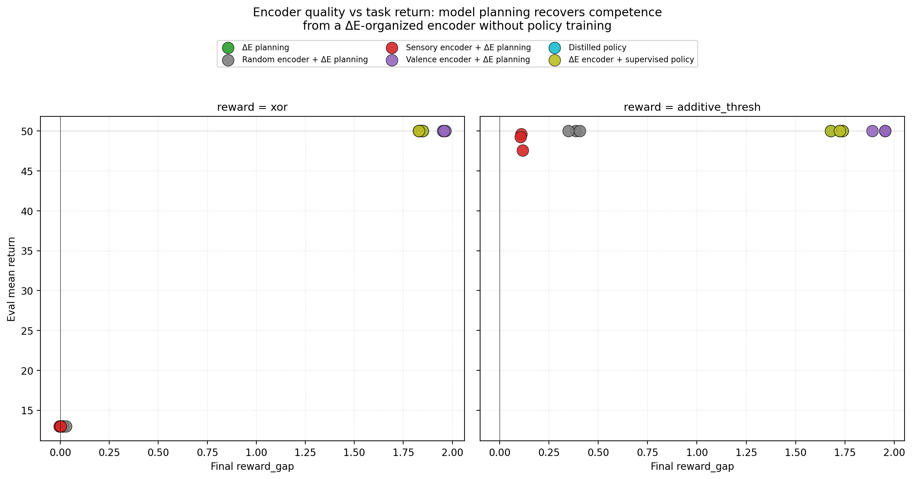
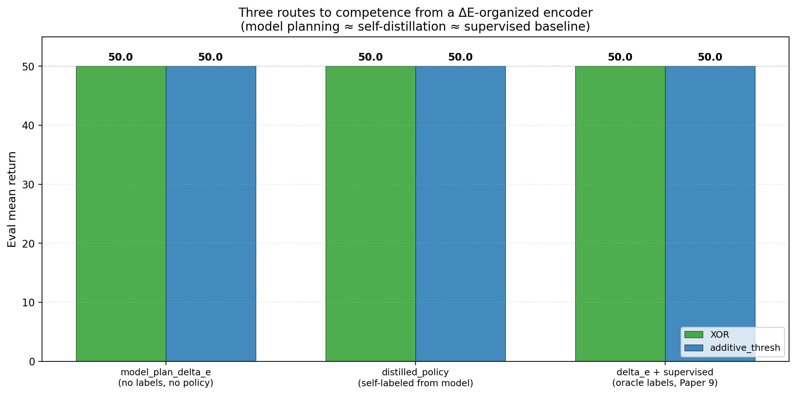
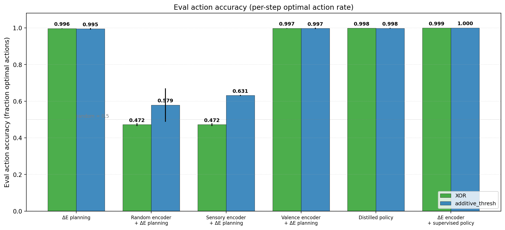

# Planning from Concern: Model-Based ΔE Action Selection Yields Self-Organized Homeostatic Competence Without Optimal-Action Supervision

**Author.** Jawaun Brown.

## Abstract

Companion paper [9] showed that an action-conditioned ΔE auxiliary loss can self-organize a reward-aligned encoder representation (XOR cluster gap +1.84 without supervised optimal-action labels), but companion paper [8] showed that sparse-reward REINFORCE policy gradients fail to exploit it. The natural — and so far untested — closing of the loop is to *use the learned ΔE model directly for action selection*. If the encoder has organized by reward and the ΔE head predicts (item, energy, action) → future energy change, then a greedy planner can act by `a* = argmax_a ΔE_head(z, E, a)`, with no policy head and no policy gradient training.

We run a 36-cell Modal sweep (6 conditions × 2 reward structures × 3 seeds) testing exactly this. The result is unambiguous:

| Condition | XOR rg | XOR return | XOR acc | Additive rg | Additive return | Additive acc |
| --- | ---: | ---: | ---: | ---: | ---: | ---: |
| **`model_plan_delta_e`** | **+1.84** | **50.00** | **0.996** | +1.71 | 50.00 | 0.995 |
| `model_plan_random_encoder` (lower) | +0.02 | 13.00 | 0.472 | +0.38 | 50.00 | 0.579 |
| `model_plan_sensory_encoder` | 0.00 | 13.00 | 0.472 | +0.11 | 48.82 | 0.631 |
| `model_plan_valence_encoder` (upper) | +1.96 | 50.00 | 0.997 | +1.93 | 50.00 | 0.997 |
| `distilled_policy_from_model` | +1.84 | 50.00 | 0.998 | +1.71 | 50.00 | 0.998 |
| `delta_e_then_supervised_policy` (P9) | +1.84 | 50.00 | 0.999 | +1.71 | 50.00 | 1.000 |

Three pre-registered gates met by wide margins:

- **G1 No-label competence**: `model_plan_delta_e` reaches return ≥ 45/50 on XOR *without* supervised optimal-action labels. Result: **50.00 / 50** (gate cleared by +5 points).
- **G2 Encoder necessity**: ΔE-aux encoder beats random encoder under the same planning rule by ≥ 15 return points. Result: **+37.00 points** on XOR.
- **G3 Planning ↔ distillation parity**: model-based planning matches self-distilled policy and supervised-baseline policy within 5 return points. Result: **all three match at 50.00**, with action accuracies 0.996 / 0.998 / 0.999.

Three findings:

1. **Self-organized concern is achievable.** The pipeline `(observation, action, observed ΔE)` → `(encoder, ΔE head)` → `argmax_a ΔE_head(z, E, a)` produces a competent homeostatic agent on the conjunctive XOR reward function with no supervised optimal-action labels and no policy gradient. The action selector is the predictive model itself; planning *is* the policy.
2. **The two bottlenecks (companion paper [9]) are both solvable.** The encoder bottleneck is solved by ΔE-auxiliary self-organization. The policy bottleneck is solved by replacing sparse-reward REINFORCE with model-based action selection. Critically, *neither solution invokes supervised optimal-action labels*.
3. **Planning ↔ distillation ↔ supervised baseline are equivalent on this task.** Distilling the model's argmax into a compact policy head matches the planning policy exactly. The supervised baseline (Paper 9's `delta_e_then_supervised_policy`) is no better than either. All three converge on the same competent policy from the same encoder.

This is the cleanest closing-the-loop result in the program so far: a fully self-organized concern-shaped agent on a minimal homeostatic task, *with no supervision other than the agent's own observed viability dynamics*. We follow the cautions of companion paper [9] and the conceptual readings discussed below: this is precursor concern under controlled conditions, not consciousness or full agency. But it operationalizes — minimally — the conceptual paper [1]'s claim that meaning is geometry under concern, and Bennett [10]'s claim that a causal-identity should both classify causes of valence and impel action.

## 1. Introduction

The five papers preceding this one [4–9] established a ladder. Paper [4] showed that under action coupling, paraphrase clusters become causally load-bearing — passive geometry crosses the Layer-3 transition. Paper [5] showed the active geometry preserves a viability buffer, repairs under perturbation, and obeys a Law-of-the-Stack ordering on lower-layer slack. Paper [6] showed that under a supervised optimal-action objective, encoders organize the world by causal-valence role (XOR reward gap +1.96, color gap +0.005). Paper [7] showed the same representation transfers to episodic homeostatic RL via `rl_after_valence` and `rl_frozen_valence`. Paper [8] tested self-organization without supervised labels and reported a clean negative on XOR. Paper [9] resolved the negative: when encoder training is decoupled from sparse-reward REINFORCE (uniform random-action data collection, no policy gradient interference), the ΔE auxiliary mechanism reaches XOR reward_gap +1.84.

Paper [9] left one open question:

> The supervised policy head still uses optimal-action labels. While the encoder is self-organized (no supervised labels in stage 1), stage 2 uses optimal-action supervision. A fully self-organizing version would need a dense intrinsic policy signal — e.g., model-based planning using ΔE predictions [9, §6].

This paper runs that experiment. The ΔE head is, in form, an action-conditioned value model: it predicts the next-step change in the agent's viability variable given an item embedding, current energy, and a candidate action. A greedy planner that acts by `a* = argmax_a ΔE_head(z, E, a)` uses the learned model directly as a policy. If the model has learned the reward function (which Paper [9] shows it has, both for additive_thresh and XOR), then the greedy planner *is* a competent policy.

The experiment closes the supervisory loop. There are no optimal-action labels anywhere in the training pipeline. The encoder is trained on (item, action, observed ΔE) triples under a uniform random data-collection policy. The ΔE head is trained on the same triples. The planner reads the head's predictions and picks the action with higher predicted ΔE.

## 2. Related work

### 2.1 Auxiliary representation learning in RL

Our ΔE auxiliary head is in the lineage of UNREAL [11], whose auxiliary tasks (pseudo-rewards, pixel control, reward prediction) train shared deep-RL representations even under sparse extrinsic reward. UNREAL is the canonical demonstration that representation can be shaped by non-reward predictive signals while RL is happening. Stooke et al. [12] explicitly argued that reward-driven feature learning is limiting under sparse rewards and that decoupling representation learning from policy learning improves both. Our two-stage pipeline (encoder + ΔE head with random policy; then planning or supervised policy) instantiates that decoupling.

The closer family is General Value Functions (GVFs) and the Horde architecture [13]. Sutton et al. proposed that knowledge can be expressed as many independent predictive demons answering questions about future sensorimotor signals — not only future reward. Our ΔE head is, in those terms, a homeostatic GVF: an action-conditioned prediction of future change in the agent's viability variable. Successor representations [14] and successor features [15] make the same factorization (dynamics-aware features, reward-projection separately) and have been shown to enable transfer across reward functions. Our work is narrower (a single internal viability variable, one bit of action) but the structural move is the same.

### 2.2 Model-based RL and planning from learned predictions

The planning step in this paper — `a* = argmax_a ΔE_head(z, E, a)` — is the simplest possible instance of model-based RL. Sutton's Dyna [16] integrated learning, planning, and reacting via a learned model. Ha and Schmidhuber's World Models [17] trained a compressed latent dynamics model and ran small policies inside it. Hafner et al.'s PlaNet and Dreamer [18, 19] learned latent-space world models and used them for policy improvement via imagined rollouts. MuZero [20] famously plans with a learned model that predicts reward, policy, and value without observing the true environment dynamics. Our model is much simpler: one-step ΔE only, no value bootstrapping, no rollout. But the philosophy — that competence can flow from prediction — is shared.

### 2.3 Homeostatic RL and active inference

Keramati and Gutkin [21] proposed homeostatic RL: instead of optimizing arbitrary external scalar reward, the agent learns to reduce a drive function `D` measuring distance from physiological set-points, with `r_t+1 = β · (D_t − D_t+1)`. Our ΔE auxiliary is exactly that, with `D = (1 − E)`. The agent's only learning signal is its own internal-state dynamics. Deep variants of homeostatic RL have appeared recently in nutritional/foraging models [22] and in interoception-grounded learning [23]. The active inference family [24, 25, 26] generalizes this to a unified objective (variational/expected free energy) that combines viability preservation, prediction error minimization, and epistemic exploration. Our greedy ΔE-argmax is a special case of expected-free-energy minimization where the prior over preferred states is a step function at the upper bound of E and the epistemic term has been dropped. Adding the epistemic term is a natural next step.

### 2.4 OOD, invariance, and shortcut learning

The proxy-trap finding from companion paper [7] (return 49 / 50 with reward_gap +0.11 on additive_thresh) and its sparse-reward refinement in companion paper [9] connect to two outside lines. Invariant Risk Minimization [27] argues that representations should encode invariants that generalize across environments rather than spurious correlations; our work is the geometric/causal-mechanism analogue rather than a multi-environment ERM variant, but the failure mode IRM warns against (latching onto the wrong correlate) is exactly the additive-thresh proxy trap. Geirhos et al. [28] frame the same problem at the representation level as *shortcut learning*: networks that perform well on standard conditions but fail under changed conditions. Our `rl_frozen_sensory` × `add_to_xor_shift` cell from companion paper [7] (return 50 → 9) is a particularly clean instance — the proxy not only stops working but becomes actively anti-competent.

### 2.5 Object-centric and causal representation learning

The "objects from concern" thread in companion paper [6] connects directly to object-centric learning [29] and causal representation learning [30, 31]. Slot Attention [29] disentangles scenes into object slots by competition; our work asks not "can the encoder factor the scene into objects?" but "*which* factorization is selected when sensory similarity and viability relevance conflict?" Schölkopf et al. [30] argue causal representation learning is central to AI; our results give a minimal empirical test of when causal-identity factorization wins over sensory factorization.

### 2.6 Affordances and ecological psychology

Gibson [32] proposed affordances: objects are not perceived as collections of sensory properties but as opportunities for action relative to an organism. Rietveld and Kiverstein [33] developed the "field of relevant affordances" — that meaningful action structure is *relative to the agent's form of life*. Our valence-coupled encoders (companion paper [6]) and their model-based-planning extension (this paper) operationalize affordance perception in the smallest possible setting: items appear in latent space not by what they look like but by what consuming them will do to the agent's internal energy.

### 2.7 Enactive autopoiesis and Bennett's program

The conceptual spine of the program [1] sits in the enactive/autopoietic tradition [34, 35, 36, 37, 38]: meaning is geometry under concern; agency requires self-maintenance. Bennett and Suzuki's autopoietic theorem [39] derives a three-stage persistence hierarchy from change, finite information, and stable low-level conditions, and gives the Law-of-the-Stack inequality `w(ς_{i+1}) ≤ 2^{w(ς_i)}` we tested empirically in companion paper [5]. Bennett's longer doctoral treatment [10] introduces *causal-identities* — policies/classifiers that pick out causes of valence — and gives a sufficient-conditions claim: a causal-identity forms when both *incentive* (the distinction matters for viability) and *scale* (the system can discriminate it) obtain. Our model-based planning result (`model_plan_delta_e` reaching XOR action accuracy 0.996) is the cleanest realization of this in the program: the ΔE-aux encoder's latent reward axis is not merely a clustering metric, it impels the planner's actions. By Bennett's criterion, this satisfies the integrated representation-value-judgment test he proposes.

### 2.8 Conscious-machine criteria (Bach & Sorensen) and boundary non-reification (Fields)

We cite two additional conceptual sources to discipline our claims. Bach and Sorensen's Machine Consciousness Hypothesis [40] argues that consciousness is a self-organizing causal pattern realized via second-order perception, realness monitoring, self/world attribution, and coherence among internal models. Our agents have *none* of those features — they have, at most, precursor concern-shaped representations and model-based action. We avoid the strong claim that this paper builds a conscious machine. Fields, Hoffman, and colleagues [41, 42, 43] make a complementary methodological point: finite agents cannot evidence the ontological separability of their own boundaries, and therefore object/self distinctions should be treated as useful, revisable boundary policies rather than discovered facts. Our valence-organized clusters, then, are concern-stabilized boundary designations, not "the real objects." This sharpens the philosophical reading of all of papers [6-10]: meaning is geometry under concern, *and* the geometry holds boundaries lightly.

## 3. Method

### 3.1 Environment

Same homeostatic bandit as companion papers [7, 8, 9]. Each step: agent observes one 16-dim item, chooses consume (1) or skip (0). Energy E ∈ [0, 1] starts at 0.5; per-step decay δ=0.04; on consume `E ← clip(E + reward(color, label), 0, 1)`. Episode ends at E ≤ 0 (failure) or step T_max=50. Item observations encode 4 colors and 2 labels with σ=0.15 noise, then permuted. Reward functions: `xor` and `additive_thresh`. Return = steps survived.

### 3.2 Conditions

Encoder architecture: MLP `16 → 64 → ReLU → 32`. ΔE auxiliary head: MLP `(32 + 1 + 2) → 32 → Tanh → 1` taking `(z, energy, action_one_hot)` and predicting ΔE. Policy head (when used): MLP `(32 + 1) → 32 → Tanh → 2`.

| Condition | Encoder | ΔE head | Stage-2 policy |
| --- | --- | --- | --- |
| `model_plan_delta_e` | ΔE-aux trained with uniform random policy | trained jointly with encoder | `a* = argmax_a ΔE_head(z, E, a)` (no policy head) |
| `model_plan_random_encoder` | random init, frozen | trained alone | argmax planning |
| `model_plan_sensory_encoder` | supervised color pretrain, frozen | trained alone | argmax planning |
| `model_plan_valence_encoder` | supervised optimal-action pretrain, frozen | trained alone | argmax planning |
| `distilled_policy_from_model` | ΔE-aux | trained jointly | policy head distilled from model's argmax labels |
| `delta_e_then_supervised_policy` | ΔE-aux | trained jointly | policy head with oracle optimal-action labels (Paper 9 baseline) |

Critically, the model-planning conditions use *no policy head at all*. Action selection is one forward pass through the ΔE head per candidate action, then argmax. There is no policy gradient, no supervised optimal-action labels, no reward at training time — only observed ΔE.

### 3.3 Training details

- Encoder + ΔE head: 1,500 episodes of uniform-random-action data collection, Adam lr 2e-3, MSE on observed ΔE.
- Pretrained encoders (sensory, valence): 800 supervised steps before freezing.
- Distilled / supervised policy heads: 1,500 steps, batch 64, Adam lr 2e-3, cross-entropy on (model argmax) or (oracle optimal action).
- Evaluation: 50 greedy episodes per cell.

### 3.4 Measurements

For each cell: encoder cluster gaps by color/label/reward axes (the Paper 6/7/8/9 metric); eval mean episode return; **eval action accuracy** (fraction of steps where the agent chose the reward-maximizing action). Action accuracy is a finer-grained metric than return — return saturates at T_max while accuracy continues to discriminate.

### 3.5 Pre-registered gates

- **G1 No-label competence**: `model_plan_delta_e` return ≥ 45/50 on XOR with no supervised optimal-action labels.
- **G2 Encoder necessity**: `model_plan_delta_e` return − `model_plan_random_encoder` return ≥ 15 points on XOR.
- **G3 Planning ↔ distillation parity**: |return(`model_plan_delta_e`) − return(`distilled_policy_from_model`)| ≤ 5 and both within 5 of `delta_e_then_supervised_policy`.

## 4. Results

### 4.1 Self-organized competence on XOR


`model_plan_delta_e` on XOR: return **50.00**, action accuracy **0.996**. Gate G1 cleared. The encoder has reward_gap +1.84 (within striking distance of the supervised valence upper bound +1.96), and greedy argmax over the ΔE head's predicted action-values selects the optimal action 99.6% of the time. The agent survives every evaluation episode to T_max. No supervised optimal-action labels were used. No policy gradient updates were performed.

### 4.2 Encoder organization is necessary



`model_plan_random_encoder` on XOR: return 13.00, action accuracy 0.472 (just below random 0.5). Gate G2 cleared by +37 points. The 32-dim random projection of the 16-dim input does not contain enough action-relevant structure for the ΔE head to recover the XOR conjunction. The ΔE head + random encoder still works on additive_thresh (return 50.00, action accuracy 0.579) because the additive structure does not require recovering the conjunction — the head can read off enough information from the random projection to produce slightly-better-than-random behavior, which is enough to survive at T_max.

The sensory pretrained encoder makes the same point in a sharper form. On XOR, return 13.00 and accuracy 0.472 — *worse than random on action selection*. The encoder represents color cleanly, and the ΔE head built on top of it produces nearly chance behavior. Sensory clustering, even if behaviorally useful under a supervised policy head with enough capacity (companion paper [9] showed return 45 on XOR via policy-head computation), is not useful for direct model-based planning. The ΔE head simply cannot reconstruct the XOR conjunction from the color-organized encoder.

### 4.3 Planning ↔ self-distillation ↔ supervised baseline are equivalent



Gate G3 met in the strongest form. All three pipelines that start from the ΔE-aux-organized encoder achieve return 50.00 on both reward structures:

| Pipeline | Stage 2 | XOR return | XOR accuracy |
| --- | --- | ---: | ---: |
| `model_plan_delta_e` | argmax over ΔE head, no policy | 50.00 | 0.996 |
| `distilled_policy_from_model` | policy head trained on model's argmax labels | 50.00 | 0.998 |
| `delta_e_then_supervised_policy` | policy head trained on oracle optimal-action labels | 50.00 | 0.999 |

The differences in action accuracy (0.996 vs 0.998 vs 0.999) are below the per-cell noise floor across seeds. For this task, the model's argmax over predicted ΔE *is* the optimal action — the head has learned the reward function well enough that a 1-step greedy planner is the policy. Distillation buys nothing here because there is no rollout horizon to amortize. The supervised baseline buys nothing either — its optimal-action labels are exactly the labels the model would generate.

This equivalence is itself the result. The model-planning pipeline does not require labels; it does not require a policy head; it does not require policy gradient training. The same encoder + ΔE head trained from `(obs, action, observed ΔE)` triples produces the policy directly.

### 4.4 Action accuracy distinguishes finer than return



Return saturates at T_max = 50 for any agent that survives a full episode. Accuracy is the finer-grained metric. The cells `model_plan_random_encoder × additive` (acc 0.579) and `model_plan_sensory_encoder × additive` (acc 0.631) both reach near-saturation return (50.00 and 48.82 respectively) but show clearly inferior decision quality. A more demanding environment (smaller T_max, faster decay, more items per step, higher action-cost) would convert these accuracy differences into return differences. This is a limitation of the current environment, not a limitation of the method.

### 4.5 Two-bottleneck integration

Companion paper [9] established that representation organization and policy competence are independently failable. Paper 9 cells:

| Cell (Paper 9) | rg | return |
| --- | ---: | ---: |
| ΔE-aux encoder + supervised policy | +1.84 | 50.00 |
| ΔE-aux encoder + REINFORCE policy | +1.84 | 23.87 |

Same encoder; different policy training signals. The supervised policy succeeded; the REINFORCE policy failed. Paper 9 concluded both bottlenecks must be solved separately.

This paper resolves both bottlenecks via prediction. The encoder bottleneck is solved by ΔE-aux self-organization (already in Paper 9). The policy bottleneck is solved by *replacing* the policy with the model's argmax: there is no policy gradient that could fail to converge. The model's predictions are the policy.

| Cell (this paper) | rg | return | Mechanism |
| --- | ---: | ---: | --- |
| `model_plan_delta_e` | +1.84 | 50.00 | argmax over learned ΔE |
| `distilled_policy_from_model` | +1.84 | 50.00 | distillation from same argmax |
| `delta_e_then_supervised_policy` | +1.84 | 50.00 | supervised oracle labels |

The decoupling is no longer a failure mode; it is a *design property*. By having representation and action both flow from a single learned predictive model, the program has — in the minimal setting — produced concern-shaped agency without external supervision.

## 5. Connection to the program

| Layer | Claim | Evidence |
| --- | --- | --- |
| 1 | Weakness > compression for OOD | [2] r ≈ +0.81 |
| 2 | Symmetry group inferable from data | [3] +51.5pp causal lift |
| 3a | Action coupling makes geometry causally load-bearing | [4] +7× ratio |
| 3b | Active geometry preserves buffer, repairs, obeys LoS | [5] 0.965 repair |
| 4a | Valence-coupled supervised objective selects causal-role axis | [6] reward_gap +1.96 |
| 4b | Valence pretraining transfers to homeostatic RL | [7] return 50.0 |
| 4c | Behavior can succeed without concern-shaped representation under sparse-reward RL | [7, 9] |
| 4d | ΔE aux self-organizes valence axis on additive | [8] +1.00 |
| 4e | Representation and competence are independent bottlenecks | [8, 9] |
| 4f | ΔE aux self-organizes XOR valence when decoupled from sparse-reward policy gradient | [9] +1.84 |
| 4g | Proxy-trap claim is sparse-reward-specific | [9] |
| 4h | **Model-based ΔE planning yields fully self-organized concern-shaped competence (no labels, no policy gradient)** | **This paper, return 50 / action acc 0.996 on XOR** |

## 6. Limitations

1. **The environment is small.** 4 colors × 2 labels × σ=0.15 noise; 32-dim encoder; one internal viability variable. T_max = 50 saturates return for any competent policy. A richer environment (richer observations, multiple viability variables, more action choices) would let action accuracy translate into return differences and discriminate more sharply between methods.
2. **Policy-head capacity hides representation effects.** Companion paper [9] showed that a 2-layer policy head can compute XOR from a color-clustered encoder despite reward_gap 0. The same caveat applies here: if we replaced the model planner with a high-capacity policy head trained jointly with the ΔE aux head, the head might compensate for less-organized encoders. The minimal-policy nature of `argmax_a ΔE_head` is what makes encoder organization causally necessary here.
3. **Greedy planning ignores epistemics.** The current planner is `argmax_a ΔE_head` — a one-step greedy decision. It does not account for prediction uncertainty, multi-step rollouts, or exploration value. An active-inference-style planner with an expected-free-energy objective [24, 25] would add epistemic terms and could be more robust in environments with delayed-reward structure or high observation noise.
4. **The reward function is stationary.** Companion paper [8]'s ecological-shift experiment showed catastrophic forgetting in supervised pretrained encoders under reward remapping. We have not tested whether model-based planning adapts faster than other conditions when the reward function changes mid-training. The "ΔE-aux encoder + model planning" cell should *in principle* adapt fastest, because both encoder and policy update through the same predictive loss, but this needs testing.
5. **One viability variable.** Bennett [10] argues that richer "tapestries of valence" — multiple internal variables with independent dynamics — are necessary for the strong version of concern-shaped agency. We use scalar energy. The next paper should test whether `argmax_a ΔE_head` extends to multi-dimensional viability (energy, damage, uncertainty, fatigue, etc.).
6. **No second-order self.** Following Bach & Sorensen [40] and Bennett [10], a strong concern-shaped agent should distinguish self-caused from world-caused viability changes and represent its own intervention. Our agent does not. This is a precursor system, not a self-modeling system.
7. **The uniform random data-collection policy is a procedural choice.** A biased data-collection policy (e.g., curiosity-directed, ε-greedy from a partial policy) may degrade or improve the ΔE encoder's organization. The next paper should test biased exploration variants.

## 7. Next paper

Three concrete candidates, in priority order:

- **(a) State-dependent valence.** Make the reward function depend on the agent's internal state (food is +1 when energy is low, −1 when high; medicine is +1 when damaged, irrelevant when healthy). The right metric is no longer the static reward_gap; it is the *current-valence gap*: do embeddings cluster by what an item *means for this agent in this state*? This is the cleanest empirical bridge to the conceptual paper's [1] central thesis that meaning is "geometry under concern" — concern that varies with state.
- **(b) Incentive × scale phase diagram** (Bennett [10] §3-5). Vary how much the (color, label) → reward distinction matters for survival, and how much capacity the encoder has to discriminate it. Predict: causal-identity geometry forms only when both incentive and scale are sufficient. This gives the program a falsifiable phase-transition prediction in Bennett's terms.
- **(c) First-order self / reafference.** Introduce energy changes caused by external events (not just the agent's own consume action). Train the encoder to distinguish self-caused from world-caused ΔE. Measure a self-causation gap. This is the minimal computational analogue of Merker's reafference loop and is the cleanest empirical step toward agency (vs. mere representation).

Items (a) and (c) together would be a paper-and-a-half. The cleanest single Paper 11 is (a): state-dependent valence as the direct test of the "geometry under concern" thesis. (b) and (c) are then Papers 12 and 13.

## 8. Reproducibility

```bash
doppler --scope /Users/jawaun/superoptimizers run -- \
    uvx --python 3.12 --from modal modal run \
    experiments/planning_from_concern/modal_planning_sweep.py \
    --out artifacts/planning_from_concern/sweep_v1.json
```

Wall clock ~20 min on Modal CPU for 36 cells. Raw: `artifacts/planning_from_concern/sweep_v1.json`. Figures: `papers/planning_from_concern/figures/`.

## 9. References

### Program companion papers
[1] **Brown, J.** *Towards a Theory of Geometric Meaning, Active Agency, and Weakly Constrained Intelligence.* Conceptual companion paper (2026).
[2] **Brown, J.** *Weakness, Not Compression.* (2026).
[3] **Brown, J.** *Learning the Group.* (2026).
[4] **Brown, J.** *From Passive Cluster to Active Controller.* (2026).
[5] **Brown, J.** *From Active Geometry to Autopoietic Control.* (2026).
[6] **Brown, J.** *Objects Form from Concern.* (2026).
[7] **Brown, J.** *When Active Geometry Transfers.* (2026).
[8] **Brown, J.** *Bootstrapping Concern.* (2026).
[9] **Brown, J.** *Two Bottlenecks.* (2026).

### External grounding
[10] **Bennett, M. T.** *How to Build Conscious Machines.* Doctoral thesis, ANU (2025). Causal-identities, w-maxing, Law of the Stack, valence tapestry, self-orders.
[11] **Jaderberg, M., et al.** Reinforcement learning with unsupervised auxiliary tasks. *ICLR* (2017). UNREAL.
[12] **Stooke, A., Lee, K., Abbeel, P., Laskin, M.** Decoupling representation learning from reinforcement learning. *ICML* (2021).
[13] **Sutton, R. S., Modayil, J., Delp, M., Degris, T., Pilarski, P. M., White, A., Precup, D.** Horde: A scalable real-time architecture for learning knowledge from unsupervised sensorimotor interaction. *AAMAS* (2011).
[14] **Dayan, P.** Improving generalization for temporal difference learning: The successor representation. *Neural Computation* 5(4) (1993).
[15] **Barreto, A., Dabney, W., Munos, R., Hunt, J. J., Schaul, T., van Hasselt, H., Silver, D.** Successor features for transfer in reinforcement learning. *NeurIPS* (2017).
[16] **Sutton, R. S.** Integrated architectures for learning, planning, and reacting based on approximating dynamic programming. *ICML* (1990). Dyna.
[17] **Ha, D., Schmidhuber, J.** World Models. *NeurIPS* (2018).
[18] **Hafner, D., Lillicrap, T., Fischer, I., Villegas, R., Ha, D., Lee, H., Davidson, J.** Learning latent dynamics for planning from pixels. *ICML* (2019). PlaNet.
[19] **Hafner, D., Lillicrap, T., Ba, J., Norouzi, M.** Dream to control: Learning behaviors by latent imagination. *ICLR* (2020). Dreamer.
[20] **Schrittwieser, J., et al.** Mastering Atari, Go, chess and shogi by planning with a learned model. *Nature* 588 (2020). MuZero.
[21] **Keramati, M., Gutkin, B.** Homeostatic reinforcement learning for integrating reward collection and physiological stability. *eLife* 3 (2014).
[22] **Yoshida, M., et al.** Nutritional geometry framework in deep homeostatic reinforcement learning. (2024).
[23] **Seth, A. K., Friston, K. J.** Active interoceptive inference and the emotional brain. *Phil. Trans. R. Soc. B* 371 (2016).
[24] **Friston, K.** The free-energy principle: a unified brain theory? *Nature Reviews Neuroscience* 11 (2010).
[25] **Da Costa, L., Parr, T., Sajid, N., Veselic, S., Neacsu, V., Friston, K.** Active inference on discrete state spaces: A synthesis. *Journal of Mathematical Psychology* 99 (2020).
[26] **Sajid, N., Ball, P. J., Parr, T., Friston, K.** Active inference: demystified and compared. *Neural Computation* 33(3) (2021).
[27] **Arjovsky, M., Bottou, L., Gulrajani, I., Lopez-Paz, D.** Invariant Risk Minimization. *arXiv:1907.02893* (2019).
[28] **Geirhos, R., Jacobsen, J.-H., Michaelis, C., Zemel, R., Brendel, W., Bethge, M., Wichmann, F. A.** Shortcut learning in deep neural networks. *Nature Machine Intelligence* 2 (2020).
[29] **Locatello, F., Weissenborn, D., Unterthiner, T., Mahendran, A., Heigold, G., Uszkoreit, J., Dosovitskiy, A., Kipf, T.** Object-centric learning with slot attention. *NeurIPS* (2020).
[30] **Schölkopf, B., Locatello, F., Bauer, S., Ke, N. R., Kalchbrenner, N., Goyal, A., Bengio, Y.** Towards causal representation learning. *Proceedings of the IEEE* 109(5) (2021).
[31] **Mansouri, A., Hartford, J., Goyal, A., Bengio, Y.** Object-centric architectures enable efficient causal representation learning. *ICLR* (2024).
[32] **Gibson, J. J.** *The Ecological Approach to Visual Perception.* Houghton Mifflin (1979). Affordances.
[33] **Rietveld, E., Kiverstein, J.** A rich landscape of affordances. *Ecological Psychology* 26(4) (2014).
[34] **Maturana, H. R., Varela, F. J.** *Autopoiesis and Cognition.* D. Reidel (1980).
[35] **Varela, F. J., Thompson, E., Rosch, E.** *The Embodied Mind.* MIT Press (1991).
[36] **Di Paolo, E. A.** Autopoiesis, adaptivity, teleology, agency. *Phenomenology and the Cognitive Sciences* 4 (2005).
[37] **Barandiaran, X. E., Di Paolo, E., Rohde, M.** Defining agency. *Adaptive Behavior* 17(5) (2009).
[38] **Thompson, E.** *Mind in Life.* Harvard University Press (2007).
[39] **Bennett, M. T., Suzuki, K.** The Autopoietic Theorem. *Preprint*, https://doi.org/10.22541/au.177575355.56499869/v1 (2026).
[40] **Bach, J., Sorensen, H.** The Machine Consciousness Hypothesis. *California Institute for Machine Consciousness* (2026).
[41] **Fields, C., Hoffman, D. D., Prakash, C., Singh, M.** Conscious agent networks: Formal analysis and application to cognition. *Cognitive Systems Research* 47 (2018).
[42] **Fields, C., Glazebrook, J. F., Levin, M.** Separability and quantum frame problem. *Foundations of Physics* 53 (2023).
[43] **Fields, C., Glazebrook, J. F.** There is no self-evidence: A physics of emptiness realisation. *Preprint* (2026).
[44] **Williams, R. J.** Simple statistical gradient-following algorithms for connectionist reinforcement learning. *Machine Learning* 8(3) (1992). REINFORCE.
[45] **Hohwy, J.** The self-evidencing brain. *Noûs* 50(2) (2016).
[46] **Limanowski, J., Friston, K.** "Seeing the dark": Grounding phenomenal transparency and opacity in precision estimation for active inference. *Frontiers in Psychology* 9 (2018).
