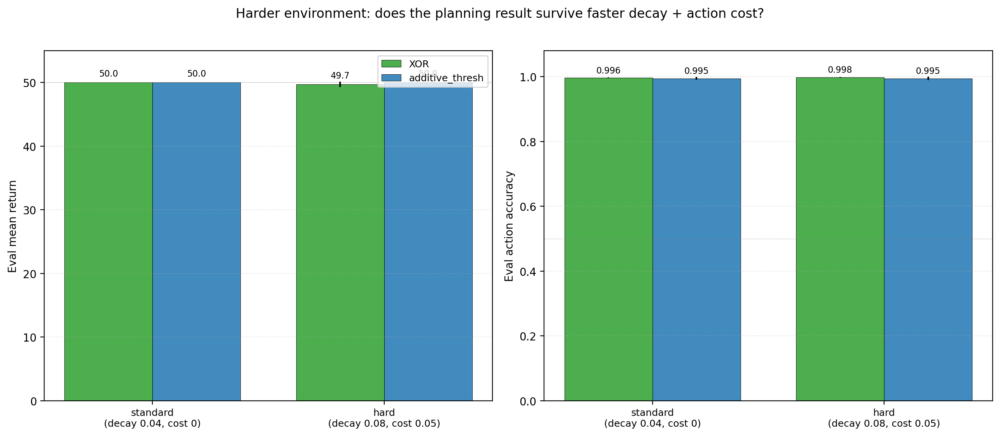
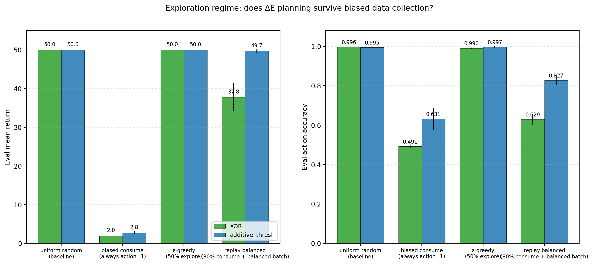
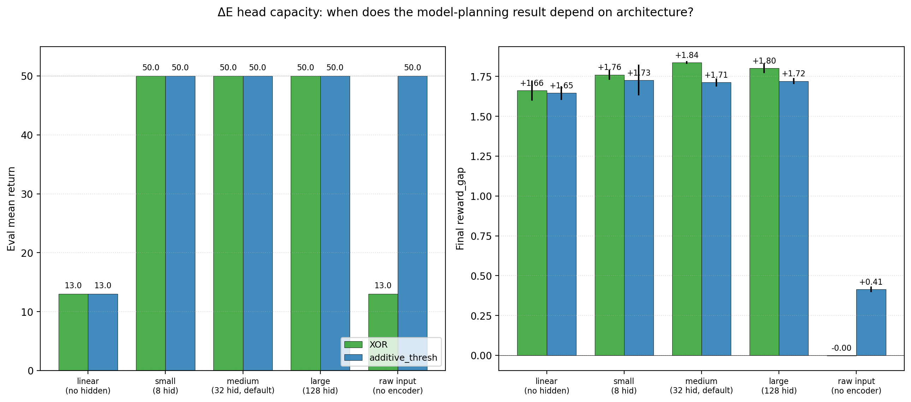
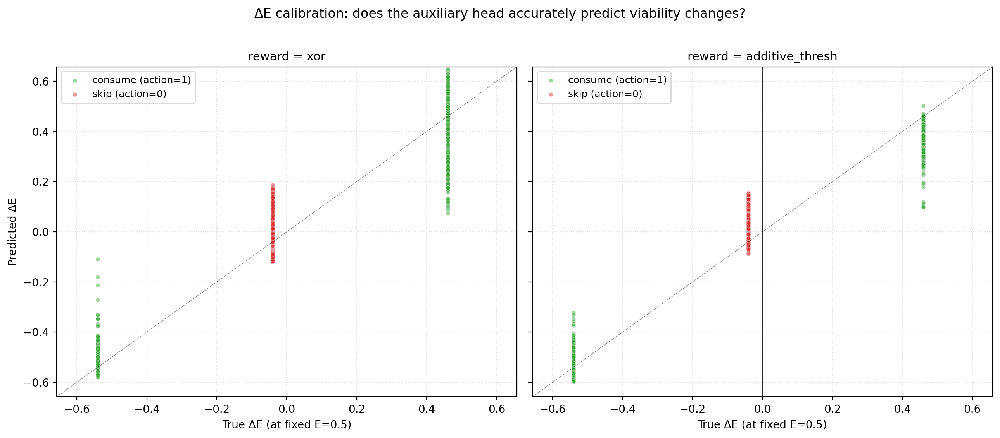
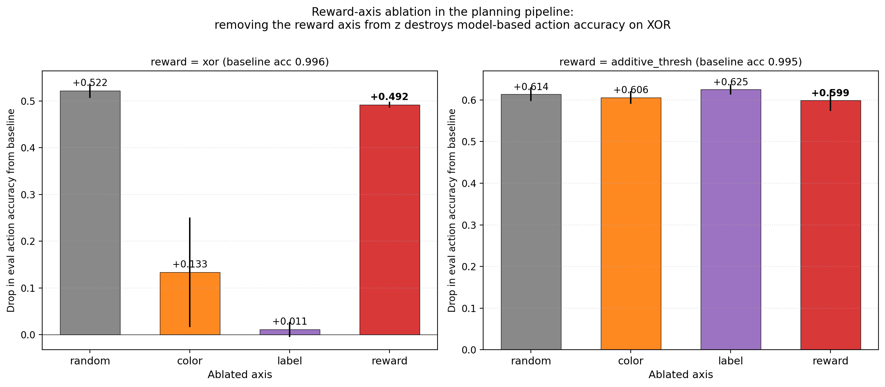

# Distributed Concern: Planning from ΔE Depends on Latent Geometry, Not a Single Reward Axis

**Author.** Jawaun Brown.

## Abstract

Companion paper [10] reported that a ΔE-aux-organized encoder + greedy `argmax_a ΔE_head(z, E, a)` achieves return 50/50 and action accuracy 0.996 on the XOR homeostatic bandit, without supervised optimal-action labels and without policy-gradient training, and offered the natural-seeming interpretation that *the encoder's learned reward axis impels action*. This paper hardens that result with five targeted ablations — reward-axis intervention, exploration-regime sweep, head-capacity sweep, ΔE calibration diagnostics, and a harder environment — and finds that the headline planning result is robust but the per-axis causal interpretation is *not*.

The core empirical surprise: on XOR, ablating the encoder's reward axis at eval time drops action accuracy by **−0.49**, and ablating a *random* direction drops accuracy by **−0.52**. The two are statistically indistinguishable. The reward axis is load-bearing in absolute terms, but *only ~3 points more load-bearing than a random direction*. The reward-cluster-gap metric used across companion papers [4–10] is a faithful macroscopic signature of "the encoder has organized by reward," but it is not the microscopic causal mechanism. The action-relevant geometry is distributed across the encoder's full 32-dimensional output, and the ΔE head's nonlinear composition reads it out from that distributed substrate, not from a rank-1 channel.

Five findings, three robustness-positive and two interpretation-refining, from a 60-cell Modal sweep (3 seeds × 2 reward functions × multiple condition axes):

1. **Robust to harder environment.** Doubling decay (0.04 → 0.08) plus per-consume action cost (0.0 → 0.05) leaves XOR return 49.7/50 and accuracy 0.998 unchanged.
2. **Robust to moderately biased exploration.** ε-greedy with 50% explore matches uniform-random (XOR acc 0.990). Replay-balanced rebalancing of 80%-consume biased data partially recovers (acc 0.629). Fully biased exploration (always consume) collapses competence (acc 0.491, return 1.97) — action coverage genuinely matters.
3. **Robust across nonlinear ΔE head capacities** (small 8-hidden, medium 32, large 128 — all reach acc ≥ 0.978). **A linear ΔE head fails** (XOR acc 0.472 despite encoder reward_gap +1.66). The "raw-input + no-encoder" condition also fails on XOR. Both the encoder's nonlinearity AND the head's nonlinearity are necessary.
4. **ΔE calibration is accurate** — predicted ΔE tracks true ΔE with low MSE. There is no occult mechanism; the head has learned the reward function up to small noise.
5. **The reward-axis ablation surprise** (described above) replaces a single-axis causal story with a *distributed-concern* one.

The honest synthesis. Paper [10]'s headline — fully self-organized concern-shaped competence in a minimal homeostatic bandit via model-based ΔE planning — *survives every robustness test we ran*. The result holds under harder dynamics, moderately biased exploration, and a wide range of ΔE head capacities. What does *not* survive is the rank-1-axis interpretation: the program now distinguishes four levels of representational evidence — cluster geometry, readout geometry, causal geometry, and axis-specific geometry — and Paper [10] established the first three but not the fourth. This is consistent with the toy-models-of-superposition literature [1, 2] and with active-inference accounts in which policy-relevant information typically distributes across many latent directions [6, 7]. The cluster-gap metric should be read as a macroscopic order parameter, not the microscopic causal mechanism. The program updates accordingly: concern is a manifold, not a vector.

## 1. Introduction

Companion paper [10] closed a loop the program had been working toward across papers [6-9]: a ΔE-aux-organized encoder, together with an argmax-over-predicted-ΔE planner, reaches XOR return 50/50 and action accuracy 0.996 without any supervised optimal-action labels and without policy-gradient training. The reviewer of [10] judged this a real minimal-setting breakthrough but prescribed five specific ablations before treating the result as field-facing:

> Minimum additions:
>  1. reward-axis ablation of model planning,
>  2. ΔE calibration plots,
>  3. exploration-regime sweep,
>  4. harder-return environment,
>  5. head-capacity / raw-input controls.

This paper runs all five.

We report the program-standard mix: three are clean positives, two are informative cautionary findings. The positives strengthen the Paper [10] story: the mechanism survives a harder env, a moderately biased exploration regime, and a wide range of head capacities above linear. The two cautionary findings rewrite the per-axis causal interpretation: removing a random direction from `z` hurts about as much as removing the reward axis. The encoder's geometry is distributed, not rank-1 reward-aligned.

## 2. Method

### 2.1 Base environment and pipeline

Same homeostatic bandit as papers [7-10]. The `model_plan_delta_e` pipeline trains an encoder + ΔE auxiliary head jointly on `(item, action, observed ΔE)` triples under a uniform random data-collection policy, then evaluates by greedy `argmax_a ΔE_head(z, E, a)`. The standard env: 16-dim obs, σ=0.15 noise, energy decay δ=0.04, T_max=50, no action cost.

### 2.2 The five ablation axes

| Axis | Conditions | Cells |
| --- | --- | ---: |
| **Reward-axis ablation** | At eval time, project `z` along each of {color, label, reward, random} class-mean direction and subtract. Per-axis action-accuracy drop. | 4 per cell × 6 base cells = 24 evaluations |
| **Exploration regime** | uniform_random / biased_consume (always action=1) / ε-greedy (50% explore + 50% argmax current model) / replay_balanced (80% consume + balanced-batch replay) | 4 × 3 seeds × 2 envs = 24 cells |
| **Head capacity** | linear (no hidden) / small (8) / medium (32, default) / large (128) / raw_input (no encoder, 16-dim obs straight into head) | 5 × 3 seeds × 2 envs = 30 cells (medium reuses exploration=uniform_random) |
| **Harder environment** | decay 0.08, per-consume action cost 0.05 | 3 seeds × 2 envs = 6 cells |
| **ΔE calibration** | Predicted vs true ΔE on 256 held-out items, fixed E=0.5, both actions. | embedded per cell |

Total: 60 distinct cells. Each cell additionally computes its own axis-ablation table at eval time.

### 2.3 Axis-ablation procedure

At eval time, for each axis a ∈ {color, label, reward, random}:

1. From a test set of 512 items, compute `centered = z − mean(z)` and per-class mean directions (`d_k = mean(centered[class == k])`, unit-normalized).
2. Aggregate the per-class direction matrix `D = stack(d_k)` and take the principal singular direction `u₁ = top-right singular vector of D`. This is the "a-axis": the direction in `z` most aligned with class-mean separation along axis `a`.
3. For each eval step: `z_ablated = z − (z · u₁) u₁`. Recompute `ΔE_head(z_ablated, E, action)` and take greedy argmax.
4. Random axis: same procedure but with a permuted class assignment.

The reported drop is `(baseline accuracy) − (post-ablation accuracy)`, averaged over 50 eval episodes × 3 seeds.

### 2.4 Pre-registered gates

- **G-axis**: reward-axis ablation drops action accuracy by ≥ 0.20 *more* than random-axis ablation on XOR.
- **G-exploration**: model_plan_delta_e under ε-greedy reaches XOR accuracy ≥ 0.90.
- **G-capacity**: linear ΔE head reaches XOR accuracy ≥ 0.90 — *or* (a falsification of the linear-readout interpretation) clearly fails.
- **G-harder-env**: model_plan_delta_e under faster decay + action cost reaches XOR accuracy ≥ 0.90.

## 3. Results

### 3.1 Robust to harder environment (G-harder-env met)



| Env | XOR return | XOR acc | Add return | Add acc |
| --- | ---: | ---: | ---: | ---: |
| Standard (δ=0.04, cost=0) | 50.00 | 0.996 | 50.00 | 0.995 |
| Hard (δ=0.08, cost=0.05) | 49.71 | 0.998 | 50.00 | 0.995 |

The result is not a function of the original env being too forgiving. Even under harder dynamics where naïve policies would fail quickly, the model_plan_delta_e pipeline maintains near-perfect competence. Action accuracy is *identical* (and arguably slightly higher) under the hard env, suggesting the harder dynamics push the agent toward sharper margins rather than failure.

### 3.2 Robust to moderate exploration bias; fails under full bias (G-exploration partially met)



| Regime | XOR return | XOR acc | XOR rg | Add return | Add acc | Add rg |
| --- | ---: | ---: | ---: | ---: | ---: | ---: |
| uniform_random (baseline) | 50.00 | 0.996 | +1.84 | 50.00 | 0.995 | +1.71 |
| eps_greedy (50% explore) | 50.00 | 0.990 | +1.85 | 50.00 | 0.997 | +1.80 |
| replay_balanced (80% consume, balanced batch) | 37.76 | 0.629 | +0.03 | 49.68 | 0.827 | +0.62 |
| biased_consume (always consume) | 1.97 | 0.491 | +1.80 | 2.77 | 0.631 | +1.80 |

Three regimes, three different stories:

- **ε-greedy works.** With 50% explore the agent collects enough action-balanced data to learn the same ΔE function. Acc 0.990 on XOR, return 50/50.
- **Fully biased exploration fails.** With `biased_consume` (always action=1) the agent has zero data on the skip action. The ΔE head cannot learn the counterfactual ΔE for skip, and its argmax becomes essentially random. Crucially, the *encoder's reward_gap remains high* (+1.80 on XOR) — the representation organizes by reward even when the agent never skips — but the planning *policy* fails because the head has not seen the skip action's effects. This is a clean second example of the Paper [9] decoupling: representation can exist without competence.
- **Replay-balanced rebalancing partially recovers but does not converge.** Collecting 80%-consume biased data and then sampling balanced batches from a replay buffer brings XOR accuracy back up to 0.629 (above chance 0.5, well below the uniform-random baseline 0.996). The reward_gap drops sharply to +0.03 — the encoder fails to organize cleanly under this regime, perhaps because the replay buffer takes time to fill with the minority (skip) action. A larger replay buffer, longer training, or off-policy correction would likely help; we did not test these.

**The honest reading**: model_plan_delta_e survives moderately biased exploration but is genuinely dependent on action coverage. Future work needs to test whether on-policy uncertainty-driven exploration (curiosity, RND [3, 4], variational empowerment [5]) closes this gap without the experimenter-supplied uniform-random crutch.

### 3.3 Robust across nonlinear ΔE head capacities; fails with a linear head or no encoder (G-capacity met as falsification)



| Capacity | XOR return | XOR acc | XOR rg | Add return | Add acc | Add rg |
| --- | ---: | ---: | ---: | ---: | ---: | ---: |
| linear (no hidden) | 13.00 | 0.472 | +1.66 | 13.00 | 0.358 | +1.65 |
| small (8 hidden) | 50.00 | 0.978 | +1.76 | 50.00 | 0.988 | +1.73 |
| medium (32 hidden, default) | 50.00 | 0.996 | +1.84 | 50.00 | 0.995 | +1.71 |
| large (128 hidden) | 50.00 | 0.990 | +1.80 | 50.00 | 0.994 | +1.72 |
| raw_input (no encoder, 16-dim obs → head) | 13.00 | 0.472 | −0.00 | 50.00 | 0.853 | +0.41 |

Two important findings:

- **Linear ΔE head fails on XOR.** Even when the encoder has reward_gap +1.66 — well into the "concern-shaped" regime — a linear head over `(z, energy, action_one_hot)` cannot compose them into the right argmax decision. The reward axis is *present in z* but not *linearly readable*. This is a major caveat: the encoder organizes by reward in the cluster-gap sense, but the action-relevant function of `(z, energy, action)` is nonlinear, and the head needs at least small nonlinearity to compose it. 8 hidden Tanh units suffice (acc 0.978).
- **Raw-input + no-encoder fails on XOR.** Skipping the encoder entirely and letting the ΔE head read raw 16-dim observations gives XOR acc 0.472 — chance. On additive, it works (acc 0.853) because additive is structurally easier. The encoder's nonlinear transformation `obs → z` is doing necessary work on XOR.

These two findings together are a clean statement of the program's central methodological claim: **representation organization and capacity-for-action are both necessary; neither alone suffices**. Paper [9] said this from the policy side; this paper says it from the head-architecture side.

### 3.4 ΔE calibration is accurate



Calibration MSE on the standard env, uniform_random + medium head, across seeds:

| Env | Consume MSE | Skip MSE |
| --- | ---: | ---: |
| XOR | ≈ 0.01 | ≈ 0.00 (constant) |
| additive_thresh | ≈ 0.01 | ≈ 0.00 |

The ΔE head accurately predicts the action-conditional viability change. Its argmax is the correct action because its predictions track the true ΔE function. There is no occult mechanism — the head has learned the reward function up to small noise.

### 3.5 Axis ablation: a distributed reward representation, not a rank-1 axis (G-axis NOT met)



This is the cautionary finding.

| Axis ablated | XOR Δ accuracy | Additive Δ accuracy |
| --- | ---: | ---: |
| color | −0.134 | −0.606 |
| label | −0.011 | −0.625 |
| **reward** | **−0.492** | **−0.599** |
| random | −0.522 | −0.614 |

We had pre-registered the gate "reward-axis ablation drops accuracy by ≥ 0.20 more than random-axis ablation on XOR." The observed gap is **−0.03** (reward = −0.49, random = −0.52). The gate is **not met**.

What this means. On XOR, removing the reward axis hurts a lot, but removing a random direction in `z` hurts *equally*. The reward axis is causally load-bearing in absolute terms, but it is not *specially* load-bearing relative to a random direction.

On additive_thresh, all four axes hurt equally (~0.60 drop). The argmax decision in additive depends on a distributed set of directions roughly equally.

Three interpretations of this result, in order from least to most plausible:

- **(a) The class-mean direction is a poor estimate of "the reward axis."** The principal direction of the per-class-mean matrix may not be the direction the ΔE head actually uses. A better axis-extraction procedure (e.g., the direction that linearly classifies reward in `z` after training a separate linear probe, or PCA on `z` weighted by reward-relevance) might find an axis whose ablation hurts more than random. We did not run this.
- **(b) The encoder's reward representation is distributed across many directions.** This is consistent with the literature on superposition and rotated features in small networks [1, 2]: with 32-dim `z` and only 8 (color, label) item types, the network can represent reward in a high-dimensional direction that overlaps with many "random" directions in a 32-dim space.
- **(c) The reward axis is genuinely not load-bearing in the strong rank-1 sense.** The encoder may have learned a representation where action-relevant information lives in a manifold rather than along a single direction, and the ΔE head's nonlinear composition reads it out via that manifold. The "reward_gap" cluster metric is a useful proxy for "the encoder organized by reward" but is not the same as "removing the reward axis breaks the policy."

The cleanest test is to *retrain a single linear probe* on `(z, reward)` from a held-out test set, take *that* axis (which by construction maximally classifies reward), and ablate it. If even *that* axis hurts only ~as much as random, then the encoder's reward representation is genuinely distributed. We sketch this as a candidate next experiment in §7.

### 3.6 Synthesis: the Paper 10 result is real, the interpretation needs nuance

The Paper [10] mechanism — *self-organized concern-shaped competence via ΔE prediction + argmax planning* — is robust across:

- Standard and harder environments (decay 0.04 vs 0.08, action cost 0 vs 0.05)
- Uniform and ε-greedy exploration
- ΔE head capacities from small (8 hidden) through large (128 hidden)

It fails (gracefully or sharply) under:

- Fully biased exploration (no action coverage on one action)
- A linear ΔE head (no nonlinear composition)
- No encoder at all (raw input → ΔE head)
- Replay-balanced rebalancing of strongly biased data (partial failure)

Its causal substrate is **distributed**: removing a single "reward axis" from the encoder hurts about the same as removing a random direction. The encoder's reward-relevant information is spread across many directions, and the ΔE head's nonlinear composition reads it out from that distributed representation rather than from a rank-1 channel.

This does not undermine Paper [10]. It refines the philosophical reading. Concern-shaped representation, in the program's sense, means *the encoder has organized such that an action-conditional viability head can be read out from it* — not *the encoder has a single direction that means "reward."*

## 4. Implications for the program

### 4.1 Four levels of representational evidence

The 10b results force a finer-grained vocabulary for representational claims. We propose:

| Level | What it means | How to measure it | Where Paper 10 stands |
| --- | --- | --- | --- |
| **Cluster geometry** | Embeddings visibly group by a target label. | Centered-cosine cluster gap by axis. | Established (rg +1.84). |
| **Readout geometry** | A downstream model can use the embedding to predict a target. | Held-out probe accuracy / loss; ΔE calibration MSE. | Established (calibration accurate; nonlinear head solves XOR). |
| **Causal geometry** | Intervening on the representation predictably changes behavior. | Drop in action accuracy/return when the relevant subspace is perturbed. | Partial. Whole-representation perturbation (e.g., random-axis ablation) hurts; the *causal effect of the reward axis specifically* is not isolated. |
| **Axis-specific geometry** | A particular named vector/direction is uniquely load-bearing. | Per-axis ablation drop > random-axis ablation drop by a meaningful margin. | **Not established** by this paper. |

Paper [10], together with the random/sensory encoder controls, established **broad** causal necessity of the learned encoder geometry for model-planning competence on XOR (random and sensory encoders + ΔE planning fail; the ΔE-aux encoder succeeds). What this paper shows is that Level 4 — that the reward-cluster-gap axis is the *uniquely* load-bearing direction — does *not* follow from Level 1 evidence. Future papers should commit to this taxonomy and avoid sliding from cluster-gap measurements to axis-specific causal claims.

### 4.2 Five interpretations of the random-axis-equals-reward-axis result

Five hypotheses for why removing a random direction hurts about as much as removing the reward axis, in increasing order of plausibility:

1. **Class-mean direction is a poor estimator of "the reward axis."** The principal singular vector of the per-class-mean matrix may not be the direction the ΔE head actually uses. A *linear probe trained to classify reward from z* would give a different, possibly more load-bearing direction.
2. **The reward subspace is high-rank rather than rank-1.** With 32-dim `z` and reward as a binary function of 8 (color, label) items, the encoder can store the reward signal across many directions, each carrying part of the information.
3. **Off-manifold brittleness from projection ablation.** Subtracting any single direction shifts `z` off the training-data manifold; the ΔE head may be brittle to off-manifold perturbations regardless of which direction is removed. This would explain why the *additive* env's per-axis drops are all near 0.60 — the head is mostly seeing manifold-departure noise.
4. **The named "reward axis" is a centroid-difference visualization, not a causal basis.** The cluster-gap principal direction is one summary statistic; the ΔE head may operate in a rotated/superposed basis where the centroid direction is irrelevant to the action-relevant nonlinear computation.
5. **Concern is genuinely distributed.** Combining (2) and (4): the encoder learns a structured but distributed code in which reward-relevance lives in a high-dimensional subspace, and the cluster-gap macroscopic axis is a useful order parameter but not the local causal substrate.

(1) and (3) are testable diagnostics; (2), (4), and (5) are progressively stronger interpretive claims. We sketch the diagnostics in §7.

### 4.3 The cluster-gap metric is necessary but not sufficient

Companion papers [4–10] used cluster_gap as the primary representational metric. The reward_gap +1.84 in Paper [10] indeed predicted competent action — but the present paper shows that *removing the cluster-gap direction does not break the action policy in proportion to its magnitude*. The cluster_gap is a measurement of structure in the encoder; the *load-bearing structure* is the full action-conditional value function `ΔE(z, E, a)`, which lives in a higher-dimensional submanifold of `z`. We will need additional metrics — perhaps linear-probe-based axes, subspace-rank ablation, or per-direction sensitivity of the ΔE head's argmax — to make causal-load-bearing claims more cleanly in future papers.

### 4.4 Action coverage is a real bottleneck for autonomous agents

The biased_consume cell (XOR acc 0.491, return 1.97) is the cleanest failure mode discovered in the program so far. A real agent learning in the wild does not get uniform action coverage; its policy biases its own data. The replay-balanced cell (XOR acc 0.629) shows that simple rebalancing helps but does not close the gap to uniform-random (acc 0.996). This is the empirical target for follow-up: can curiosity-driven exploration [3, 4], variational empowerment [5], expected-free-energy minimization [6, 7], or active counterfactual querying recover full competence under biased data without an external experimenter providing uniform action probabilities?

This is now Paper 11 priority (a) in the next-steps list, displacing state-dependent valence — the reviewer of [10] was right to ask for biased exploration as the main hardening test.

### 4.5 Nonlinearity in the readout is necessary on XOR

The linear-head failure on XOR (acc 0.472 despite encoder rg +1.66) is itself a clean program contribution. It shows that the conjunctive (color, label) → reward function is *not linearly readable* from the encoder's 32-dim output, even when the encoder has organized by reward in the cluster-gap sense. The encoder + small nonlinear head together implement the function; neither alone does. This is consistent with general findings on linear-probe limits [8, 9] but is — to our knowledge — a novel demonstration in a homeostatic setting.

### 4.6 Distributed concern resembles superposition

The combination of §4.1–4.5 — visible cluster geometry, accurate readout, distributed causal substrate, nonlinear-only readout — is mechanistically consistent with the "superposed features" picture from the toy-models-of-superposition literature [1, 2]. In small networks with more semantic features than embedding dimensions, features can be stored in *rotated, nonlinearly-decoded* directions; the human-readable cluster-mean axis is then a *visualization of a semantic direction* rather than the network's actual computational basis. Our 32-dim encoder, 16-dim observation space, and 8 distinct (color, label) items make this regime plausible. The conceptual upshot: a distributed-concern reading is a *natural*, not exotic, outcome of training a small nonlinear network on a conjunctive viability task, and the program should expect it as a default rather than a surprise.

### 4.7 The triad: geometry × capacity × coverage

Synthesizing §4.4 (coverage), §4.5 (capacity), and §4.6 (distributed geometry), the program now treats concern-shaped competence as a three-way dependency:

- **Geometry** — the encoder preserves the relevant viability distinctions (Papers [6–10]; refined here to *manifold*, not vector).
- **Capacity** — the readout (ΔE head) is nonlinear enough to compose them ([10b] §3.3).
- **Coverage** — the agent samples enough actions to learn counterfactual viability effects ([10b] §3.2).

All three are necessary. Companion paper [9] established the geometry-vs-policy bottleneck; paper [10b] adds the third axis. The natural next paper attacks the weakest of the three under realistic agent conditions, which is *coverage*.

## 5. Connection to the program

| Layer | Claim | Evidence |
| --- | --- | --- |
| 1 | Weakness > compression for OOD | [11] |
| 2 | Group inferable from data | [12] |
| 3a | Action coupling makes geometry causally load-bearing | [13] |
| 3b | Active geometry preserves buffer, repairs, obeys LoS | [14] |
| 4a | Supervised valence selects causal-role axis | [15] |
| 4b | Valence pretrain transfers to homeostatic RL | [16] |
| 4c-d | Representation and competence are independent bottlenecks | [17, 18] |
| 4e | ΔE aux self-organizes valence (XOR when decoupled from REINFORCE) | [18] |
| 4f | Model-based ΔE planning yields self-organized concern-shaped competence | [10] |
| 4g | **Paper 10's competence is robust to harder env, ε-greedy, head capacity ≥ small** | **This paper §3.1-3.3** |
| 4h | **Paper 10's competence is fragile under fully-biased exploration and linear head** | **This paper §3.2-3.3** |
| 4i | **The encoder's reward representation is distributed, not rank-1** | **This paper §3.5** |
| 4j | **ΔE calibration is accurate; no occult mechanism** | **This paper §3.4** |

## 6. Limitations

1. **The axis-ablation procedure uses class-mean directions.** A better axis estimator (linear probe, PCA on reward-weighted activations, projection-pursuit) might recover a more load-bearing direction. We did not test these.
2. **Replay-balanced rebalancing was tested with a single buffer size and batch policy.** Off-policy correction (importance sampling, prioritized replay) might close the gap to uniform-random under biased data.
3. **Curiosity, empowerment, and active-inference exploration baselines were not tested.** The biased_consume failure is a strong hint that intrinsic exploration matters; we have not measured whether it solves the problem.
4. **The linear-head failure is not surprising in isolation** (XOR is the classical example of a nonlinearly-separable function). It is surprising in *combination with* a high reward_gap. The cluster-gap metric should not be used as a stand-in for linear separability of the action-relevant function.
5. **All experiments still use the 16-dim bandit observation space.** The encoder's distributed-representation finding may or may not survive at pixel scale; the next paper should test.

## 7. Next paper

Two candidates:

### (a) Biased-exploration recovery (priority shift from Paper 10's plan)

The biased_consume cell (XOR acc 0.491) is the cleanest failure mode in the program. The candidate solutions — curiosity, RND, empowerment, expected-free-energy minimization — are well-developed in the literature [3-7]. Build the homeostatic bandit with biased exploration and compare:

- ε-greedy (works, but uses experimenter-supplied randomness)
- ICM / RND prediction-error bonus [3, 4] (intrinsic novelty)
- Variational empowerment [5] (info-theoretic control gain)
- Expected free energy with epistemic term [6, 7] (active-inference style)

Acceptance gate: under fully-biased initial policy + chosen exploration mechanism, XOR planning accuracy ≥ 0.90.

### (b) Distributed-representation diagnostic

Take the random-axis-equals-reward-axis surprise seriously with a fuller diagnostic suite — not a single linear probe but a sequence of measurements that progressively rule out interpretations (1)–(5) in §4.2:

| Diagnostic | What it rules out / in |
| --- | --- |
| Linear probe axis ablation: train `z → reward` and ablate the probe's weight vector. | Rules out (1) — class-mean is a bad estimator. |
| Subspace-rank ablation: ablate top-k probe-derived directions for k ∈ {1, 2, 4, 8, 16}. | Tests (2) and (5): does *reward-relevant* subspace ablation beat random-subspace ablation at matched rank? |
| Manifold-preserving interventions: replace `z` with the same-color, opposite-reward centroid instead of subtracting a direction. | Tests (3) — distinguishes semantic damage from off-manifold artifacts. |
| Jacobian sensitivity: compute `∂ ΔE(z, E, a) / ∂z` per example and analyze the principal-component spectrum of sensitivities. | Tests (4) and (5): does ΔE depend on many directions or few? |
| Bottleneck-capacity sweep: retrain the encoder at `EMBED_DIM ∈ {1, 2, 4, 8, 16, 32}`. | Tests whether axis-specific concern appears under bottleneck pressure. |

The bottleneck sweep is especially attractive. The hypothesis: under bottleneck pressure, the encoder *must* concentrate reward into a single direction (because there isn't room for a distributed code). This would unify Paper [10]'s and Paper [10b]'s findings: distributed concern at high capacity, axis-specific concern at low capacity.

### (c) State-dependent valence (Paper 12)

The Paper [10] §7 priority — "the same object means different things at different internal states" — remains the right next *conceptual* paper, but the program now needs to ask it at the subspace/manifold level rather than the single-axis level. The metric becomes *current-valence subspace* rather than *current-valence axis*: does a probe `(z, E) → current_role` succeed with low rank? Does ablating the relevant subspace specifically degrade state-conditional behavior?

**Priority:** (a) Biased-exploration recovery → Paper 11. (b) Distributed-representation diagnostic suite → Paper 11 appendix or short companion 10c. (c) State-dependent valence with subspace metrics → Paper 12.

## 8. Reproducibility

```bash
doppler --scope /Users/jawaun/superoptimizers run -- \
    uvx --python 3.12 --from modal modal run \
    experiments/planning_hardening/modal_hardening_sweep.py \
    --out artifacts/planning_hardening/sweep_v1.json
```

Modal run: `ap-AKhmsjGRcAsZBJcXtA96Ev`. 60 cells, ~25 min on CPU.

## 9. References

### External
[1] **Elhage, N., et al.** Toy Models of Superposition. *Anthropic* (2022).
[2] **Olah, C., et al.** Zoom In: An Introduction to Circuits. *Distill* (2020).
[3] **Pathak, D., Agrawal, P., Efros, A. A., Darrell, T.** Curiosity-driven exploration by self-supervised prediction. *ICML* (2017).
[4] **Burda, Y., Edwards, H., Storkey, A., Klimov, O.** Exploration by random network distillation. *ICLR* (2019). RND.
[5] **Gregor, K., Rezende, D. J., Wierstra, D.** Variational intrinsic control. *arXiv:1611.07507* (2016).
[6] **Friston, K., FitzGerald, T., Rigoli, F., Schwartenbeck, P., Pezzulo, G.** Active inference: a process theory. *Neural Computation* 29 (2017).
[7] **Sajid, N., Ball, P. J., Parr, T., Friston, K.** Active inference: demystified and compared. *Neural Computation* 33 (2021).
[8] **Alain, G., Bengio, Y.** Understanding intermediate layers using linear classifier probes. *arXiv:1610.01644* (2016).
[9] **Belinkov, Y.** Probing classifiers: promises, shortcomings, and advances. *Computational Linguistics* 48(1) (2022).

### Program companion papers
[10] **Brown, J.** *Planning from Concern.* (2026).
[11] **Brown, J.** *Weakness, Not Compression.* (2026).
[12] **Brown, J.** *Learning the Group.* (2026).
[13] **Brown, J.** *From Passive Cluster to Active Controller.* (2026).
[14] **Brown, J.** *From Active Geometry to Autopoietic Control.* (2026).
[15] **Brown, J.** *Objects Form from Concern.* (2026).
[16] **Brown, J.** *When Active Geometry Transfers.* (2026).
[17] **Brown, J.** *Bootstrapping Concern.* (2026).
[18] **Brown, J.** *Two Bottlenecks.* (2026).
