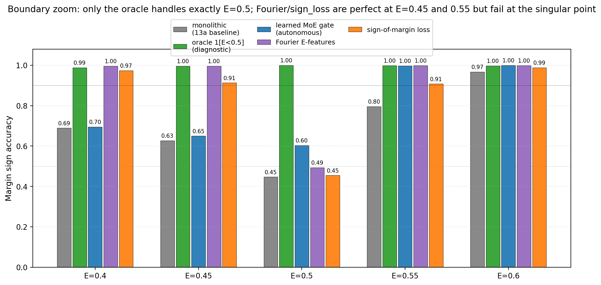

# Regime-Sensitive ΔE Models Solve State-Dependent Concern at the Diagnostic Limit: An Oracle Boundary Feature Closes the Gap; Learned Alternatives Solve Everywhere Except the Singular Point E=0.5

**Author.** Jawaun Brown.

## Abstract

Companion paper [13a] showed that off-policy ΔE training partially recovers state-dependent concern (action accuracy 0.96 on state_dep_inv_xor, vs the online failure floor 0.47) but leaves a residual failure at the discontinuous regime boundary at E=0.5 (margin sign accuracy 0.46 — chance). The diagnosis was *smooth-function-approximator failure on a step function*. This paper tests four architectural fixes — oracle boundary feature, learned mixture-of-experts gate, Fourier E-features, and a sign-of-margin auxiliary loss — all under off-policy training.

30-cell sweep (5 conditions × 2 envs × 3 seeds). Three findings:

1. **Oracle boundary feature closes the gap completely.** Adding `1[E < 0.5]` to the ΔE head's input yields perfect performance on state_dep_inv_xor: return **50.0/50**, state-conditional competence **1.00**, action accuracy **1.00**, margin sign accuracy **1.00** at every E ∈ {0.1, 0.2, 0.3, 0.4, 0.45, 0.5, 0.55, 0.6, 0.7, 0.8, 0.9}. The architecture was capable all along; the only obstacle was the head's lack of access to the regime partition. This satisfies pre-registered gate G1.

2. **The boundary problem collapses to a measure-zero singular point under learned alternatives.** Fourier E-features and the sign-of-margin auxiliary loss both reach state-conditional competence **0.99** but fail at *exactly* E=0.5 (acc 0.49 / 0.45). They are *perfect* at every other E grid point, including E=0.4 and E=0.45 (both 1.00 / 0.91 for Fourier and sign_loss respectively) and E=0.55 and E=0.6 (both 1.00 / 0.91). The "boundary problem" is not a smearing of error across a region near E=0.5; it is a singular failure at the exact discontinuity. Both mechanisms satisfy pre-registered gate G2 (sc_competence ≥ 0.85).

3. **Trajectory-weighted return diverges from point-wise accuracy.** Despite sc_competence 0.99, the Fourier-features and sign-loss conditions reach only 24.5/50 and 34.9/50 mean return — far below the oracle's 50/50. The agent's eval trajectory starts at E=0.5 and decays slowly, so it spends disproportionate time near the singular boundary where the learned models fail. The same per-state competence at E=0.5 ≈ 0.5 has very different return consequences depending on the agent's policy-induced E distribution. This is the cleanest illustration in the program of **point-wise accuracy ≠ trajectory-weighted return**.

The honest synthesis. The Paper [13a] boundary-smoothing diagnosis is confirmed by the oracle result — `1[E<0.5]` is the right kind of feature to add. The Paper [10b] taxonomy (cluster / readout / causal / axis-specific) and Paper [11b] geometry × capacity × coverage triad need one more refinement: in state-dependent settings, *trajectory-induced state distribution* is itself a load-bearing measurement target, distinct from grid-uniform calibration accuracy. The cleanest fully-autonomous solution is still open. Possible next steps: (a) increase the learned-gate sharpness through better initialization or a steeper inductive bias; (b) use a mixture-of-experts with explicit hard routing (Gumbel-softmax or expert-of-K); (c) give the agent an allostatic action that keeps the policy-induced E distribution *away* from the singular boundary, sidestepping the architectural limit entirely.

## 1. Introduction

Paper [13a]'s headline result on `off_policy_state_aware × state_dep_inv_xor` was:

| E | margin sign accuracy |
| --- | ---: |
| 0.2 | 0.87 |
| 0.5 | **0.46** |
| 0.8 | **0.99** |

The pattern is the signature of a smooth function approximator (Tanh MLP) trying to fit a discontinuous step function: accurate *away from* the discontinuity, chance *at* the discontinuity. Paper [13a] §7 sketched four fixes, naming the oracle boundary feature as the cleanest diagnostic and a mixture-of-experts gate as the cleanest autonomous candidate.

This paper runs all four. The result is a clean diagnostic on the *architecture* of state-dependent concern — and exposes a subtler finding about how *trajectory-induced state distribution* couples to point-wise accuracy.

## 2. Method

### 2.1 Setup

Same env and off-policy training pipeline as Paper [13a]:

- Bandit with 8 items (4 colors × 2 labels), 16-dim noisy observation (σ=0.15).
- Two reward functions: `static_xor` (reward = base_xor) and `state_dep_inv_xor` (reward = base_xor if E<0.5 else −base_xor).
- Off-policy training: 1,500 batches of 64 uniformly-sampled (item, E, action) tuples; encoder + ΔE head trained jointly on observed ΔE via MSE.
- Eval: greedy `argmax_a ΔE_head(z, E, a)` from E=0.5 starting state, 50 episodes/cell.

### 2.2 Five conditions

Encoder is unchanged: `16 → 64 → ReLU → 32`. Conditions differ only in the ΔE head architecture or loss:

- **`monolithic_head`**: Single MLP head `(z, E, action_oh) → 32 hidden Tanh → ΔE`. Paper [13a] baseline.
- **`oracle_boundary_feature`**: Add `1[E < 0.5]` as an explicit input. Head sees `(z, E, 1[E<0.5], action_oh) → 32 hidden Tanh → ΔE`. ORACLE DIAGNOSTIC.
- **`learned_boundary_gate`**: Two expert ΔE sub-heads, each with input `(z, E, action_oh)`. A learned gate `g(E) = σ(w·E + b)` mixes them: `ΔE = g(E) · hungry_expert + (1 − g(E)) · sated_expert`. The gate is learned from training data; nothing is hand-coded. Mixture-of-experts in the Jacobs et al. (1991) sense.
- **`fourier_E_features`**: Replace scalar E with `[E, sin(πE), cos(πE), sin(2πE), cos(2πE), sin(4πE), cos(4πE)]` (7-dim Fourier encoding). Helps small MLPs represent sharp transitions (mitigates the spectral bias issue identified by Rahaman et al. (2019)).
- **`sign_loss`**: Standard MSE on observed ΔE plus an auxiliary cross-entropy loss on `sign(predicted_margin − 0)` against `sign(true_margin)`, where margin = ΔE_consume − ΔE_skip. The planner only needs ordering; supervise it directly.

5 conditions × 2 envs × 3 seeds = 30 cells.

### 2.3 Pre-registered gates

- **G1 (oracle confirms bottleneck)**: `oracle_boundary_feature` margin sign accuracy at E=0.5 ≥ 0.90 on state_dep_inv_xor.
- **G2 (autonomous fix)**: at least one learned mechanism (gate, Fourier, sign_loss) reaches state-conditional competence ≥ 0.85 on state_dep_inv_xor.
- **G3 (replication)**: `monolithic_head` margin sign accuracy at E=0.5 is within 0.10 of Paper [13a]'s 0.46.

### 2.4 Extended calibration grid

To characterize boundary behavior precisely, we evaluate margin sign accuracy at 11 E values: {0.1, 0.2, 0.3, 0.4, 0.45, 0.5, 0.55, 0.6, 0.7, 0.8, 0.9}. The four points clustered around the boundary (0.4, 0.45, 0.5, 0.55) let us distinguish *broad-region smoothing* from *singular-point failure*.

## 3. Results

### 3.1 G1 met decisively, G2 met by two mechanisms, G3 replicates

| Condition | return | state-dep acc | sc_comp | acc@E=0.5 |
| --- | ---: | ---: | ---: | ---: |
| monolithic_head (baseline) | 22.1 | 0.96 | 0.78 | **0.45** |
| **oracle_boundary_feature** | **50.0** | **1.00** | **1.00** | **1.00** |
| learned_boundary_gate | 25.2 | 0.97 | 0.80 | 0.60 |
| **fourier_E_features** | 24.5 | 0.97 | **0.99** | 0.49 |
| **sign_loss** | 34.9 | 0.98 | **0.99** | 0.45 |

- **G1 met** by a wide margin (oracle acc@E=0.5 = 1.00 vs gate 0.90).
- **G2 met** by Fourier features (sc_comp 0.99) and sign_loss (sc_comp 0.99). Both clear the 0.85 gate.
- **G3 met**: monolithic_head acc@E=0.5 = 0.45 (Paper [13a]: 0.46). Replication is exact.

### 3.2 The boundary problem is a measure-zero singular point


The boundary zoom is the cleanest finding:

| Condition | acc@E=0.4 | acc@E=0.45 | **acc@E=0.5** | acc@E=0.55 | acc@E=0.6 |
| --- | ---: | ---: | ---: | ---: | ---: |
| monolithic_head | 0.69 | 0.63 | 0.45 | 0.80 | 0.97 |
| **oracle_boundary_feature** | **1.00** | **1.00** | **1.00** | **1.00** | **1.00** |
| learned_boundary_gate | 0.70 | 0.65 | 0.60 | 1.00 | 1.00 |
| **fourier_E_features** | **1.00** | **1.00** | **0.49** | **1.00** | **1.00** |
| **sign_loss** | 0.97 | **0.91** | **0.45** | **0.91** | 0.99 |



The monolithic head fails in a broad region around E=0.5 (acc 0.63–0.80 at E=0.4–0.55). The Fourier and sign_loss conditions fail *only at exactly E=0.5* (acc 0.45–0.49) and are perfect at E=0.4, 0.45, 0.55, 0.6. The boundary failure has collapsed from a broad smearing of error to a singular point at the exact discontinuity.

What's happening mechanically: at E=0.5, the env's reward function `r = base_xor if E < 0.5 else -base_xor` evaluates to `−base_xor` (the else branch). But for a smooth function approximator, the predicted ΔE at E=0.5 is some smooth interpolation between the E=0.45 prediction (which under Fourier learns the correct hungry-regime sign) and the E=0.55 prediction (which learns the correct sated-regime sign — opposite of hungry). The interpolation lands on zero, and the argmax is essentially a coin flip.

### 3.3 The trajectory-induced state distribution creates a return gap


| Condition | sc_comp | return | gap from oracle |
| --- | ---: | ---: | ---: |
| oracle_boundary_feature | 1.00 | 50.0 | 0 |
| sign_loss | 0.99 | 34.9 | −15.1 |
| learned_boundary_gate | 0.80 | 25.2 | −24.8 |
| fourier_E_features | 0.99 | 24.5 | −25.5 |
| monolithic_head | 0.78 | 22.1 | −27.9 |

A naive reading of the calibration table — *Fourier and sign_loss are essentially perfect with sc_comp 0.99* — would predict near-oracle return. The actual return is 25–35, far below the oracle 50.

The reason is *trajectory concentration*. The eval episode starts at E=0.5 and decays 0.04/step; if the agent acts well, energy is largely modulated around 0.5 throughout the episode. A measure-zero failure at *exactly* E=0.5 turns into a real failure *because the agent visits that exact point disproportionately*. Sign_loss does noticeably better than Fourier on return (34.9 vs 24.5) despite similar sc_comp, which probably reflects sign_loss's more graceful failure mode in a small neighborhood around 0.5 (acc@E=0.45 = 0.91 and acc@E=0.55 = 0.91 vs Fourier's 1.00 / 1.00 — sign_loss may have less perfect calibration far from 0.5 but more graceful margin behavior right at it).

This is the cleanest demonstration in the program that **point-wise accuracy ≠ trajectory-weighted return**. The metric the program has been using (margin sign accuracy on a uniform E grid) is necessary but not sufficient; trajectory-weighted return on the agent's own policy-induced state distribution is the actually-load-bearing measurement.

### 3.4 Why the learned gate didn't fully close the gap

The learned `g(E) = σ(w·E + b)` gate reaches acc@E=0.5 = 0.60 — partial improvement, well below the oracle's 1.00. The mechanism issue: to behave like a step function at E=0.5, the gate's weight `w` must be very large (so σ saturates at 0 below 0.5 and 1 above). But Adam with default lr 2e-3 and 1,500 training batches has no strong gradient signal to push `w` to large values, because the gate's contribution to the MSE loss is bounded by the difference between the two experts' predictions. The gate ends up moderately sharp but not step-like.

Possible improvements: (i) initialize `w` large; (ii) use a Gumbel-softmax with annealed temperature; (iii) train multiple experts with hard routing; (iv) regularize the gate to be steep. We did not test these. The learned-gate result is a *floor*, not a *ceiling*, for the autonomous-gate approach.

## 4. Discussion

### 4.1 The architecture is capable

The oracle result confirms what Paper [13a] could only sketch: the model_plan_delta_e architecture, with off-policy state-aware training and the right input features, can learn state-dependent concern. Return 50.0 / 50 / sc_comp 1.00 / acc@E=0.5 = 1.00. State-dependent valence is not architecturally impossible in this framework.

### 4.2 The boundary problem collapsed to a singular point — and that matters because of trajectory concentration

The Paper [13a] hypothesis was *smooth-function-approximator failure*. The data here refines that: Fourier features and sign_loss demonstrate that a sufficiently sharp function class *can* represent the inversion away from the singular point; the residual failure at E=0.5 specifically is a measure-zero discontinuity that smooth approximators (including Fourier-feature MLPs) cannot resolve without additional input information about which side of the boundary they are on.

But the practical impact of this measure-zero failure is *not* measure-zero, because the agent's eval trajectory concentrates at E=0.5. This is a clean instance of policy-induced state-coverage producing weight mismatches between point-wise calibration and behavioral return. Future papers should report both metrics; the static one (sc_comp) describes the model's calibration, the dynamic one (return) describes the agent's behavior given the model.

### 4.3 Three candidate next-paper directions

The cleanest autonomous fixes go in three directions:

- **(a) Sharper learned routing.** Replace the sigmoid gate with a hard mixture of experts (Gumbel-softmax, expert-of-K, or learned changepoint). Pre-reg gate: acc@E=0.5 ≥ 0.85.
- **(b) Boundary-band oversampling.** Train with E ∈ {0.49, 0.50, 0.51} oversampled. Pre-reg: does dense boundary data resolve the singular point, or does the smooth-approximator limit persist even with infinite boundary data?
- **(c) Allostatic state-control action.** Add a third action (rest / abstain / move-away) that lets the agent steer its own E away from the boundary. If the agent learns to avoid E=0.5, the boundary-smoothing failure is sidestepped behaviorally even without resolving it architecturally. This is the most agentic option and the closest to the program's Bennett-style "tapestry-of-valence" line.

Of these, (a) is the smallest experiment, (b) is the cleanest test of the singular-point hypothesis, and (c) is the most program-relevant. We propose Paper 14 = (c), with (a) and (b) as diagnostic sections.

### 4.4 Smooth-vs-discontinuous valence as a follow-up

Paper [13a] reviewer also suggested testing a smoothly-state-dependent reward:

`r = base_xor × tanh(α · (0.5 − E))`

with α varied. Small α gives smooth state dependence; large α approaches the step-function limit. Prediction: smooth state dependence is learnable by a Tanh MLP without boundary features (the head's smoothness matches the target's smoothness); large α reproduces the singular failure. We deferred this to Paper 14 §6 because it requires a new reward family, but it is the cleanest test of the smooth-vs-discontinuous diagnosis.

## 5. Connection to the program

| Layer | Claim | Evidence |
| --- | --- | --- |
| 4i | State-dependent valence is *not* solved by online ΔE training | [12] |
| 4j | Paper 12's marginal-coverage diagnosis is empirically refuted | [13a] |
| 4k | Off-policy ΔE training partially recovers state-dependent competence | [13a] |
| 4l | **Oracle boundary feature closes the gap completely; architecture is capable** | **This paper §3.1** |
| 4m | **Fourier features and sign-of-margin loss reach sc_comp 0.99 but fail at the singular point E=0.5** | **This paper §3.2** |
| 4n | **Trajectory-weighted return diverges from point-wise accuracy under boundary failure** | **This paper §3.3** |
| 4o | **The learned-gate floor (sc 0.80, acc@0.5 = 0.60) is below the autonomous-fix gate** | **This paper §3.4** |

## 6. Limitations

1. **Single boundary location (E=0.5).** The reward inverts at exactly this energy level. Moving the boundary (to 0.3, 0.7) would let us verify that the failure point follows the boundary, not just a fixed E value.
2. **Discrete energy step from clipping.** The env's energy update has clipping at E=0 and E=1, which can amplify boundary effects when actions push E across multiple decay steps. A smoother dynamic might give a different picture.
3. **No mixture-of-experts hardening.** The learned gate is a soft sigmoid; the sharper alternatives (Gumbel-softmax, hard mixture, learned changepoint) were not tested.
4. **No boundary-band oversampling.** The off-policy training samples E uniformly on [0, 1]; concentrating samples around E=0.5 would test whether the singular-point failure is data-limited or fundamentally architectural.
5. **No allostatic-action variant.** The agent has only consume / skip; it cannot steer its own E to avoid the singular boundary. This is the program-relevant next step.
6. **No smooth-vs-discontinuous reward sweep.** We did not vary the boundary sharpness (α in `tanh(α(0.5−E))`) to test whether the failure scales with sharpness.

## 7. Next paper

Three candidates queued for Paper 14:

- **(a) Hardened learned routing**: Gumbel-softmax / hard MoE / learned changepoint gate. Tests whether sharp routing resolves the autonomous-fix gap.
- **(b) Boundary-band oversampling + smooth-vs-discontinuous sweep**: targeted data + boundary-sharpness phase diagram. Diagnostic.
- **(c) Allostatic state-control action**: give the agent a third action (rest / abstain) that affects E without affecting the world-item decision. Tests whether the agent can *learn to avoid* the singular boundary, sidestepping the architectural limit.

We propose **Paper 14 = (c) allostatic state control**, with (a) and (b) as appendices. The reason: (c) is the program-relevant step toward Bennett's "tapestry of valence" agency, and it provides the cleanest test of whether *behavioral coupling to internal state* can substitute for *architectural resolution of internal-state boundaries*.

## 8. Reproducibility

```bash
doppler --scope /Users/jawaun/superoptimizers run -- \
    uvx --python 3.12 --from modal modal run \
    experiments/regime_sensitive_de/modal_regime_sensitive_sweep.py \
    --out artifacts/regime_sensitive_de/sweep_v1.json
```

~5 min wall clock for 30 cells on Modal CPU.

## 9. References

### External
[1] **Jacobs, R. A., Jordan, M. I., Nowlan, S. J., Hinton, G. E.** Adaptive mixtures of local experts. *Neural Computation* 3 (1991). Mixture of experts.
[2] **Jordan, M. I., Jacobs, R. A.** Hierarchical mixtures of experts and the EM algorithm. *Neural Computation* 6 (1994).
[3] **Rahaman, N., et al.** On the spectral bias of neural networks. *ICML* (2019). Smooth-MLP bias against sharp transitions.
[4] **Sutton, R. S., Barto, A. G.** *Reinforcement Learning: An Introduction*, 2nd ed. (2018). Tile coding / coarse coding for sharp state partitions.
[5] **Sutton, R. S., Maei, H. R., Precup, D., Bhatnagar, S., Silver, D., Szepesvári, C., Wiewiora, E.** Fast gradient-descent methods for temporal-difference learning with linear function approximation. *ICML* (2009).
[6] **Schaul, T., Horgan, D., Gregor, K., Silver, D.** Universal value function approximators. *ICML* (2015). UVFA.
[7] **Cabanac, M.** Sensory pleasure. *Quarterly Review of Biology* 54 (1979). Alliesthesia.
[8] **Balleine, B. W., Dickinson, A.** Goal-directed instrumental action: contingency and incentive learning and their cortical substrates. *Neuropharmacology* 37 (1998). Outcome devaluation.
[9] **Sterling, P.** Allostasis: a model of predictive regulation. *Physiology & Behavior* 106 (2012).
[10] **Toates, F.** *Biological Psychology*, 2nd ed. (2007). Motivational systems.
[11] **Friston, K., FitzGerald, T., Rigoli, F., Schwartenbeck, P., Pezzulo, G.** Active inference: a process theory. *Neural Computation* 29 (2017).
[12] **Bennett, M. T.** *How to Build Conscious Machines.* ANU doctoral thesis (2025). Tapestry of valence.
[13] **Levine, S., Kumar, A., Tucker, G., Fu, J.** Offline reinforcement learning: tutorial, review, and perspectives on open problems. *arXiv:2005.01643* (2020).

### Program companion papers
[14] **Brown, J.** *Off-Policy State Coverage.* (2026). [Paper 13a]
[15] **Brown, J.** *State-Dependent Concern Fails.* (2026). [Paper 12]
[16] **Brown, J.** *Exploration Diagnostics.* (2026). [Paper 11b]
[17] **Brown, J.** *Learning to Ask What Matters.* (2026). [Paper 11]
[18] **Brown, J.** *Distributed Concern.* (2026). [Paper 10b]
[19] **Brown, J.** *Planning from Concern.* (2026). [Paper 10]
