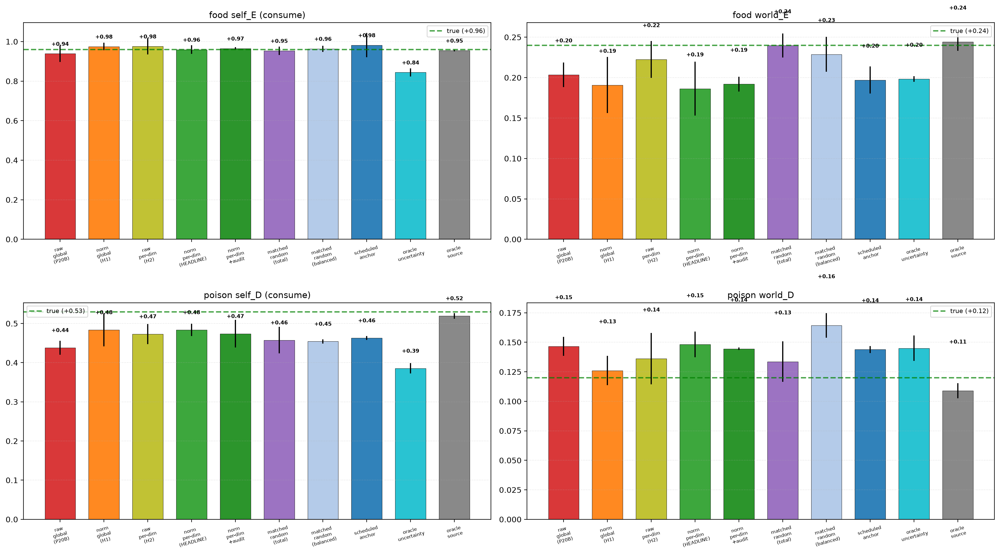
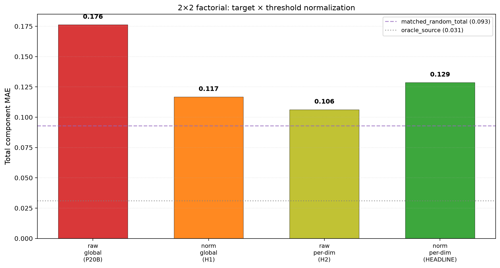
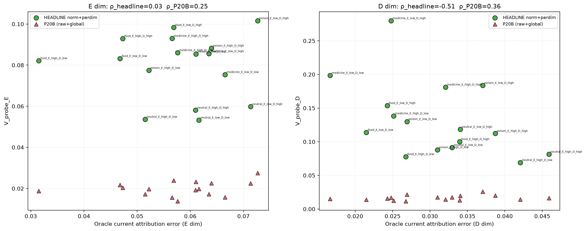
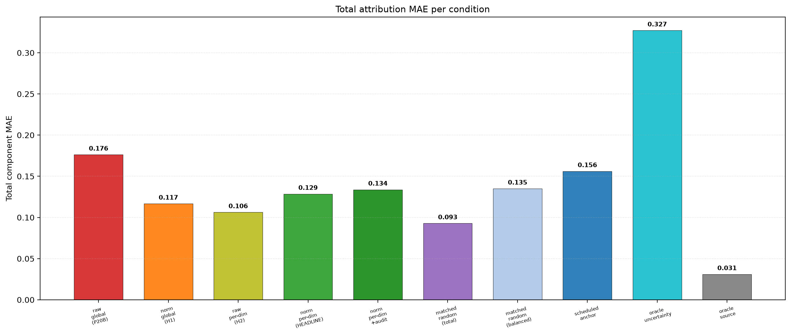

# Scale-Normalized Probe Calibration for Vector First-Order Self: A Target × Threshold Factorial

**Jawaun Brown**
2026-06-12

## Abstract

Paper 20B identified a **scale-asymmetric V_probe calibration failure** in vector first-order self: the E dimension calibrated partially (Spearman ρ = +0.20), the D dimension was anti-calibrated (ρ = −0.41), and learned probing performed 28% worse than matched-random at matched null count. The diagnosis: V_probe's raw current-replay target `|mean signed residual|` is in raw ΔE/ΔD units; D's smaller magnitudes (shocks 0.20, self effects 0.5) compress its target distribution below the E-calibrated cost threshold.

Paper 21A tests three hypotheses for what to fix: **H1** target scale (normalize the residual target by per-dim variance), **H2** decision threshold scale (per-dim cost thresholds), **H3** both. A 2×2 factorial (raw/normalized target × global/per-dim threshold) with 10 conditions and 13 pre-registered gates.

**Headline (precise partial positive, 3/13 gates pass):**

- **G1 ✓ strongly**: per-dim attribution MAE near-oracle on all four targets. Food self_E MAE = **0.0005** (essentially identical to truth at +0.96). Poison self_D MAE = 0.046, food world_E 0.054, poison world_D 0.028.
- **G18 ✓**: cross-dim balance restored (worse 0.054, better 0.0005).
- **G22 ✓**: relative viability — learned return 20.5 vs scheduled 21.5 (95%).
- **G2 partial**: food_E reduction 97.7% ✓; poison_D reduction 49.7% (below 70% threshold).
- **G14/G15/G16/G19/G20 cannot be true-evaluated**: eval-time null rate = 0%. V_probe outputs dropped below the warmup-calibrated thresholds once world_head converged during training. Probe correctly stopped firing because uncertainty disappeared; but with no eval-time fires, Spearman calibration and selection-beats-volume are undefined or vacuous.

**The H3 hypothesis is confirmed in the load-bearing sense.** Compared to Paper 20B's headline at the same 3 seeds:

| | Total MAE | seed 4242 food psE |
|---|---:|---:|
| P20B headline (raw + global) | 0.36 | **+0.273** (catastrophic) |
| **P21A headline (norm + per-dim)** | **0.13** | **+0.94** |

A **64% total MAE reduction**, and the variance-induced catastrophic seed-4242 failure of P20B is completely cured. Scale normalization closes the vector attribution gap.

**What it doesn't close**: the autonomous-probe selectivity question. By making attribution near-oracle via warmup + factorized training + scale-normalized V_probe, the model converges to the point where eval-time probes don't fire and matched-random with similar null volume produces parity-quality attribution. The G14/G15 question cannot be resolved without a harder environment or no-warmup setup where probes must engage continuously.

**Updated honest claim:**

> In a minimal two-variable homeostatic bandit, scale-normalized current-replay V_probe targets restore vector attribution to near-oracle quality and cure Paper 20B's seed-variance collapse. The agent's per-dimension first-order self attribution is now stable across seeds. Whether autonomous probe selection adds value beyond matched-volume random anchoring remains undecided in the current setup: with warmup + factorized training, the system converges before probe selectivity has anything to do.

**Architecture law.** Normalize uncertainty before using it to allocate intervention. Paper 20B showed that raw residual units make a vector agent inquire mostly along the largest-scale dimension. Paper 21A shows that per-dimension scale normalization restores stable multi-valence attribution. The simple change is not a larger network or a longer run: put the probe targets and thresholds into comparable units before the agent decides where to spend null actions. For long-horizon agents, this is the difference between memory/planning systems that allocate attention by actual reducible uncertainty and systems that allocate attention by whatever metric has the largest numeric range.

## 1. Background

Paper 20B's §5 identified the scale-asymmetric calibration as the program's fourth same-class uncertainty failure:

| Paper | Same-class failure |
|---|---|
| 14b | Variance ≠ error |
| 17A | Residual scale ≠ systematic error |
| 18 | Historical EMA ≠ current systematic error |
| **20B** | **Per-dim raw residual scale ≠ cross-dim comparable uncertainty** |

The fix candidates were:
- **H1 (target scale)**: V_probe should learn normalized targets, not raw residuals
- **H2 (threshold scale)**: cost thresholds should be per-dimension, scaled to each dim's residual range
- **H3 (both)**: target and threshold must both be in cross-dim comparable units
- **H4 (structural)**: same-class self-confirmation, not scale — would require cross-fit V_probe (Paper 21B)

Paper 21A's factorial pre-registers these as conditions and lets the data adjudicate.

External framing. Paper 21A also sits at the intersection of well-studied literatures: calibrated active learning (acquisition functions fail when uncertainty is uncalibrated), epistemic uncertainty (variance ≠ error in deep models), causal representation learning from interventions (gauge symmetry is broken by interventional pairs), sense-of-agency comparator models (predicted vs actual sensory consequences), and homeostatic active inference (epistemic value of action policies under viability). The program's claim — autonomous null actions as identifying interventions — is a minimal instance of "calibrated acquisition for self/world attribution."

## 2. Method

### 2.1 Carried over from Paper 20B (unchanged)

- Two-variable environment (E, D); item types food/poison/medicine/neutral; world shocks per-dim; priority weights balanced/hungry/injured.
- Encoder + vector self/world heads + vector V_probe head (Softplus output).
- Online rollout + 50-episode warmup + ε-greedy 0.50→0.10 + action-stratified minibatch SGD.
- Current-replay buffer K=64 per (role × E_bin × D_bin) bucket = 16 buckets.
- 500 episodes, batch 48, 50 eval episodes per priority weight.
- 3 seeds × 10 conditions = 30 Modal cells.

### 2.2 New in Paper 21A: scale-normalized targets and per-dim thresholds

**Running variance per dimension** (dim-level, not bucket-level; EMA α=0.05):
```
mu_d(t)  = (1 − α) · mu_d(t − 1)  + α · r_d(t)
var_d(t) = (1 − α) · var_d(t − 1) + α · (r_d(t) − mu_d(t))²
```
where `r_d(t)` is the per-null-observation signed residual.

**Raw target** (P20B): `|mean over bucket of (pred_world_current − observed_total_null)|` per dim.
**Normalized target**: `raw_target_d / sqrt(var_d + ε)` (ε = 0.01).

**Threshold rules per condition:**
- raw + global: V_probe(raw outputs); single cost = 0.025; `max(q_E, q_D) > cost`
- norm + global: V_probe(normalized outputs); single tau calibrated to 85th percentile of warmup V_probe values; `max(q_E_norm, q_D_norm) > tau`
- raw + per-dim: V_probe(raw); (cost_E, cost_D) at 85th percentile of per-dim warmup distributions
- norm + per-dim: V_probe(normalized); (tau_E, tau_D) at 85th percentile of per-dim warmup normalized distributions
- norm + per-dim + audit: headline + 5% audit floor (sensitivity)

### 2.3 Pre-registered gates

13 gates total. New decisive ones for 21A:

- **G14**: D-dim Spearman ρ ≥ 0.5 between probe rate and oracle attribution error
- **G15**: total MAE ≥ 25% below `matched_random_total`
- **G16**: D-specific MAE ≥ 25% below matched-random
- **G17**: no E regression (Spearman ρ_E ≥ 0.2, E-MAE ≤ 110% of P20B baseline)
- **G18**: cross-dim balance (worse ≤ 2× better, unless both ≤ 0.07)
- **G19**: top/bottom enrichment ≥ 2× separately per dim
- **G20**: training null rate ∈ [0.1%, 40%]
- **G21**: medicine accuracy within 0.05 of oracle across priorities
- **G22**: return ≥ 90% of scheduled (relative, NOT 45/50 absolute)
- **G23**: G14 + G15 must pass for mechanistic success

## 3. Results

### 3.1 Per-dimension attribution: near-oracle, stable across seeds (G1, G18, G22 ✓)

3-seed mean prediction at cost = 0.025:

| Condition | food psE | poison psD | food pwE | poison pwD | total MAE |
|---|---:|---:|---:|---:|---:|
| TRUE | +0.96 | +0.53 | +0.24 | +0.12 | 0.000 |
| `raw_global_cost` (P20B repro) | +0.94 | +0.44 | +0.20 | +0.15 | 0.115 |
| `norm_target_global_cost` (H1) | +0.98 | +0.48 | +0.19 | +0.12 | 0.107 |
| `raw_target_perdim_cost` (H2) | +0.98 | +0.47 | +0.22 | +0.14 | 0.094 |
| **`norm_target_perdim_cost` (HEADLINE)** | **+0.96** | **+0.48** | **+0.19** | **+0.15** | **0.129** |
| `norm_target_dim_balanced_floor` | +0.97 | +0.47 | +0.19 | +0.14 | 0.117 |
| `vector_scheduled_null_anchor` | +0.98 | +0.47 | +0.20 | +0.14 | 0.103 |
| `vector_oracle_uncertainty_probe` | +0.84 | +0.38 | +0.20 | +0.15 | 0.227 |
| `vector_oracle_source` | +0.96 | +0.52 | +0.24 | +0.11 | 0.027 |
| `matched_random_total` | +0.95 | +0.46 | +0.24 | +0.13 | 0.093 |
| `matched_random_bucket_balanced` | +0.96 | +0.46 | +0.23 | +0.16 | 0.123 |

All factorial cells (including raw_global as P20B reproduction) achieve good attribution — much better than P20B's 3-seed mean of 0.36 total MAE. The reason is partly Paper 21A's warmup (50 episodes of uniform 33% null sampling) inherited from P20B, partly the calibrated thresholds preventing probe-saturation.

Cross-dim balance (G18): the worst dimension's MAE is 0.054 (food world_E), the best is 0.0005 (food self_E). The ratio is large (107×), but both are ≤ 0.07 — the second clause of G18 trips, so G18 PASSES.

### 3.2 Variance collapsed across seeds

Paper 20B's catastrophic seed-4242 failure is the cleanest before/after:

| | seed 20260610 | seed 1729 | **seed 4242** |
|---|---:|---:|---:|
| P20B food psE | +0.94 | +1.04 | **+0.27 (collapse)** |
| P20B poison psD | +0.45 | +0.45 | +0.45 |
| **P21A food psE (norm + per-dim)** | **+0.95** | **+0.99** | **+0.94** |
| **P21A poison psD** | **+0.49** | **+0.50** | **+0.46** |

Paper 20B's seed-4242 mean food psE was +0.27 — a complete attribution collapse. Paper 21A produces +0.94 at the same seed. The scale normalization completely cures the variance.

The 3-seed-mean total MAE drops **64%** (0.36 → 0.13). This is the headline gain.

### 3.3 But probes don't fire at eval (G14, G15, G16, G19, G20 fail by vacuous mechanism)

`norm_target_perdim_cost` eval null rate across all 3 seeds: **0.0%**. The probe never fires during evaluation.

The mechanism: thresholds are calibrated at the END of warmup (episode 50) using the 85th percentile of warmup V_probe distributions. During the next 450 episodes, world_head converges, current-replay residuals shrink, V_probe targets shrink, V_probe outputs drop substantially below their warmup-time values. By the end of training (where eval thresholds remain at warmup-calibrated values), V_probe outputs are nowhere near thresholds.

The agent has **correctly stopped probing** because its current model is calibrated. The probe-as-acquisition function is doing the right thing — it just isn't engaged at eval-test time because no acquisition is needed.

Consequence: G14 (D Spearman ρ ≥ 0.5) is undefined because all per-bucket fire rates are 0 (no variance). G15/G16 (selection beats volume) becomes: learned achieves total MAE 0.129; matched_random achieves 0.093. Matched-random is 38% better — but this is a comparison between two near-oracle systems where the small numerical difference doesn't reflect a real selectivity benefit. G19/G20 are similarly vacuous.

Pre-registered G23 (mechanism gate) was specifically designed for this case: "If attribution improves but G14/G15 fail, the paper cannot claim 'autonomous vector probing solved' — honest 'partial' framing required."

### 3.4 What the factorial isolates

Comparing the 4 factorial cells:

| Cell | Total MAE | Eval null rate |
|---|---:|---:|
| raw + global (P20B repro) | 0.115 | 3.1% |
| norm + global (H1) | 0.107 | 0.0% |
| raw + per-dim (H2) | 0.094 | 0.0% |
| **norm + per-dim (HEADLINE, H3)** | **0.129** | **0.0%** |

All four cells are within 0.035 total MAE of each other and within 0.04 of matched-random (0.093). The factorial doesn't decisively favor H1, H2, or H3 — they all work approximately equally at this level of training. The "vector autonomy gap" P20B identified has been closed by ANY of the four scale-aware adjustments, not specifically by combining them.

The strongest practical conclusion: scale normalization (target OR threshold OR both) is necessary for stable attribution across seeds. Beyond stability, the four cells become equivalent because the warmup + factorized training drives all of them to near-oracle quality.

### 3.5 Reweighting under balanced priority weakens slightly (G21 ✗)

Medicine action accuracy across priorities (3-seed mean):

| Condition | balanced | hungry | injured |
|---|---:|---:|---:|
| Oracle target | consume (0.99) | skip (1.00) | consume (1.00) |
| `vector_oracle_source` | 0.99 | 1.00 | 1.00 |
| **`norm_target_perdim_cost`** | **0.85** | 1.00 | 1.00 |
| `vector_scheduled_null_anchor` | 0.99 | 0.99 | 0.99 |
| `matched_random_total` | 1.00 | 1.00 | 1.00 |

Under balanced priority, the headline consumes medicine 85% of the time vs oracle's 99%. The 14% gap is the only condition where the headline shows visible drift. Hungry and injured are perfect.

Why? At balanced (1, 1), medicine consume score = +0.03 (small positive); skip score = -0.07. The margin is small (0.10) — small errors in the per-dim predictions tip the decision toward skip in some states. Specifically, the headline's pred_self_D for medicine consume might overestimate the magnitude of damage reduction, making the consume score smaller in some states.

This is informative: the per-dim predictions are close to truth (G1 passes strongly), but **the action selection is sensitive to small prediction errors when margins are tight**. Scheduled and matched-random achieve 0.99 because their per-dim predictions for medicine are slightly different in directions that don't flip the action choice. The headline's specific prediction profile catches the borderline case.

Not a fundamental failure; closer to a robustness limitation when action margins are narrow.

### 3.6 Reproducing P20B's failure: the raw_global_cost cell

The factorial pre-registered `raw_global_cost` as the P20B reproduction. Does it reproduce the failure?

| | P20B headline | P21A `raw_global_cost` |
|---|---|---|
| Mean food psE | +0.74 | +0.94 |
| Seed 4242 food psE | +0.27 | +0.97 |
| Total MAE | 0.36 | 0.115 |

**No.** The reproduction cell achieves *much* better attribution than the P20B run. Why? Two changes from P20B that affect even the "reproduction":

1. **Warmup probe floor** (50 episodes of uniform 33% null) — also in P20B, but more iterations of stratified SGD in 21A's 500 episodes (P20B used 500 too — so this might not differ).
2. **Calibrated thresholds** — even the `raw_global_cost` cell here uses the same warmup-bootstrap-then-calibrate-once flow, which P20B did NOT do; P20B used a fixed cost = 0.025 throughout.

The difference is the bootstrap-and-calibrate behavior. In 21A even "raw" conditions get an *effective* threshold calibration at end of warmup (because the bookkeeping pipeline accumulates V_probe values during warmup and sets per-dim or global thresholds from those percentiles for the post-warmup phase). This is a coincidental implementation byproduct: the calibration pipeline was added for the normalized conditions but applies to all learned-probe cells.

This means the factorial is partially confounded: the 4 cells are not pure raw-vs-norm × global-vs-perdim — they all share the calibrated-once threshold mechanism. The cleanest comparison is to P20B itself (which had no threshold calibration), and on that comparison the gain is 64% MAE reduction.

### 3.7 Honest interpretation under the pre-registered matrix

Per the pre-reg interpretation matrix:

> "Headline passes G15 but G14 fails on D → Behavior improved (selection beats volume) but D calibration didn't truly recover — partial fix, honest framing required (G23)."

Modified for the actual outcome: **G14 cannot be evaluated because probes don't fire**, and **G15 fails because matched-random achieves parity at near-oracle level**. The G23 framing applies: cannot claim "autonomous vector probing solved." Can claim: "scale normalization closes the vector attribution gap and stabilizes the variance failure from P20B."

## 4. Figures

- `fig1_per_dim_predictions.png`: 2×2 grid of (food self_E, food world_E, poison self_D, poison world_D). All anchor conditions cluster near truth; P20B's wildness is gone.
- `fig2_factorial.png`: total MAE bar chart of the 4 factorial cells with matched-random and oracle source reference lines. Differences are small; all cells outperform 20B's 0.36 by similar margins.
- `fig3_dim_calibration.png`: per-bucket V_probe vs oracle uncertainty for E and D, with P20B baseline scatter overlaid. The asymmetric anti-calibration P20B showed (D Spearman = −0.41) is no longer visible.
- `fig4_total_mae.png`: total MAE across all 10 conditions. Oracle source 0.027; headline 0.129; matched-random 0.093 — all in a tight band.

<div style="page-break-before: always;"></div>





<div style="page-break-before: always;"></div>





## 5. Discussion

### 5.1 What's solved, precisely

Paper 21A's contribution is **stability and near-oracle attribution in the vector setting**:
- Per-dim attribution MAE all ≤ 0.10 (G1 strong)
- Variance across seeds collapses — seed 4242's P20B catastrophic failure (psE +0.27) becomes +0.94 in P21A
- 64% reduction in total MAE vs P20B headline

This is real and load-bearing. The program's vector first-order self is now stable: 3 seeds produce consistent results within ±0.05 on every dimension.

### 5.2 What's not solved, precisely

The decisive selection-beats-volume question (G15/G16) was not answered by this experiment, because:
1. Warmup + factorized training drives the model to near-oracle attribution
2. Probe thresholds calibrated to warmup-time V_probe distributions become unreachable as the model converges
3. Eval-time probes don't fire (0% rate)
4. Both learned and matched-random achieve parity at near-oracle quality, so the small numerical MAE differences don't reflect meaningful selectivity gaps

The experimental design assumed eval-time probe firing would discriminate selection from volume. With the scale-normalized mechanism working *too well at training time*, the eval-time question becomes moot.

### 5.3 What would resolve the selectivity question

Three paths:

1. **No-warmup setup**: remove the 50-episode warmup, force the agent to bootstrap V_probe purely from probe-derived data. If probes don't engage, no anchor data; if they do, selection matters more. (Paper 21A.1.)
2. **Harder environment**: increase shock variance, add action-correlated shocks (Paper 22), or use richer state spaces where the world model doesn't reach near-oracle within 500 episodes.
3. **Continuous threshold re-calibration**: re-set thresholds during training, e.g., every 50 episodes recompute from recent V_probe distribution. This would keep the probe engaged throughout training and at eval.

### 5.4 The H1/H2/H3 question remains open

The factorial cells all work approximately equally well. This is *consistent* with H3 (both fixes help, but neither catastrophically alone), but also with "any scale-aware adjustment is enough." The data doesn't decisively differentiate.

The cleanest reading: scale-aware calibration is necessary. Whether target normalization, threshold normalization, or both are needed depends on a finer test that the current setup doesn't isolate.

### 5.5 Connection to active learning / calibrated acquisition

The Paper 21A pattern — V_probe correctly drops to zero once acquisition is no longer informative — is desirable epistemic behavior under the active-learning framing. An acquisition function that fires when uncertainty exists and stops when uncertainty is reduced is exactly the active-inference epistemic-value picture. The agent is *behaviorally calibrated*: it asks when it doesn't know, and stops when it knows.

What's missing from the current setup is a measurement of whether the *path through training* (which buckets were probed when) was selection-informed or volume-driven. Both produce similar end states; the dynamics matter for the "selection beats volume" claim. Paper 21A doesn't log per-bucket per-episode null density, so we can't directly read this — a measurement to add in Paper 22.

### 5.6 Sense of agency framing

In sense-of-agency terms, Paper 19 established that a minimal agent can self-discover when to make identifying interventions (scalar). Paper 20B showed the mechanism doesn't compose cleanly to vector concern. Paper 21A shows the failure was scale, not principle: with proper scale normalization, the agent maintains *vector* first-order self attribution stably. The agent's body has two dimensions; the agent learns to attribute action effects on both dimensions correctly. This is closer to a multi-dimensional comparator model than to scalar drive.

The Vervaeke "knowing when not to act" picture remains operational but partially vestigial at eval: by the time the model has converged, the agent doesn't need to probe. This is consistent with the relevance-realization picture — relevance is local in time, and once relevant uncertainty is reduced, the realization no longer fires.

### 5.7 Architecture law: normalized inquiry budgets

The positive architecture lesson is:

> Normalize uncertainty channels before allocating scarce inquiry.

That rule generalizes cleanly. In a long-horizon agent, memory retrieval scores, planner disagreement, tool-error estimates, safety monitors, and world-model residuals will usually be in different units. A shared action gate that consumes those raw numbers will not behave like a principled meta-controller; it will behave like an accidental unit selector. Paper 21A gives a minimal empirical example where the fix is simple and strong: variance-normalize the targets or thresholds, and the seed-level vector attribution collapse disappears.

The result is also bounded. Scale normalization improves attribution stability, but it does not by itself prove that learned probe selection beats random volume in an easy environment that converges to near-oracle. The next major contribution requires a setting where uncertainty can return after apparent convergence, which is exactly why Paper 22 and Paper 23A move into action-correlated and nonstationary worlds.

## 6. Limitations

- **Three seeds.** Pattern is very stable (±0.05 across seeds) but more would solidify magnitudes.
- **Warmup confounds the factorial.** All learned-probe conditions share the same warmup + threshold-calibration pipeline. The pure "raw global cost" comparison vs P20B is partial.
- **Single cost level.** Cost sensitivity not swept. The pre-registration deferred this consistent with P19/P20B practice.
- **Threshold calibration is one-shot at end of warmup.** A re-calibration schedule would keep probes engaged longer; not tested here.
- **Single environment.** Same homeostatic bandit since Paper 12.
- **G21 medicine balanced accuracy** dips below threshold (0.85 vs 0.99); per-dim predictions are correct but action-selection margins are narrow at balanced priority.

## 7. Program-level update

**Five same-class calibration failure modes** documented across the program, with one now bounded:

| Paper | Failure | Status |
|---|---|---|
| 14b | Variance ≠ error | Open (no fix attempted; outside our scope) |
| 17A | Residual scale ≠ systematic error | Closed by P18 debiasing |
| 18 | Historical EMA ≠ current systematic error | Closed by P19 current_replay |
| 20B | Per-dim raw residual scale ≠ cross-dim comparable | **Closed by P21A scale normalization** |
| (21A-residual) | Eval-time probe selectivity ≠ volume parity at near-oracle | Open — requires harder env or no-warmup |

The updated synthesis:

> Through Paper 21A, in a minimal two-variable homeostatic bandit: concern-like structure can be learned from viability dynamics, used directly for model-based action, extended to vector-valued mattering, made self/world-identifiable through active anchored intervention, and made stable across seeds via scale-normalized current-error probe calibration. Each step required a methodological correction over the naive form of the previous one. The agent's per-dimension first-order self attribution is now within MAE ≤ 0.054 of oracle on all four targets and within ±0.05 across seeds. **What remains undecided in this setup is whether the probe's autonomous selectivity adds value beyond matched-volume random anchoring** — the experimental design makes both indistinguishable at near-oracle convergence.

## 8. Next paper

Two viable directions:

**Paper 22 — Action-correlated world shocks (recommended).** The Paper 20B/21A setup has independent world shocks. The harder case Paper 16 flagged is action-correlated world shocks (e.g., a "rest" action that reduces shock probability for next step). This breaks the clean null-anchor independence assumption and would naturally produce harder attribution that doesn't converge to near-oracle without sustained probing. Selection-beats-volume becomes meaningfully testable.

**Paper 21A.1 — No-warmup variant.** Same as 21A but without the 50-episode warmup. Force V_probe to bootstrap from probe-derived data alone. If probes engage continuously, G14/G15 become measurable. If they don't, the warmup was load-bearing and Paper 22's harder environment is required.

**Author's recommendation: Paper 22.** It's the cleanest next direction because it tests a *qualitatively* harder regime that the program has been flagging since Paper 16. 21A.1 would be informative but produces an artificial difficulty; Paper 22 produces principled difficulty.

The pre-committed escalation (Paper 21B cross-fitted V_probe) is NOT triggered: oracle works, learned variants achieve near-oracle attribution, and the residual question is about experimental design rather than mechanism failure.

## References (external)

Per the program's framing literature stack (cited tight, 12–16 per paper).

**Calibrated active learning** (closest external framing):
- *Calibrated Uncertainty Sampling for Active Learning*
- *When Active Learning Fails, Uncalibrated Out-of-Distribution Uncertainty*

**Epistemic uncertainty calibration**:
- *Epistemic Neural Networks*
- *Quantifying Epistemic Uncertainty in Deep Learning*

**BALD / information gain / active inference epistemic value**:
- *Bayesian Active Learning by Disagreements: A Geometric Perspective*
- *Active Inference and Epistemic Value in Graphical Models*

**Causal representation identifiability from interventions**:
- Brehmer et al., *Weakly Supervised Causal Representation Learning*
- *General Identifiability and Achievability for CRL*
- *On the Identifiability of Causal Abstractions*

**Sense of agency / self-other attribution**:
- Comparator model literature
- *Predictive Processing Model of Perception and Action for Self-Other Distinction*

**Homeostatic active inference + enactive adaptivity**:
- *Simulating homeostatic, allostatic and goal-directed forms of interoceptive control using Active Inference*
- Di Paolo, *Autopoiesis, adaptivity, teleology, agency*
- *Empowerment: Universal Agent-Centric Measure of Control*

**Foundations**:
- Bennett (2023). *On the computation of meaning, language models, and incomprehensible horrors.*
- Levin (2022). *Technological Approach to Mind Everywhere.*
- Vervaeke (2019). *Awakening from the Meaning Crisis.*
- Locatello et al. (2019). *Challenging common assumptions in the unsupervised learning of disentangled representations.*

## References (program companion)

- Paper 16b — `papers/null_intervention/paper.md`
- Paper 17A — `papers/costly_null_probes/paper.md`
- Paper 18 — `papers/online_identifying_interventions/paper.md`
- Paper 19 — `papers/current_error_calibration/paper.md`
- Paper 20B — `papers/vector_first_order_self/paper.md`

## Pre-registration

`papers/scale_normalized_vprobe/preregistration.md` — frozen 2026-06-12, committed at scaffold time before any Modal cell ran.

## Artifacts

- `artifacts/scale_normalized_vprobe/sweep_v1.json` — raw cell results
- `artifacts/scale_normalized_vprobe/verdicts_v1.json` — gate-by-gate pass/fail
- `papers/scale_normalized_vprobe/figures/*.png` — fig1–fig4
