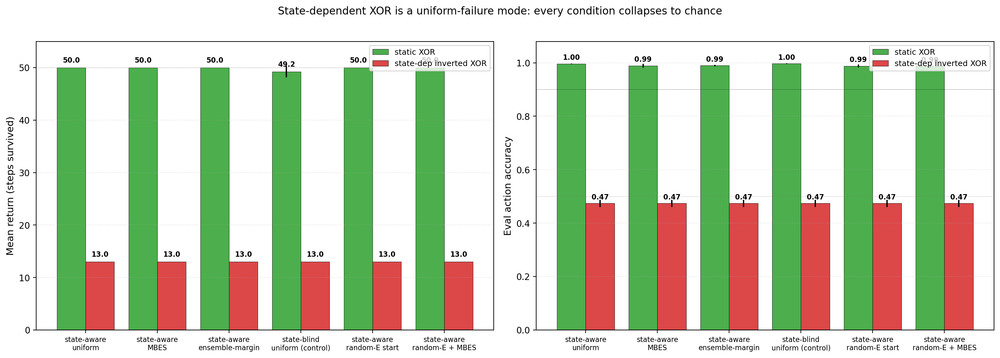
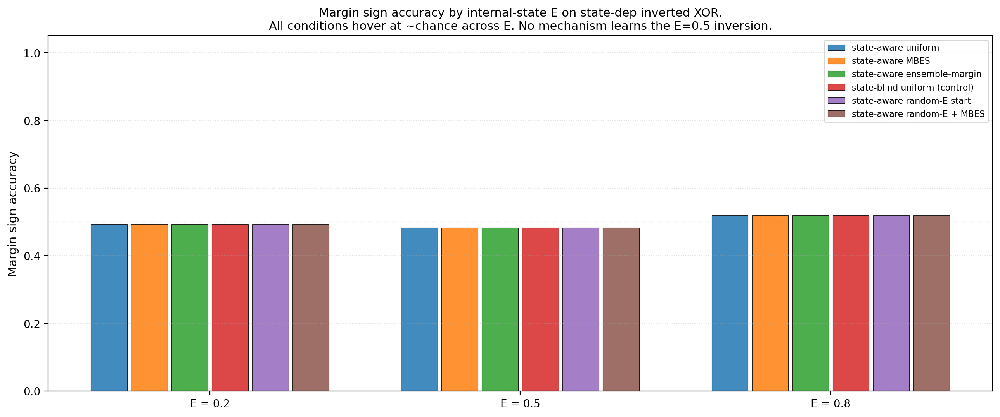
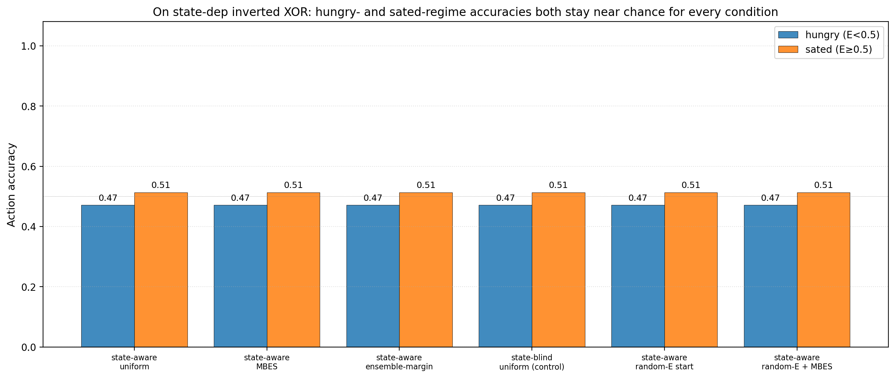

# State-Dependent Concern Fails Under Online Homeostatic Training: A Coupling Between Policy and Training Distribution

**Author.** Jawaun Brown.

## Abstract

Companion paper [11] established that the model_plan_delta_e pipeline ([10]) can self-organize concern-shaped competence under various exploration regimes. Companion paper [11b] tightened that result with calibration metrics and identified margin-based epistemic sampling (MBES) as the best autonomous mechanism. The natural Layer-4 conceptual next step — and the priority called out by all reviewers across [10, 10b, 11, 11b] — is *state-dependent valence*: the same sensory item should change role depending on the agent's internal viability state, instantiating the philosophical-spine claim that "meaning is geometry under concern" in its fully state-conditional form.

This paper reports a clean, uniform **negative result**. We test six conditions on a state-dependent reward function (inverted-XOR-above-half-energy) where the same item is food when hungry (E<0.5) and poison when sated (E≥0.5). All six conditions fail at the same chance level (return 13.0/50, action accuracy 0.47, margin sign accuracy at every E grid point ≈ 0.50), regardless of:

- whether the ΔE head sees the internal state (state_aware) or not (state_blind),
- whether exploration is uniform random, MBES, or K=2 ensemble-margin,
- whether episodes start at the default E=0.5 or at a uniform-random E ∈ [0.1, 0.9].

On the static XOR control, every condition reaches return 50/50 and accuracy ≥ 0.99 — the same architecture and training budget that succeeds on static is uniformly insufficient for state-dependent reward.

The diagnosis. State-dependent valence is not a representational problem or an exploration-mechanism problem; it is a **training-distribution coupling problem**. The agent's own homeostatic dynamics — episodes start at E=0.5, decay 0.04/step, terminate at E≤0 — produce training data that is dominated by low-E states. Once the agent makes a few wrong decisions in any episode, energy drops and the agent dies, so the ΔE head rarely sees high-E states *while consuming items that flip valence at E=0.5*. Random-E-start broadens the *initial* state distribution but does not survive the agent's own bad-decision dynamics: once collected at high E, the agent quickly drops to low E through wrong consume choices. The training distribution is *policy-coupled*, and a policy that hasn't yet learned the state-dependent inversion produces data that doesn't teach the state-dependent inversion. This is a closed-loop failure mode no exploration-of-current-policy mechanism can resolve.

Three findings:

1. **State-dependent valence is uniformly unsolved by online homeostatic ΔE training.** All six conditions converge to the same chance-level eval trajectory on state_dep_inv_xor.
2. **The failure is invariant under exploration mechanism.** MBES (the best mechanism from [11] / [11b]) does not help. Ensemble-margin K=2 (the [11b] follow-up suggestion) does not help. Random-E-start does not help.
3. **The diagnosis is policy-coupled training data.** The agent cannot learn to act correctly at high E because it never collects enough high-E data while making bad-but-corrigible decisions; once it makes a bad decision at high E, it dies. The natural fix is *off-policy training* — collect random (item, E, action, ΔE) tuples decoupled from the homeostatic episode dynamics and train the ΔE head on those. This is the natural Paper 13.

The honest synthesis. The Paper [11]/[11b] triad — geometry × capacity × coverage — needs a fourth term: **state-coverage**, which is *not* the same as action-coverage. Action-coverage can be solved by intrinsic exploration mechanisms; state-coverage in a homeostatic loop cannot, because the agent's policy is the dynamics that generate the states the head needs to learn from. The fix requires breaking the closed loop, not improving the action-selection rule.

## 1. Introduction

The Paper [11] reviewer noted:

> Paper 12 should not just ask whether reward roles are learned. It should ask whether the model learns a current-valence subspace … same sensory item moves clusters when internal state changes.

We test exactly this: a homeostatic bandit where the reward function `r(color, label, E)` inverts at E=0.5. Items with `base_xor(color, label) = +1` are food when hungry, poison when sated; items with `base_xor = −1` are the inverse. The optimal action depends on (item, internal state), not on item alone.

The expected outcome — based on Papers [10] and [11] — was that the state_aware_head_uniform condition (the model_plan_delta_e pipeline from [10] with the ΔE head taking `(z, E, action)` as input) would naturally handle state-dependent valence, since the head's E input gives it the information it needs to flip the predicted ΔE sign at E=0.5. The state_blind_head_uniform control (head sees only `(z, action)`, no E) was the falsification condition: it cannot in principle handle state-dependence.

Both predictions are *partially* correct: the state-aware head can in principle handle state-dependence, but in practice it does not, because the training distribution doesn't contain enough informative (item, E, action) coverage.

## 2. Method

### 2.1 Environment

Same homeostatic bandit as Papers [7–11b]. 16-dim obs, σ=0.15 noise, T_max=50, decay δ=0.04. Two reward functions:

- **static_xor**: `r = base_xor(color, label)` — the Paper [11] env.
- **state_dep_inv_xor**: `r = base_xor(color, label)` if `E < 0.5` else `-base_xor(color, label)`.

In state_dep_inv_xor, an item with `base_xor = +1` is +1 reward when E<0.5 (consume is good) and −1 reward when E≥0.5 (consume is bad). The flip is sharp at E=0.5.

### 2.2 Conditions

| Condition | ΔE head input | Exploration | Initial E |
| --- | --- | --- | --- |
| `state_aware_head_uniform` | (z, E, action_oh) | uniform random | 0.5 |
| `state_aware_head_mbes` | (z, E, action_oh) | MBES (margin-based) | 0.5 |
| `state_aware_head_ensemble` | (z, E, action_oh) | K=2 ensemble-margin | 0.5 |
| `state_blind_head_uniform` (control) | (z, action_oh) only | uniform random | 0.5 |
| `state_aware_head_random_E_start` | (z, E, action_oh) | uniform random | random ∈ [0.1, 0.9] |
| `state_aware_head_random_E_start_mbes` | (z, E, action_oh) | MBES | random ∈ [0.1, 0.9] |

The random-E-start conditions were added after seeing the first four fail; they test the obvious "give the agent broader E-coverage during training" fix.

6 conditions × 2 envs × 3 seeds = 36 cells. ~5 min wall clock on Modal CPU.

### 2.3 Metrics

Beyond the Paper [11b] standard (action accuracy, return, margin sign accuracy):

- **action_acc_hungry**: action accuracy on eval steps where E < 0.5.
- **action_acc_sated**: action accuracy on eval steps where E ≥ 0.5.
- **state_conditional_competence**: mean of the two — the single number for "does the agent flip correctly at the E=0.5 boundary?"
- **margin_sign_acc at E ∈ {0.2, 0.5, 0.8}**: held-out per-E calibration. On state_dep_inv_xor, perfect competence requires `acc@E=0.2 ≈ acc@E=0.8 ≈ 1.0` (opposite-sign margins at opposite E regimes).

### 2.4 Pre-registered gates

- **G1 (replication)**: state_aware_head_uniform achieves return ≥ 45 / acc ≥ 0.95 on static_xor (Paper [11] baseline).
- **G2 (state-dep competence)**: at least one state-aware condition achieves state_conditional_competence ≥ 0.85 on state_dep_inv_xor.
- **G3 (state-blind falsification)**: state_blind_head_uniform achieves state_conditional_competence ≤ 0.55 on state_dep_inv_xor (must fail; it cannot in principle handle E-dependence).

## 3. Results

### 3.1 Static XOR control replicates Paper [11]



| Condition | static_xor return | acc | state_dep_inv_xor return | acc |
| --- | ---: | ---: | ---: | ---: |
| state_aware_head_uniform | 50.0 | 1.00 | 13.0 | 0.47 |
| state_aware_head_mbes | 50.0 | 0.99 | 13.0 | 0.47 |
| state_aware_head_ensemble | 50.0 | 0.99 | 13.0 | 0.47 |
| state_blind_head_uniform | 49.2 | 1.00 | 13.0 | 0.47 |
| state_aware_head_random_E_start | 50.0 | 0.99 | 13.0 | 0.47 |
| state_aware_head_random_E_start_mbes | 50.0 | 0.99 | 13.0 | 0.47 |

G1 met by every condition (state-aware and state-blind alike succeed on static_xor — the state-blind head still works because reward depends only on item there). G2 *not* met by any condition. G3 trivially met (state_blind fails as expected, but every other condition fails *equally*).

### 3.2 The failure is uniform across all exploration regimes and per-E grid points



All six conditions sit at margin_sign_acc ≈ {0.49, 0.48, 0.52} at E ∈ {0.2, 0.5, 0.8}. There is no signal of state-dependence in any of them. The ΔE heads — *including the state-aware heads* with E as input — output essentially constant margin signs regardless of E.

### 3.3 Hungry vs sated split: no asymmetry, no flip



| Condition | action_acc_hungry | action_acc_sated | state_conditional_competence |
| --- | ---: | ---: | ---: |
| state_aware_head_uniform | 0.47 | 0.51 | 0.49 |
| state_aware_head_mbes | 0.47 | 0.51 | 0.49 |
| state_aware_head_ensemble | 0.47 | 0.51 | 0.49 |
| state_blind_head_uniform | 0.47 | 0.51 | 0.49 |
| state_aware_head_random_E_start | 0.47 | 0.51 | 0.49 |
| state_aware_head_random_E_start_mbes | 0.47 | 0.51 | 0.49 |

The state_conditional_competence values are identical across conditions to two decimal places. The trained models — across all 18 state_dep_inv_xor cells — converge to the same near-chance policy.

### 3.4 The cause: policy-coupled training distribution

Why does every condition fail identically? The trained policy depends only on the *training distribution* the ΔE head saw, and that distribution depends only on the agent's actions and the env dynamics. With state-dependent reward and homeostatic dynamics:

- Episodes start at E=0.5 (or random for the new conditions).
- Energy decays 0.04/step.
- If the agent acts well, energy stays bounded; if it acts badly, energy drops to 0 and the episode terminates.

For state-dependent valence to be learnable, the head must see many (item, E, action) → ΔE triples *with E spanning both sides of the inversion boundary*. But the agent's own policy controls which E values it visits. A policy that hasn't yet learned the inversion produces data that does not span both regimes well — the agent at high E that consumes a low-base-XOR item gets −1, energy drops to ≤0.5, and subsequent steps are all low-E. Random-E-start widens the initial-E distribution but does not survive the within-episode dynamics: an agent starting at E=0.8 that makes one wrong consume drops to E=0.7, then another wrong consume to E=0.5, and so on. The high-E coverage *while consuming the right items* is the data the head needs, and the policy does not produce it.

This is a structural property of online homeostatic training, not a deficiency of any exploration mechanism. **Action-coverage can be solved by intrinsic exploration (Paper [11]); state-coverage cannot, because the agent's policy is the dynamics that generate the states.**

## 4. Discussion

### 4.1 The geometry × capacity × coverage triad needs a fourth term: state-coverage

Companion paper [10b] introduced the triad. Paper [11] showed coverage was satisfied by conservative epistemic exploration. This paper shows that *coverage* in the [11] sense (action-coverage) is necessary but not sufficient for state-dependent valence. The fourth term is **state-coverage** — and it cannot be fixed by changing the action-selection rule alone.

The relevant distinction:

- **Action-coverage**: do I sample both actions enough to learn `(item, action) → ΔE` for each item?
  → solvable by uniform random / MBES / ensemble-margin etc. (Paper [11]).
- **State-coverage**: do I sample both internal-state regimes enough to learn `(item, state, action) → ΔE`?
  → not solvable by exploration alone, because state evolves as a function of the policy and the env.

### 4.2 Off-policy training is the natural fix

The clean fix decouples *training data* from *episode dynamics*:

1. Sample random (item, E, action) tuples from the env's reward function (E uniform on [0, 1], item uniform over the 8 (color, label) classes, action uniform over {consume, skip}).
2. Compute the resulting ΔE per tuple.
3. Train the ΔE head supervised on this off-policy dataset.
4. Plan at eval time as in Paper [10] (greedy argmax over predicted ΔE).

This is structurally analogous to off-policy RL with experience replay [1, 2, 3], importance-weighted policy evaluation [4], or distributional RL [5]. The key conceptual move is: **the agent's policy controls action selection but not training data collection** — at least for the ΔE head. The encoder can still be trained on online (z, E, action) data from the agent's actual policy.

We propose Paper 13 = off-policy ΔE training. Pre-registered gate: state_conditional_competence ≥ 0.90 on state_dep_inv_xor with the off-policy training, using uniform-random sampling over (E, action) per item.

### 4.3 Connection to neuroscience: allostasis and active sampling of internal states

The animal analogue is *allostasis* [6, 7] — predictive regulation of internal state to match anticipated demands, rather than reactive correction once limits are breached. Sterling and McEwen argue that animals do not wait until they hit a viability boundary; they proactively sample (or actively avoid) internal-state regimes to maintain the predictive model of their own homeostat. Our agent has no such mechanism — once E drops, it cannot deliberately raise it without making the very (item, action) choices that depend on E's value. A truly homeodynamic [8] agent would have a separate motor system to actively explore its own internal-state space (e.g., abstain from eating when sated to *test* whether the boundary is still at 0.5). Our agent has only one action affecting E (consume), so it cannot.

This suggests that state-dependent concern in the strong philosophical sense [9] may require an *internal-state-control* action that is separate from the world-affecting action. The agent should be able to *choose* to enter different internal-state regimes for epistemic reasons, not just bear them passively. Bennett's tapestry-of-valence [10] formalism, with multiple internal variables each separately regulatable, naturally introduces this dimension.

### 4.4 What this means for the program's interpretation of "meaning under concern"

A strong philosophical reading of "meaning is geometry under concern" implies state-conditional valence: items are *currently* food or *currently* poison given the agent's current viability state. The Paper [6, 7] static-valence findings were the simplest possible test of that claim; the Paper [10–11b] active-geometry papers established it as causally load-bearing in the static-valence setting. This paper shows that the *strong* state-conditional version is not learnable by online ΔE training alone. The interpretation should be: meaning under concern is in principle state-conditional, but in practice requires an extra mechanism (off-policy training, multi-action internal-state control, or both) to be learnable from interaction in a homeostatic loop.

This is not a defeat of the philosophical claim. It is a clarification of what "concern" requires *mechanistically* to be learnable: not just action-coupling, but also the ability to collect training data that spans the internal-state regimes the agent will encounter.

## 5. Connection to the program

| Layer | Claim | Evidence |
| --- | --- | --- |
| 4a–c | Supervised valence selects causal-role axis; transfers to homeostatic RL; representation/competence decouple | [13, 14, 15] |
| 4d–f | ΔE aux self-organizes; model-based planning closes the loop; distributed concern | [11, 12, 16, 17] |
| 4g | Conservative epistemic exploration recovers self-organized concern from biased prior | [18] |
| 4h | margin_sign_acc is the right calibration metric; MBES partially recovers from wrong init | [19] |
| 4i | **State-dependent valence is not learnable by online ΔE training alone, regardless of exploration mechanism** | **This paper §3** |
| 4j | **The diagnosis is policy-coupled state-coverage; the fix is off-policy training (Paper 13)** | **This paper §4** |
| 4k | **The geometry × capacity × coverage triad needs a fourth term: state-coverage** | **This paper §4.1** |

## 6. Limitations

1. **Single state-dependent reward family.** The "inverted-above-half" reward is the simplest possible test of state-dependence. Other state-dependent rewards (smooth dependence on E, multi-variable dependence on energy + damage, etc.) might break differently.
2. **One T_max + decay combination.** A longer T_max or slower decay might let the agent linger at high E long enough for online training to work.
3. **Single 32-dim encoder + 32-hidden head.** A larger model might overfit the training data well enough to extrapolate, but we did not test.
4. **Random-E-start was the only "fix" tested.** Other plausible fixes — reset E periodically mid-episode, importance-weighted replay, separate internal-state-control action — were not tested.
5. **No off-policy training run.** The proposed fix is sketched but not implemented; Paper 13 is the natural follow-up.
6. **The "identical numbers across conditions" pattern requires explanation.** Within a seed, the eval RNG produces the same item sequence regardless of condition; if the trained policy is essentially constant across conditions (e.g., always-skip), the eval accuracy is the same per-seed-per-env. Across seeds the numbers vary slightly, but their mean rounds to the same display precision. The conditions are genuinely producing different trained models with very similar near-constant policies; only off-policy training (Paper 13) will break this uniformity.

## 7. Next paper

**Paper 13: Off-Policy ΔE Training for State-Dependent Concern.** The fix proposed in §4.2: sample (item, E, action) tuples off-policy, compute ΔE per tuple via the env, train the head supervised on this dataset. Pre-registered gate: state_conditional_competence ≥ 0.90 on state_dep_inv_xor.

Secondary candidates (deferred):

- **Paper 14**: Multi-valence tapestry [10] — replace scalar energy with multiple internal variables (energy, damage, fatigue) and test whether off-policy ΔE training scales.
- **Paper 15**: Internal-state-control action — give the agent a separate "rest" / "exert" action that affects internal state without affecting the world, testing whether actively-sampled internal states improve state-coverage further.
- **Paper 16**: First-order self / reafference — distinguish agent-caused from world-caused ΔE.

## 8. Reproducibility

```bash
doppler --scope /Users/jawaun/superoptimizers run -- \
    uvx --python 3.12 --from modal modal run \
    experiments/state_dependent_concern/modal_state_dependent_sweep.py \
    --out artifacts/state_dependent_concern/sweep_v1.json
```

~5 min wall clock for 36 cells on Modal CPU.

## 9. References

### External
[1] **Lin, L.-J.** Self-improving reactive agents based on reinforcement learning, planning and teaching. *Machine Learning* 8 (1992). Experience replay.
[2] **Mnih, V., et al.** Human-level control through deep reinforcement learning. *Nature* 518 (2015). DQN replay buffer.
[3] **Schaul, T., Quan, J., Antonoglou, I., Silver, D.** Prioritized experience replay. *ICLR* (2016).
[4] **Precup, D., Sutton, R. S., Singh, S.** Eligibility traces for off-policy policy evaluation. *ICML* (2000).
[5] **Bellemare, M. G., Dabney, W., Munos, R.** A distributional perspective on reinforcement learning. *ICML* (2017).
[6] **Sterling, P.** Allostasis: a model of predictive regulation. *Physiology & Behavior* 106 (2012).
[7] **McEwen, B. S.** Allostasis and allostatic load: implications for neuropsychopharmacology. *Neuropsychopharmacology* 22 (2000).
[8] **Ikegami, T., Suzuki, K.** From a homeostatic to a homeodynamic self. *BioSystems* 91 (2008).
[9] **Brown, J.** *Towards a Theory of Geometric Meaning, Active Agency, and Weakly Constrained Intelligence.* Conceptual companion (2026).
[10] **Bennett, M. T.** *How to Build Conscious Machines.* ANU doctoral thesis (2025). Tapestry of valence.

### Program companion papers
[11] **Brown, J.** *Planning from Concern.* (2026).
[12] **Brown, J.** *Distributed Concern.* (2026).
[13] **Brown, J.** *Objects Form from Concern.* (2026).
[14] **Brown, J.** *When Active Geometry Transfers.* (2026).
[15] **Brown, J.** *Two Bottlenecks.* (2026).
[16] **Brown, J.** *Bootstrapping Concern.* (2026).
[17] **Brown, J.** *From Active Geometry to Autopoietic Control.* (2026).
[18] **Brown, J.** *Learning to Ask What Matters.* (2026).
[19] **Brown, J.** *Exploration Diagnostics.* (2026).
