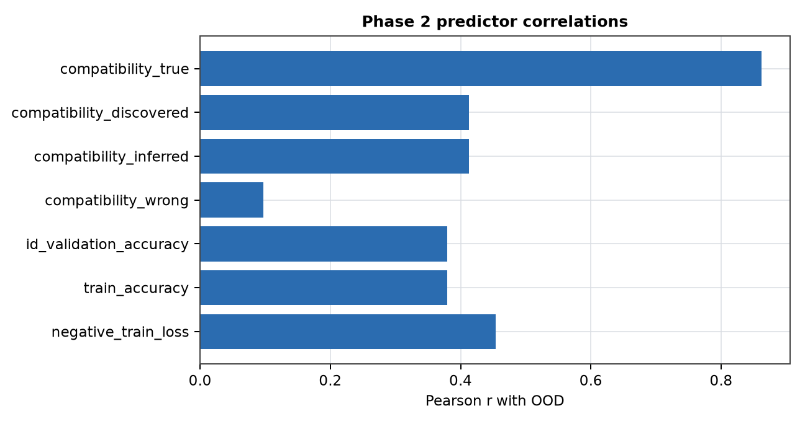
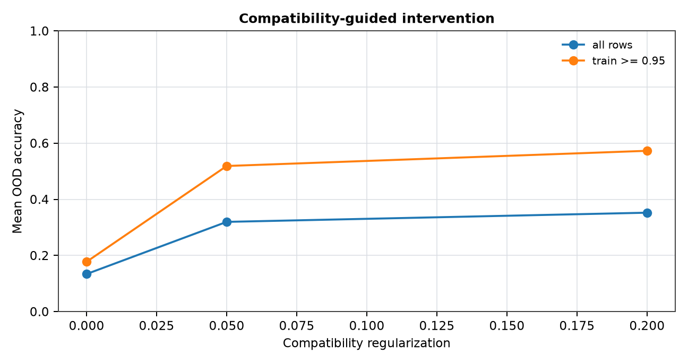

# Inferred Transformations for Structure-Compatible Generalization

**Jawaun Brown**

## Abstract

Phase one showed that oracle transformation compatibility predicts OOD behavior under underspecification. This phase asks whether the oracle can be weakened: infer supported transformations from training evidence, score compatibility under that discovered family, and use the discovered family as a train-time regularizer. In a modular addition domain, a shift is admitted only when observed train-label overlaps support the induced input and label action. The resulting suite evaluates both prediction and control without using OOD labels for model selection or training.

## 1. Regime Transition

The old regime supplied the deployment group. The new regime infers a supported finite transformation family, rejects vacuous shifts, and applies compatibility pressure to unlabeled domain points.

## 2. Result

The strongest phase-two predictor was `compatibility_true` (Pearson r=0.862 with OOD).

The best high-ID regularization arm was 0.200, with high-ID mean OOD 0.573. Delta versus zero regularization: 0.395.

## Figures

## 3. Scope

This is a finite modular-domain intervention result. It supports the broader OOD-certifiability-lite program, but it does not yet solve transformation discovery for vision, language, or open deployment shifts.

## 4. Next Operation

The next operation is to make the discovery family learned rather than enumerated, then transfer the same intervention protocol to vision rotations and paraphrase/template substitutions.
