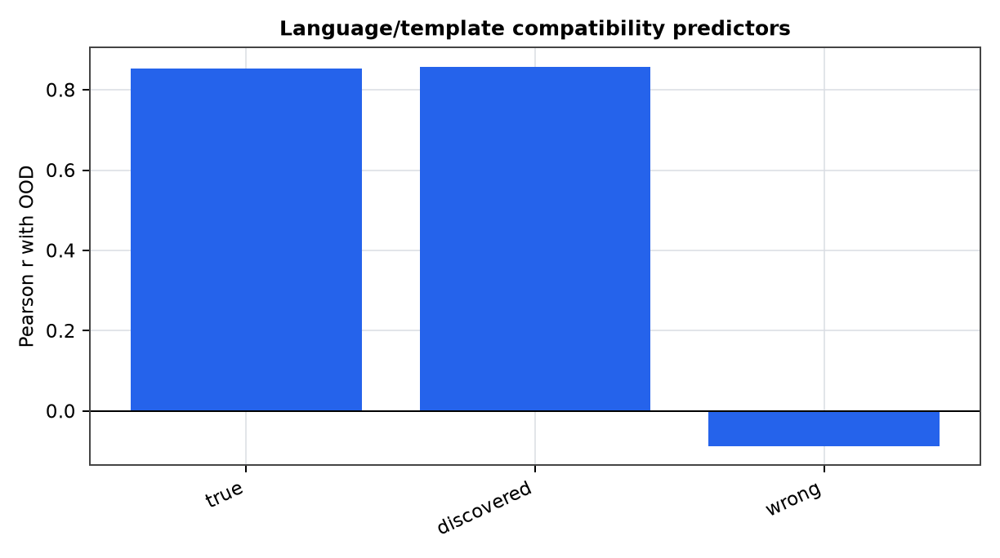
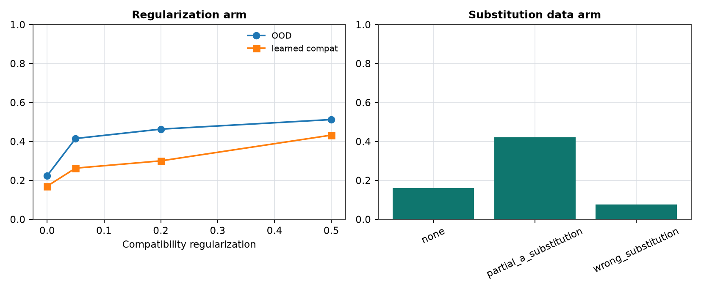

# Language-Template Substitution for Structure-Compatible Generalization

**Jawaun Brown**

## Abstract

This phase tests structure-compatible generalization in a controlled finite text domain. Examples are rendered as short templates with number words and offset words, but the deployment shift is precise: held-out number-word substitutions should transport the label by the same offset. A finite generator is inferred from observed input/label-overlap evidence and used for OOD prediction, model selection, and compatibility regularization without OOD labels.

## 1. Regime Transition

Earlier phases tested oracle groups, inferred modular shifts, learned affine transports, and vision rotations. This phase moves the same diagnostic into a language-like template surface while keeping the deployment transformations auditable.

## 2. Result

The strongest language-template predictor was `compatibility_discovered` with Pearson r=0.858.

The best high-ID regularization arm was 0.500, with high-ID mean OOD 0.512. Delta versus zero regularization: 0.288.

## Figures

## 3. Scope

This is not a claim about arbitrary natural-language paraphrases. It is a controlled finite-language result: the syntax is rendered as text, the deployment family is number-word substitution, and the inferred generator is judged by held-out substitution OOD.

## 4. Next Operation

The next step is to connect this controlled text result to either semantic paraphrase or retrieval-template shifts, while preserving the no-OOD-label selection protocol.
