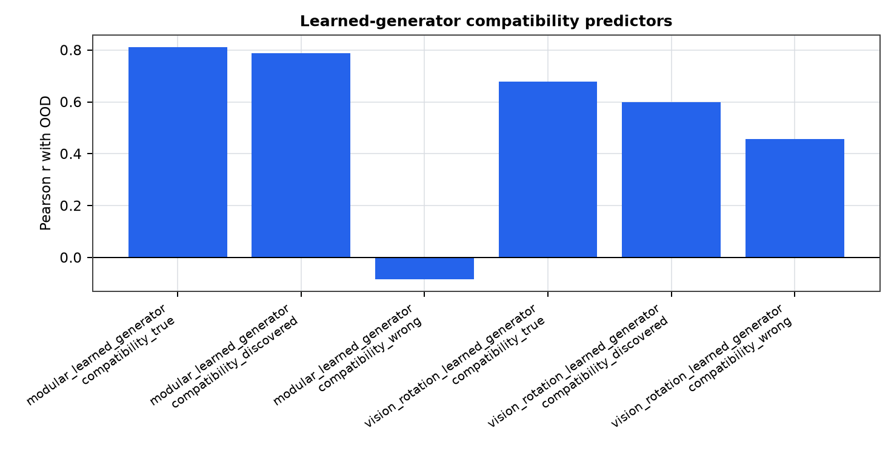
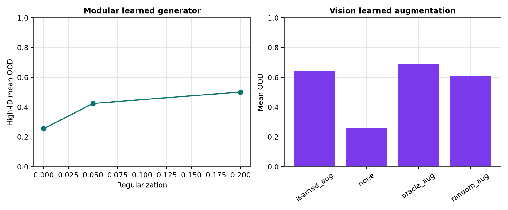

# Learned Generators for Structure-Compatible Generalization

**Jawaun Brown**

## Abstract

Earlier structure-compatible generalization results used either oracle deployment transformations or supported finite shifts inferred from observed overlaps. This phase tests a stricter protocol: learn a finite generator family from input/label transport evidence, use it for compatibility scoring and regularization in the modular domain, then transfer the same diagnostic shape to vision rotations inferred from training images. The claim is bounded: learned generators can support OOD prediction and intervention in controlled finite domains, not arbitrary open-world transformation discovery.

## 1. Regime Transition

The old regime supplied the transformation parameterization. The new operation learns candidate transports from data: modular offsets of the form `(a,b,y)->(a+da,b+db,y+dy)` and vision rotations selected by training-set self-consistency.

## 2. Result

The strongest phase-three predictor was `compatibility_true` on `modular_learned_generator` (Pearson r=0.812).

The best modular high-ID regularization arm was 0.200, with high-ID mean OOD 0.502. Delta versus zero regularization: 0.246.

In the vision transfer arm, learned augmentation produced mean paired OOD delta 0.391 versus no augmentation.

## Figures

## 3. Scope

This is a learned finite-generator transfer result. It is stronger than hand-given oracle groups, but weaker than open-ended transformation discovery. The generator classes are still chosen by the experimenter.

## 4. Next Operation

The next operation is a language/template substitution generator with strict controls: learned substitutions should improve OOD over no augmentation and beat random substitutions of matched size without using OOD labels.
