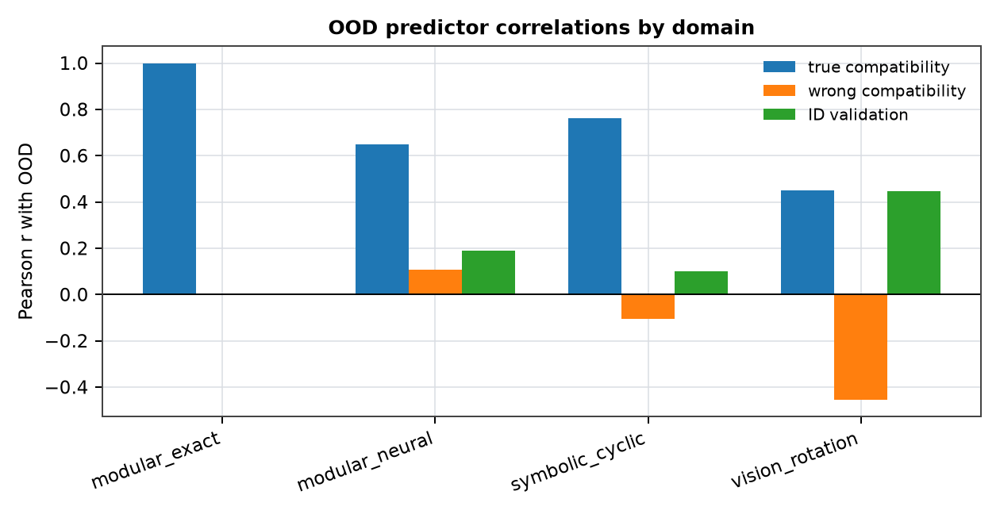
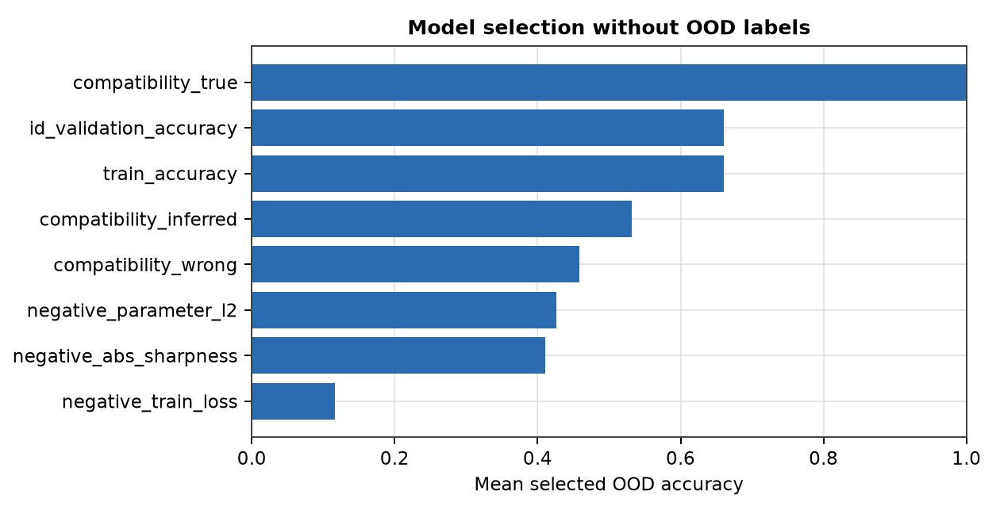

# Structure-Compatible Generalization

**Jawaun Brown**

## Abstract

Modern learning systems are underspecified: many finite models can fit the same training data and pass the same in-distribution checks while behaving differently under deployment shifts. This paper reports a controlled diagnostic suite testing whether the transformation structure a learned function preserves predicts OOD behavior better than loss, ID validation, norm, or sharpness proxies. The suite combines cyclic symbolic MLPs, rotated visual objects, and a modular algorithmic table task under one schema. The claim is intentionally bounded: for finite domains where deployment shift is generated by a known transformation family, compatibility is an OOD diagnostic and model-selection signal, not a universal certification theorem.

## 1. Problem

The practical question is which model to trust when train loss and ID validation do not identify the transportable rule. The diagnostic tested here measures compatibility with the transformations expected to generate deployment cases.

## 2. Suite

The suite uses three controlled domains:

- symbolic cyclic prefix tasks from the existing weakness benchmark;
- rotated 16x16 visual-object tasks from the existing rotation weakness benchmark;
- modular addition tasks where local prefix shortcuts and global translation rules are both train-compatible.

Every trained model emits the same row schema: train accuracy, ID validation accuracy, OOD accuracy, true compatibility, wrong-group compatibility, loss, parameter norm, and sharpness when available.

## 3. Results

- `modular_exact`: top predictor `compatibility_inferred` (Pearson r=1.000).
- `modular_neural`: top predictor `compatibility_true` (Pearson r=0.649).
- `symbolic_cyclic`: top predictor `compatibility_true` (Pearson r=0.763).
- `vision_rotation`: top predictor `compatibility_true` (Pearson r=0.451).

Selection by true compatibility without OOD labels reached mean selected OOD accuracy 1.000 across domains where that selector was available.

## Figures

## 4. Scope

The result does not claim all OOD generalization is solved. It identifies a precise operating regime: finite or structured domains where the deployment shift is generated by a candidate transformation family and ID evidence underdetermines shortcut and rule-like completions.

## 5. Next Step

The next regime transition is learned or weakly inferred transformation discovery, followed by compatibility-guided regularization and active data acquisition.
