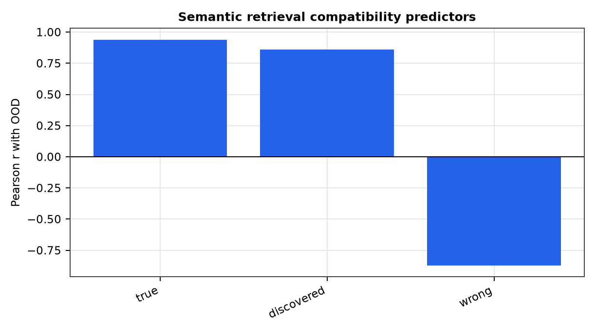
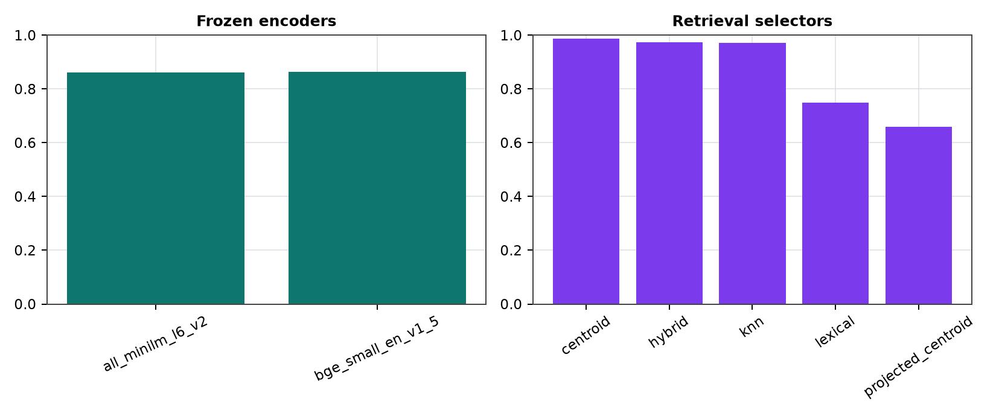

# Semantic Retrieval Transfer for Structure-Compatible Generalization

**Jawaun Brown**

## Abstract

This phase moves structure-compatible generalization from rendered templates to short semantic retrieval cases. Actual frozen sentence encoders provide embeddings; nearest-neighbor structure infers candidate paraphrase and entity-substitution orbits; trained retrieval selectors are then evaluated on held-out semantic variants without using OOD labels.

## 1. Result

The strongest semantic retrieval predictor was `compatibility_true` with Pearson r=0.940.

## Figures

## 2. Scope

The result is bounded to a finite semantic-retrieval corpus and public frozen text encoders. It does not certify arbitrary paraphrase invariance or production model behavior.
