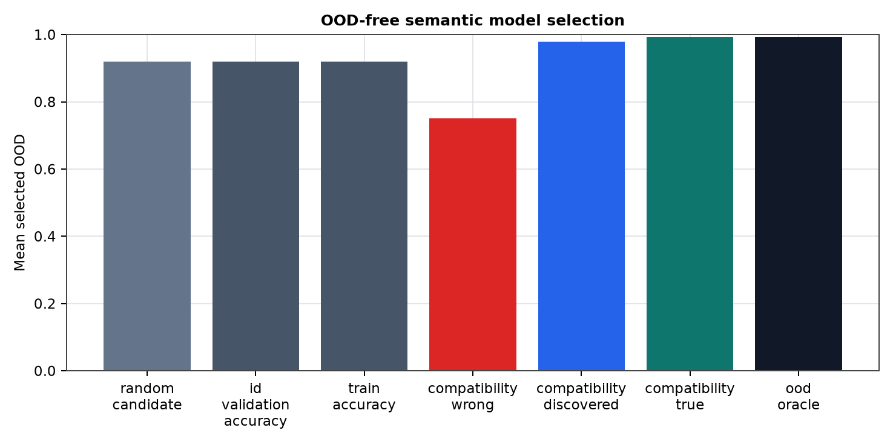
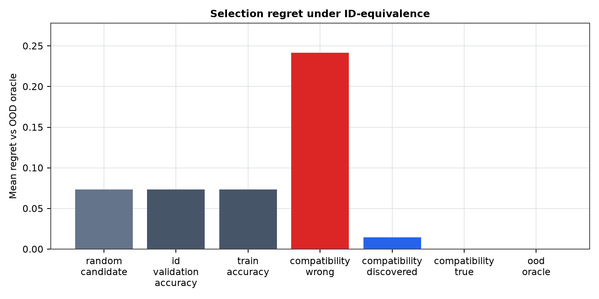

# Semantic Selection Control for Structure-Compatible Generalization

**Jawaun Brown**

## Abstract

This phase turns semantic retrieval compatibility from a predictor into an OOD-free model-selection protocol. Candidate retrieval models are grouped into encoder-threshold seed zoos, filtered to high train and ID validation performance, selected by learned compatibility or baseline selectors, and evaluated only afterward on held-out semantic variants.

## 1. Result

Learned compatibility selected mean OOD 0.978, compared with ID validation selection at 0.919 and wrong-compatibility control at 0.751.

## Figures

## 2. Scope

The protocol selects among finite semantic retrieval candidates generated by public frozen encoders. It is an OOD-certifiability-lite result for this structured setting, not a full behavioral guarantee for open-ended language systems.
