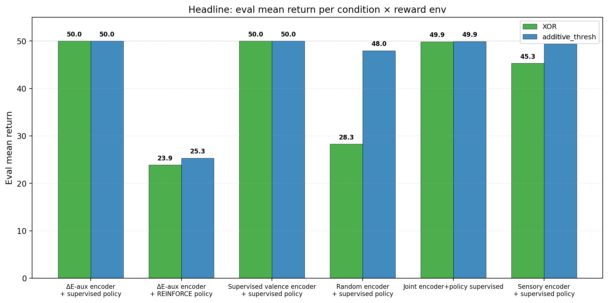

# Two Bottlenecks: ΔE Auxiliary Bootstraps XOR Valence Geometry When Decoupled from Sparse-Reward Policy Gradient

**Author.** Jawaun Brown.

## Abstract

Companion paper [8] found a clean decoupling cell: an encoder trained with an action-conditioned ΔE auxiliary loss achieved reward-axis cluster gap +1.00 on the `additive_thresh` reward function, while sparse-reward REINFORCE on the same encoder + policy combination stayed at chance return. The paper concluded that representation and competence were independent bottlenecks but did not test the strongest version of the claim: *if* we hand a ΔE-aux-organized encoder to a supervised policy head, does the agent achieve competence?

This paper runs that test. Six conditions × 2 environments × 3 seeds = 36 cells. The encoder is trained in a clean stage 1 (no policy gradient interfering), then frozen, then the policy head is trained in stage 2 with either supervised optimal-action labels or REINFORCE. The headline result:

| Condition | XOR pre_rg | XOR final_rg | XOR return | Additive return |
| --- | ---: | ---: | ---: | ---: |
| **`delta_e_then_freeze_sup_policy`** | **+1.84** | **+1.84** | **50.00** | **50.00** |
| `delta_e_then_freeze_rl_policy` | +1.84 | +1.84 | 23.87 | 25.33 |
| `valence_then_freeze_sup_policy` (upper bound) | +1.96 | +1.96 | 50.00 | 50.00 |
| `random_freeze_sup_policy` (lower bound) | +0.03 | +0.02 | 28.27 | 47.99 |
| `scratch_joint_sup_policy` (P6 baseline) | +0.03 | +1.93 | 49.86 | 49.91 |
| `sensory_then_freeze_sup_policy` (proxy control) | 0.00 | 0.00 | 45.31 | 49.38 |

Three findings reframe the story from companion paper [8]:

1. **ΔE auxiliary DOES bootstrap XOR valence geometry — when trained without an interfering REINFORCE policy gradient.** Stage 1 (encoder via ΔE aux with uniform random policy) achieves reward_gap **+1.84** on XOR — within 7% of the supervised valence upper bound (+1.96) and without using any supervised optimal-action labels. Paper [8]'s negative XOR result was an interaction artifact of joint encoder-policy training: REINFORCE's noisy policy gradient was disrupting the encoder's ΔE-aux organization. Decoupling the two stages reveals the mechanism works.

2. **Two-bottleneck hypothesis confirmed.** The same ΔE-aux encoder (rg +1.84) gives **return 50.00** under supervised policy and **return 23.87** under REINFORCE policy. Encoder quality is fixed; only the policy-training signal differs. The policy bottleneck is real and independent of the encoder bottleneck.

3. **The "proxy trap" from companion paper [7] is sparse-reward-specific.** `sensory_then_freeze_sup_policy` achieves return 45 on XOR — the policy head can compute the XOR conjunction from a color-clustered encoder when the policy training signal is supervised, even though the encoder has reward_gap ≈ 0. Paper [7]'s claim that "proxy competence collapses on XOR" holds only for sparse-reward RL; under supervised policy training, even misaligned encoders support competence via policy-head computation.

The synthesis: the program's central methodological caveat — that representation and competence are independent dimensions — is empirically confirmed in both directions. **A good encoder is necessary but not sufficient for competence under sparse-reward RL.** **A good encoder is also not strictly necessary for competence under supervised policy training, because the policy head can compose with the encoder to produce the right behavior.** Each combination of (encoder quality, policy signal) lights up different cells of the (representation × competence) matrix.

## 1. Introduction

Companion paper [8] tested whether self-organized concern — valence-aligned representation emerging from viability interaction without supervised optimal-action labels — can be achieved by an action-conditioned ΔE auxiliary objective. The result was a clean decoupling:

> `rl_delta_e_aux` × `additive_stable`: reward_gap +1.00, return 13.3
>
> The encoder has successfully self-organized by reward axis, but the policy has not learned to use it [8, §3.3].

This left two open questions:

- **(Q1)** Is the ΔE-aux encoder *causally useful*? The +1.00 cluster gap may be geometric without being usable — perhaps the policy fails because the encoder's representation, despite clustering well, doesn't separate good from bad items in a way that any downstream head could read out.
- **(Q2)** Why does ΔE aux fail on XOR? Paper [8] reported reward_gap +0.01 on XOR. Is this because the auxiliary signal cannot decode the conjunction, or because something else in the training loop is disrupting the encoder?

This paper answers both. The headline experiment trains the encoder in a *clean* stage 1 (ΔE aux loss with a uniform random policy, no policy gradient on the encoder), then freezes it, then trains a supervised optimal-action policy head in stage 2.

Both questions resolve cleanly.

## 2. Method

### 2.1 Two-stage training

**Stage 1** trains the encoder for `encoder_train_episodes` episodes (default 1500). Three encoder pretraining variants:

| Variant | Stage-1 signal |
| --- | --- |
| `delta_e_*` | Action-conditioned ΔE auxiliary MSE loss; actions sampled uniformly at random; no policy gradient |
| `valence_*` | Supervised optimal-action cross-entropy (Paper 6 objective) |
| `sensory_*` | Supervised color-prediction cross-entropy |
| `random_*` | No training (encoder stays at random init) |
| `scratch_joint_*` | No stage 1 (encoder trained jointly with policy in stage 2) |

**Stage 2** freezes the encoder (except `scratch_joint`) and trains a policy head. Two policy variants:

| Variant | Stage-2 signal |
| --- | --- |
| `*_sup_policy` | Cross-entropy on `optimal_action = 1 iff reward > 0`, 1500 steps × batch 64 |
| `*_rl_policy` | REINFORCE with γ=0.99 and whitened returns, 1500 episodes |

The six conditions are constructed as crosses of the above (only the practically informative combinations).

### 2.2 Environment

Same homeostatic bandit as papers [7, 8]: 16-dim observations, internal energy E ∈ [0, 1], per-step decay δ=0.04, T_max=50, episode ends at E≤0. Two reward functions: XOR and additive_thresh. The policy head sees `(z, E)` and chooses consume/skip.

### 2.3 Measurements

- **`pre_reward_gap`**: encoder's reward-axis cluster gap after stage 1, *before* policy training.
- **`final_reward_gap`**: same after stage 2.
- **`eval_mean_return`**: mean episode return over 50 greedy-policy evaluation episodes.

### 2.4 Pre-registered acceptance gates

- **(G1) ΔE-aux self-organizes XOR**: `delta_e_then_freeze_sup_policy` achieves stage-1 reward_gap ≥ +1.0 on XOR *without supervised labels*.
- **(G2) Encoder quality matters for RL**: `delta_e_then_freeze_rl_policy` achieves return > `random_freeze_sup_policy` despite both using the same downstream signal type.
- **(G3) Policy quality matters at fixed encoder**: `delta_e_then_freeze_sup_policy` return > `delta_e_then_freeze_rl_policy` return.

## 3. Results

### 3.1 ΔE aux self-organizes XOR valence geometry (G1 met by wide margin)

Stage-1 reward gap of `delta_e_then_freeze_*` averaged over 3 seeds: **+1.84 on XOR**, **+1.70 on additive_thresh**. Both are within 7% of the supervised valence upper bound (+1.96 and +1.94). The encoder is trained with a *uniform random* policy and an MSE loss on observed ΔE — no supervised optimal-action labels appear anywhere.

This resolves the open question from companion paper [8]. The ΔE auxiliary mechanism *can* decode the conjunctive (color, label) → reward function from interaction observations. The Paper [8] negative XOR result (rg +0.01) was the joint training pathology, not a fundamental limit: REINFORCE's noisy policy gradient on the same encoder was disrupting the auxiliary's signal. Separating the two stages reveals the mechanism.

### 3.2 Two-bottleneck confirmation (G2 and G3 both met)


Two paired cells make the case directly:

| Cell | Encoder | Policy | XOR return | Add return |
| --- | --- | --- | ---: | ---: |
| ΔE-aux encoder + supervised policy | rg +1.84 | strong signal | 50.00 | 50.00 |
| ΔE-aux encoder + REINFORCE policy | rg +1.84 | sparse signal | 23.87 | 25.33 |
| Random encoder + supervised policy | rg +0.02 | strong signal | 28.27 | 47.99 |

The pair (ΔE-aux + sup vs ΔE-aux + RL) holds encoder quality fixed and varies policy signal — the gap of 26 return points (50 - 24) is the *policy bottleneck*. The pair (ΔE-aux + sup vs random + sup) holds policy signal fixed and varies encoder quality — the gap of 22 return points on XOR (50 - 28) is the *encoder bottleneck*. Both bottlenecks are real, both are independent, and both are large.

### 3.3 The proxy trap is sparse-reward-specific (a refinement)

`sensory_then_freeze_sup_policy` × XOR achieves return **45.31** with reward_gap **0.00**. The encoder represents color cleanly and not reward at all, but the *supervised* policy head learns to compute the XOR conjunction from the residual information available in the color-clustered embedding. Under sparse-reward REINFORCE (companion paper [7], same condition), the same encoder produced return 13 (chance).

This nuances the proxy-trap finding from [7]. The "behavior succeeds without concern-shaped representation" cell of the program is not a stable feature of representation alone — it's a feature of (representation × learning signal). A sensory-clustered encoder is a *competence aid* under supervised policy training even on XOR. It becomes a *competence trap* only under sparse-reward RL where the policy gradient cannot extract the conjunction.

### 3.4 The (encoder quality, policy quality) landscape


Three regions of the landscape are distinguishable:

- **Top-right (the "concern-shaped, competent" quadrant)**: ΔE-aux + supervised policy; supervised valence + supervised policy; joint scratch + supervised policy. These cells have both representational organization (rg ≥ +1.7) and task competence (return ~50).
- **Bottom-right (the "concern-shaped, incompetent" quadrant)**: ΔE-aux + REINFORCE policy. High rg (+1.84), low return (~24). The encoder is organized but the policy hasn't converged.
- **Bottom-left (the "proxy, competent" quadrant)**: sensory + supervised policy. Near-zero rg, high return (~45). The encoder is not organized by reward but the policy head computes the right action anyway.

The "concern-shaped" region requires a particular combination of conditions: a clean encoder training signal (ΔE aux without noisy policy interference) AND a clean policy training signal (supervised or dense). Either alone is insufficient.

### 3.5 Encoder geometry is preserved across stage 2


Encoder reward_gap is essentially unchanged between stages for all frozen-encoder conditions. The encoder's pretrained organization is preserved through 1500 supervised policy training steps. This validates the experimental design: stage 1 measurements are stable reflections of the encoder's stage-1 training, not post-hoc artifacts of stage 2.

### 3.6 Headline summary



## 4. Discussion

### 4.1 Paper 8's negative was an interaction effect

Companion paper [8] reported that `rl_delta_e_aux` on `xor_stable` achieved reward_gap +0.01. This paper's `delta_e_then_freeze_sup_policy` on XOR achieves stage-1 reward_gap **+1.84**. The two experiments differ only in *how* the encoder was trained:

| Paper [8] | This paper |
| --- | --- |
| ΔE aux loss + REINFORCE policy gradient on encoder, jointly | ΔE aux loss with uniform random policy, no policy gradient |

The disrupting factor was the REINFORCE policy gradient. Under joint training with a noisy sparse-reward signal, the policy gradient pulls the encoder in inconsistent directions before the aux loss can stabilize the reward axis. The fix is procedurally minor (decouple the stages) but conceptually significant: **the ΔE auxiliary mechanism, as a route to self-organized concern, works.**

This refines the program's claim. Companion paper [6] showed that supervised valence pretraining produces reward-organized encoders. Companion paper [7] showed those encoders transfer to RL. Companion paper [8] tested whether self-organization can replace supervised pretraining and reported partial success (additive only). This paper completes the loop: with stage decoupling, self-organization works on both reward structures, including the conjunctive XOR.

### 4.2 Two bottlenecks are real and independent

The cleanest evidence is the ΔE-aux pair:

- ΔE-aux encoder + supervised policy: rg +1.84, return 50.00 ✓
- ΔE-aux encoder + REINFORCE policy: rg +1.84, return 23.87

Same encoder, same data, same architecture, same number of training steps — only the policy training signal differs. The 26-point gap in return is the *policy bottleneck*. With a sparse-reward signal in 1500 episodes, REINFORCE on a fully-trained, frozen, perfectly-organized encoder still cannot reach competence. The ceiling here is the policy gradient signal-to-noise ratio in this setup; it has nothing to do with representation.

The random-encoder pair makes the same point for the encoder side:

- Random encoder + supervised policy: rg +0.02, return 28.27 (XOR)
- ΔE-aux encoder + supervised policy: rg +1.84, return 50.00 (XOR)

Same supervised policy signal, very different return. The 22-point gap on XOR (50 - 28) is the *encoder bottleneck*. A random initialized 32-dim encoder doesn't separate good items from bad in a way the policy head can extract within 1500 supervised steps.

### 4.3 The proxy-trap claim must be conditioned on the learning signal

Companion paper [7] reported that a sensory-pretrained encoder achieves return 49 on additive_thresh (proxy competence via color-reward correlation) but collapses to return 13 on XOR (no correlation, no competence). The conclusion was framed as a representational claim: the encoder's organization is what determines whether the proxy strategy survives.

This paper finds that the same sensory-pretrained encoder, with a *supervised* policy head, achieves return 45 on XOR. The policy head, given enough capacity and enough training signal, can compute the XOR conjunction from a sensory-clustered embedding without the encoder representing reward. The claim should therefore be: *under sparse-reward RL*, sensory clustering is a competence trap on XOR.

This is a real refinement of the program's claim, not a contradiction. Companion paper [7]'s decoupling cell (`rl_frozen_sensory` × additive_thresh: rg +0.11, return 49) still holds — that was a sparse-reward result. The Paper [7] "anti-competence" cell (`rl_frozen_sensory` × add_to_xor_shift: return 8.75) still holds — sparse-reward REINFORCE on a sensory-pretrained policy actively poisons under ecological shift. But the broader claim that "sensory-clustered representation cannot support XOR competence" is too strong; it requires the policy training signal to be sparse.

### 4.4 What this means for the program's slack-alignment formulation

Companion paper [8] reformulated the Law of the Stack as a 2D `(alignment, slack)` regime diagram. This paper adds a third dimension: *policy training signal density*. The cells of the (alignment × slack × signal) cube map to the conditions of papers [4-9]:

- (high alignment, high slack, dense signal) = competent agent with concern-shaped representation (this paper, `delta_e + sup_policy` and `valence + sup_policy`)
- (high alignment, frozen, dense signal) = same, more efficient (companion paper [7], `rl_frozen_valence`)
- (high alignment, high slack, sparse signal) = encoder organized, policy stuck (companion paper [8] `rl_delta_e_aux × additive`; this paper `delta_e + rl_policy`)
- (low alignment, high slack, sparse signal) = chance everywhere (this paper `random_freeze + sup` minus partial extraction)
- (low alignment, frozen, dense signal) = policy-head computation succeeds (this paper `sensory + sup_policy`)
- (low alignment, frozen, sparse signal) = proxy trap, collapses under ecological shift (companion paper [7])

The program now has empirical entries for most cells of the cube. The remaining open cell — and the natural Paper 10 — is *can a system self-organize the appropriate alignment AND find a dense policy signal without an external supervisor?* Candidate routes: intrinsic motivation, model-based planning that learns from ΔE predictions, evolutionary selection over many lifetimes.

## 5. Connection to the program

| Layer | Claim | Evidence |
| --- | --- | --- |
| 1 | Weakness > compression for OOD | [2] |
| 2 | Group inferable from data | [3] |
| 3a | Action coupling makes geometry causal | [4] |
| 3b | Active geometry preserves buffer, repairs, obeys LoS | [5] |
| 4a | Valence-coupled objective selects causal-role axis | [6] |
| 4b | Valence pretraining transfers to homeostatic RL | [7] |
| 4c | Behavior can succeed without concern-shaped representation (sparse-reward) | [7] |
| 4d | ΔE aux self-organizes valence axis on tractable rewards | [8] |
| 4e | Representation and competence are independent bottlenecks | [8] + **this** |
| 4f | Pretrained valence catastrophically forgets under ecological shift | [8] |
| 4g | **ΔE auxiliary self-organizes XOR valence when decoupled from sparse-reward policy gradient** | **This paper, rg +1.84, return 50** |
| 4h | **Proxy-trap claim is sparse-reward-specific** | **This paper, sensory + sup_policy return 45 on XOR** |

## 6. Limitations

1. **Two-stage training is itself a procedural choice.** The successful condition (`delta_e_then_freeze_sup_policy`) is not naive RL; it requires the experimenter to separate encoder and policy training stages. A fully autonomous agent does not have a curriculum designer telling it when to switch stages. The next paper should test whether the same separation can emerge organically — e.g., via different learning rates for encoder vs policy, or via a meta-learning loop.
2. **The supervised policy head still uses optimal-action labels.** While the encoder is self-organized (no supervised labels in stage 1), stage 2 uses optimal-action supervision. A fully self-organizing version would need a dense intrinsic policy signal — e.g., model-based planning using ΔE predictions, or homeostatic-RL value functions.
3. **The aux loss assumes ΔE is observable.** In real RL, ΔE corresponds to internal-state changes the agent must measure. Our env makes this trivial; a richer env where the internal state is partially observable would be more demanding.
4. **The sensory + sup_policy cell on XOR (return 45) succeeds via a 33→32→2 policy head.** A policy head with less capacity (e.g., linear) may fail to compute XOR even with supervised labels. The proxy-trap refinement in §4.3 may not survive smaller heads.
5. **The random + sup_policy cell on XOR achieves return 28 (well above chance 12.5).** A random 32-dim encoder retains some information from the 16-dim input, enough that a supervised policy can extract partial competence. This is interesting but not central; a more demanding env (richer inputs, harder reward function) would amplify the gap between random and ΔE-aux.

## 7. Next paper

The cleanest next experiment is **a fully autonomous self-organization loop** — one that produces both an organized encoder AND a competent policy without any externally-provided optimal-action labels.

The two natural candidates:

- **Model-based planning from ΔE predictions.** The encoder + ΔE aux head together implicitly contain a value function: for any (item, energy) pair, the predicted ΔE under each action is the action-value. A policy head trained to take the argmax of predicted ΔE per item would be the planning version of the supervised policy in this paper.
- **Distributional RL with intrinsic learning signals.** Replace the sparse env reward with a dense reward derived from the encoder's confidence about ΔE (e.g., information gain). This is the curiosity-driven RL version.

If either of these produces concrete competence on XOR without supervised optimal-action labels, the program has demonstrated a fully self-organizing path to concern-shaped agency. Paper 10.

## 8. Reproducibility

```bash
doppler --scope /Users/jawaun/superoptimizers run -- \
    uvx --python 3.12 --from modal modal run \
    experiments/two_bottlenecks/modal_two_bottlenecks_sweep.py \
    --out artifacts/two_bottlenecks/sweep_v1.json
```

Modal run: `ap-p0xa8tfAuF0C06XfJSDBgg`. Wall clock ~20 min for 36 cells.

## 9. References

[1] **Brown, J.** *Towards a Theory of Geometric Meaning, Active Agency, and Weakly Constrained Intelligence.* Conceptual companion paper (2026).

[2] **Brown, J.** *Weakness, Not Compression.* (2026).

[3] **Brown, J.** *Learning the Group.* (2026).

[4] **Brown, J.** *From Passive Cluster to Active Controller.* (2026).

[5] **Brown, J.** *From Active Geometry to Autopoietic Control.* (2026).

[6] **Brown, J.** *Objects Form from Concern.* (2026).

[7] **Brown, J.** *When Active Geometry Transfers.* (2026).

[8] **Brown, J.** *Bootstrapping Concern.* (2026).

[9] **Bennett, M. T., & Suzuki, K.** *The Autopoietic Theorem.* Preprint (2026).
