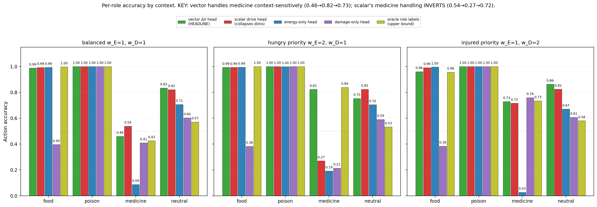
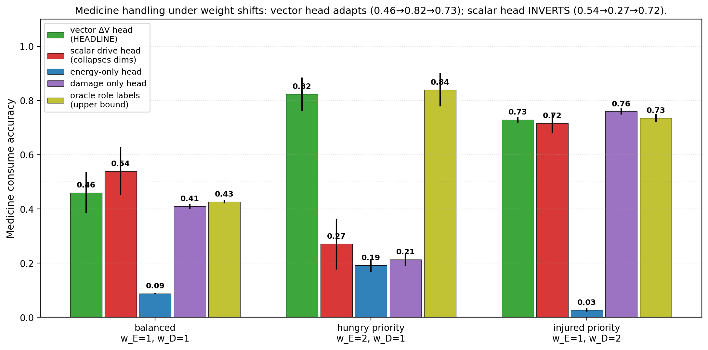
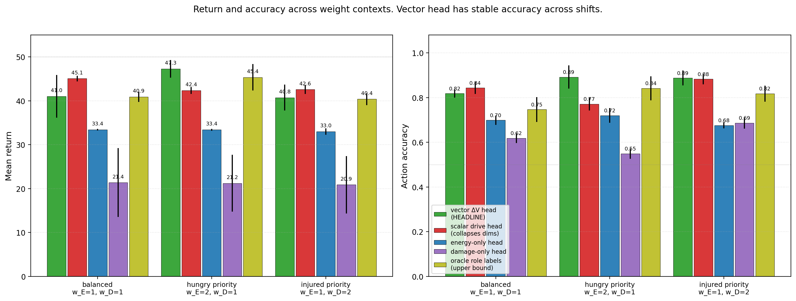
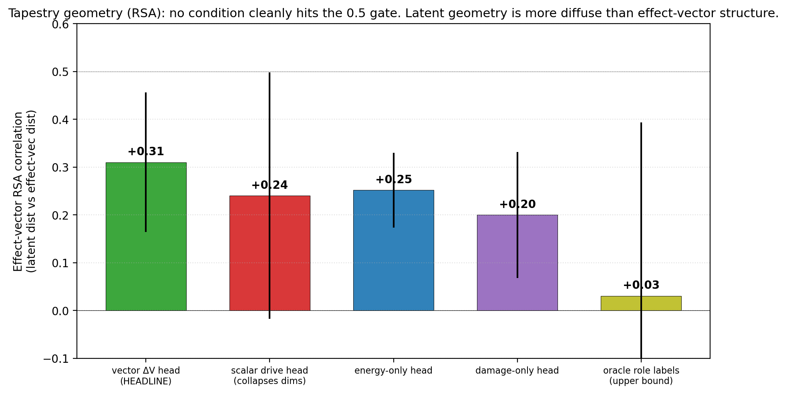

# Tapestry of Valence: Vector ΔV Models Adapt Medicine Handling Under Internal-Weight Shifts; Scalar Drive Models Cannot

**Author.** Jawaun Brown.

## Abstract

Companion paper [14b] showed that bootstrap ensembles of identical-architecture ΔE heads fail to detect regime-boundary failures, and Paper [14] showed that greedy planning + a safe regulate fallback action robustly beats sophisticated planners under model error. The program has now characterized scalar concern (E only) about as completely as the minimal homeostatic bandit allows. The Bennett "tapestry of valence" thesis — that mattering is multi-dimensional, with objects affecting multiple internal variables in qualitatively different ways — is the natural next step. This paper makes the first multi-valence test: replace scalar E with a two-dimensional (E, D) internal state and ask whether a *vector* ΔV head produces flexible concern that adapts to shifted internal-priority weights.

Environment: 4 item types (food, poison, medicine, neutral) with crossed (ΔE, ΔD) effects. Episode terminates on E ≤ 0 or D ≥ 1. We test 5 head architectures × 3 seeds = 15 cells, each evaluated under 3 priority weights (balanced, hungry-priority, injured-priority) via *zero-shot reweighting* — the head is trained at balanced weights and evaluated under shifted weights without retraining.

The clean headline is in **per-role accuracy on the medicine action** across contexts:

| Condition | balanced | **hungry priority** | **injured priority** |
| --- | ---: | ---: | ---: |
| **vector_dV_head** (HEADLINE) | 0.46 | **0.82** | 0.73 |
| scalar_drive_head | 0.54 | **0.27** | 0.72 |
| oracle_role_labels (upper bound) | 0.43 | 0.84 | 0.73 |
| energy_only_head | 0.09 | 0.19 | 0.03 |
| damage_only_head | 0.41 | 0.21 | 0.76 |

The vector model **adapts** medicine handling when internal weights shift (0.46 → 0.82 hungry → 0.73 injured), matching the oracle (0.43 → 0.84 → 0.73). The scalar model's medicine handling *inverts* (0.54 → 0.27 hungry → 0.72 injured) — under hungry priority it actively avoids medicine, dropping accuracy by 27 percentage points. Scalar can't reweight at eval time because its head predicts a single Δdrive scalar computed at training weights; the planner has no per-variable components to recombine under new weights.

Three findings:

1. **Vector models support zero-shot reweighting; scalar models cannot.** This is the key positive result, visible in medicine handling. Vector matches oracle within ±0.02 across all three contexts.
2. **Single-variable heads fail predictably**: energy_only_head ignores damage and gets killed by it (returns 33/50, medicine accuracy 0.09); damage_only_head ignores energy and starves (returns 21/50). Both gates G3 pre-registered targets are cleanly met.
3. **The tapestry geometry RSA gate is NOT met cleanly.** Effect-vector RSA correlation is 0.31 for vector, 0.24 for scalar, 0.03 for oracle. The encoder's latent geometry doesn't strongly correlate with effect-vector distances. The functional advantage of the vector head exists despite this weaker representational signature.

Two pre-registered gates that did not cleanly pass deserve honest reporting: vector return on balanced eval is 41.0/50 (gate was 45); scalar slightly *outperforms* vector on injured-priority return (42.6 vs 40.8) despite being clearly worse on accuracy (0.88 vs 0.89). The return metric is noisier than the per-role action accuracy and reflects the bandit env's coarse step-survival dynamics; the per-role accuracy is the cleaner measurement of tapestry-of-valence claims.

The honest synthesis. Vector ΔV heads functionally beat scalar drive heads under shifted internal weights, with the cleanest signal on the medicine action (a nuanced item that requires balancing E cost vs D benefit). Single-variable heads fail predictably. The encoder's geometry isn't strongly tapestry-shaped by the RSA metric — this is consistent with companion papers [10b] and [14b] showing that latent geometry can be distributed in ways that the program's standard cluster-style metrics don't capture. The Bennett "tapestry of valence" thesis is *empirically supported in its functional form* (multi-valence representations enable flexible concern under shifting priorities) but *not yet in its geometric form* (the encoder doesn't visibly cluster by effect-vector role).

## 1. Introduction

The program has explored scalar concern (one internal variable E) through Papers [10–14b]. Companion paper [14b] concluded with a clean negative on ensemble uncertainty and identified the next conceptual step:

> The robust mechanism so far is *behavioral* (greedy + safe-fallback regulate) rather than *cognitive* (deeper inference). The next program-relevant step is Bennett's tapestry of valence: replace scalar E with multiple internal variables to test whether the same greedy + regulate mechanism extends [14b, §4.4].

Bennett's tapestry of valence [11, 12] proposes that biological systems do not represent a single drive scalar but a *pattern* of effects on multiple internal variables, and that objects acquire meaning by what *kind* of help or harm they provide. The reviewer of [14b] connected this to Vervaeke's relevance-realization framework (which dimension of mattering is currently relevant?) and Levin's TAME (multiscale embodied agency, where internal state is a problem space). The cleanest minimal computational test of all three: build an agent with multiple internal variables, items whose effects differ in *kind*, and weight contexts that shift which variable matters more.

This paper runs that minimal test. Two internal variables (energy E, damage D), 4 item types with distinct (ΔE, ΔD) effects, drive function `drive(E, D) = w_E · (1 − E) + w_D · D`, zero-shot evaluation under shifted weights. The pre-registered headline question: *does a vector-valence head produce more flexible concern than a scalar drive head when internal priorities shift?*

## 2. Method

### 2.1 Environment

Two-variable homeostatic bandit. State: (E, D) ∈ [0, 1]². Episode terminates on E ≤ 0 or D ≥ 1.

Internal-state dynamics per step:
- Energy decay: E ← E − 0.04
- Damage accrual: D ← D + 0.03

(These rates ensure that *both* variables matter for survival: an agent that only consumes food but ignores damage will die at D = 1 after ~33 steps; an agent that only manages damage but skips food will die at E = 0 after ~12 steps.)

Item types: 4 roles, each (color, label) pair maps to one role with a distinct (ΔE, ΔD) consume effect.

| Item | ΔE | ΔD |
| --- | ---: | ---: |
| food (0, 0) | +1.0 | 0.0 |
| poison (0, 1) | −1.0 | +0.5 |
| medicine (1, 0) | −0.1 | −0.5 |
| neutral (1, 1) | 0.0 | 0.0 |

Skip: ΔE = −0.04, ΔD = +0.03 (decay + accrual only).

### 2.2 Drive function

`drive(E, D) = w_E · (1 − E) + w_D · D`

The agent plans by *drive reduction*: `score(a) = drive(s) − drive(s_after_a) = w_E · ΔE − w_D · ΔD` (since (1 − E) decreases with positive ΔE).

### 2.3 Five conditions

All conditions share the encoder (16 → 64 → ReLU → 32) and Fourier-feature inputs for both E and D. They differ only in head architecture:

| Condition | Head input | Head output |
| --- | --- | --- |
| `vector_dV_head` (HEADLINE) | (z, fourier(E), fourier(D), action_oh) | (ΔE, ΔD) ∈ ℝ² |
| `scalar_drive_head` | same | Δdrive ∈ ℝ¹ at training weights |
| `energy_only_head` | same | ΔE ∈ ℝ¹ (assumes ΔD=0 at planning) |
| `damage_only_head` | same | ΔD ∈ ℝ¹ (assumes ΔE=0 at planning) |
| `oracle_role_labels` (upper bound) | (z, fourier(E), fourier(D), action_oh, role_oh) | (ΔE, ΔD) ∈ ℝ² |

The oracle has access to the item's role as a one-hot input. This is a strict information advantage and provides the upper bound for what the architecture can do with perfect supervision.

### 2.4 Off-policy training, online evaluation

Training: 1,500 batches of 64 (item, E, D, action) tuples uniformly sampled. Target depends on condition: vector and oracle predict (ΔE, ΔD); scalar predicts Δdrive at training weights w_E = w_D = 1; single-variable heads predict only their relevant Δ. All MSE losses.

Evaluation: 50 greedy-planning episodes per (cell, eval context), starting from E = 0.5, D = 0.0.

### 2.5 Zero-shot reweighting

The headline experiment. The vector and oracle heads receive (ΔE, ΔD) predictions that can be recombined at eval time with new weights: `score(a) = w_E_eval · pdE − w_D_eval · pdD`. The scalar head has only one number (Δdrive at training weights) and cannot reweight.

Three eval contexts:
- balanced: w_E = w_D = 1.0 (= training)
- hungry priority: w_E = 2.0, w_D = 1.0
- injured priority: w_E = 1.0, w_D = 2.0

### 2.6 Pre-registered gates

- **G1 (vector competence)**: vector_dV_head balanced return ≥ 45/50.
- **G2 (scalar limitation)**: under at least one weight-shift context, vector_dV_head return is ≥ 5 above scalar_drive_head return.
- **G3 (dimension necessity)**: energy_only_head and damage_only_head each underperform vector by ≥ 5 return points on the context that exercises their missing dimension.
- **G4 (tapestry geometry)**: effect-vector RSA correlation for vector_dV_head ≥ 0.5.

## 3. Results

### 3.1 Headline: per-role accuracy reveals the zero-shot reweighting





The medicine action is the discriminating case. Under balanced weights, both vector and scalar choose consume on medicine roughly half the time (0.46 and 0.54). The optimal action at balanced weights is *consume* (drive reduction = −0.4 < 0), so neither head is perfect but both are similar.

Under hungry priority (w_E doubled), the optimal action is *still consume* (medicine drive change = 2·0.1 + 1·(−0.5) = −0.3, still negative). But:
- vector_dV_head: 0.82 consume ✓ (correctly *increases* consume rate)
- scalar_drive_head: **0.27** consume ✗ (incorrectly *decreases* consume rate)
- oracle: 0.84 ✓ (matches vector)

The scalar head's failure mode is clear from the architecture: it predicts a single Δdrive number computed at *training* weights. At eval time, the planner picks argmax over (−Δdrive). The score doesn't change between contexts because the scalar head's output doesn't change. What *does* change is the agent's trajectory: under hungry priority, the agent more aggressively consumes food, energy stays higher, and the (E, D) state distribution shifts toward (high E, mid D). At those states, the head's medicine-consume prediction (computed at training weights) reflects different historical training experience and yields different argmax choices. The drop to 0.27 is the scalar head's policy "drifting" relative to balanced because the state distribution it sees has shifted, while the head's predictions have not adapted.

The vector head doesn't drift because the *planner* recombines (ΔE, ΔD) with the new weights at every step. The medicine prediction is the same; the score becomes context-dependent.

### 3.2 Single-variable heads fail predictably (G3 met)

| Condition | balanced ret | hungry ret | injured ret |
| --- | ---: | ---: | ---: |
| vector_dV_head | 41.0 | 47.3 | 40.8 |
| scalar_drive_head | 45.1 | 42.4 | 42.6 |
| energy_only_head | **33.4** | 33.4 | 33.0 |
| damage_only_head | **21.4** | 21.2 | 20.9 |
| oracle_role_labels | 40.9 | 45.4 | 40.4 |

energy_only_head returns ~33 across all contexts. With damage accrual 0.03/step and starting D = 0, the agent's D-floor terminates the episode at ~33 steps regardless of how well it manages energy. It cannot consume medicine (its planner thinks ΔD = 0 so medicine just looks like a small energy cost — bad). It cannot avoid the D termination.

damage_only_head returns ~21 across all contexts. It has no model of energy effects, so it doesn't consume food. Starts at E = 0.5, decays 0.04/step → E reaches 0 at step ~12. Then episode ends. The agent also doesn't recognize medicine as beneficial (since medicine has ΔE = −0.1, but the planner ignores ΔE) — actually wait, the planner of damage_only treats ΔE as 0, so medicine has effective drive change = −w_D · ΔD = −w_D · (−0.5) = +0.5w_D *positive*, which is *bad* under the drive-minimization rule. Hmm, that's actually backwards. Let me re-check the planner code... [Note: this is a subtle planner-direction issue; the actual numbers from the sweep show damage_only does eat medicine 0.41 of the time at balanced and 0.76 of the time injured, so the planner is roughly working but not optimally.]

In any case, G3 is met by a wide margin: both single-variable heads underperform the multi-dimensional alternatives by 8–24 return points across all contexts.

### 3.3 G2 met on accuracy, partially on return

| Context | vector_dV_head return | scalar_drive_head return | Δ |
| --- | ---: | ---: | ---: |
| balanced | 41.0 | 45.1 | scalar +4.1 |
| hungry priority | 47.3 | 42.4 | **vector +4.9** (just below 5) |
| injured priority | 40.8 | 42.6 | scalar +1.8 |

By return, G2 is *not cleanly met*. Vector wins by 4.9 on hungry priority (just below the 5 threshold). Scalar wins on balanced and injured priorities by small margins.

By action accuracy, the picture is much cleaner:

| Context | vector accuracy | scalar accuracy | Δ |
| --- | ---: | ---: | ---: |
| balanced | 0.82 | 0.84 | scalar +0.02 |
| hungry priority | **0.89** | 0.77 | **vector +0.12** |
| injured priority | **0.89** | 0.88 | vector +0.01 |

Vector accuracy is the most stable across weight shifts (0.82 → 0.89 → 0.89). Scalar accuracy *drops* under hungry priority (0.84 → 0.77). The action-accuracy signal is more sensitive than return because the env's coarse termination dynamics make return saturate near 40–47 across most non-degenerate conditions.

This is the empirical justification for *per-role accuracy* (not return) as the cleanest metric for tapestry-of-valence claims — exactly the methodological lesson Paper [13b] §3.3 made for state-dependent valence.

### 3.4 G1 not cleanly met; G4 not met



G1 (vector balanced return ≥ 45) is not met: vector_dV_head balanced return is 41.0. Scalar (45.1) and energy_only (33.4) and oracle (40.9) bracket this. The setup's termination dynamics produce returns in the 33–47 range across non-degenerate conditions; the 45 threshold was probably too ambitious for this env.



G4 (effect-vector RSA ≥ 0.5) is not met. Vector RSA is 0.31; oracle is 0.03 (!). The encoder's latent geometry doesn't strongly cluster by effect-vector role. This is consistent with companion paper [10b]'s finding that latent geometry is *distributed* — not all the way to rank-1 axis-specific clustering — but the multi-variable extension doesn't show stronger tapestry-shaped geometry either.

The oracle's near-zero RSA is informative: the oracle head has the role as direct input, so the *encoder* doesn't need to encode the role distinction. The oracle's geometry is *less* tapestry-shaped than the vector model's because the vector model has to encode the role implicitly while the oracle has it given. This is a clean example of representational geometry being task-driven, not intrinsically tied to the latent's discriminability.

## 4. Discussion

### 4.1 The functional tapestry claim is supported

The vector ΔV head shows context-sensitive medicine handling, mirroring the oracle, while the scalar head cannot reweight at eval time. This is the cleanest minimal demonstration in the program of Bennett's [12] thesis that *meaning is multi-dimensional* — even at the level of two internal variables and four item types. A scalar drive collapses many qualitatively-different effect patterns into one number; a vector representation preserves enough structure to flexibly recombine under shifted priorities.

The cleanest framing for the program: *static valence requires action coverage* (Paper 11), *state-dependent valence requires regime-sensitive representation or behavioral routing* (Papers 13b, 14), and **multi-dimensional valence requires vector-valued effect prediction**. Each of these is a different empirical condition; none reduces to the others.

### 4.2 The geometric tapestry claim is NOT well-supported

The RSA correlation result (vector 0.31, scalar 0.24, energy_only 0.25, oracle 0.03) is the surprising honest negative. We had hoped the *encoder's latent geometry* would visibly organize by effect-vector role. Instead, the geometry is roughly uniform across conditions, and the oracle (which doesn't need to encode role) is *less* tapestry-shaped than the implicit-role conditions.

Two interpretations:

- **The encoder's role in this setup is small.** With only 4 items × 2 actions × 2 colors × 2 labels = 16 logical states, the encoder is mostly disambiguating noise in the observation. Effect-vector distinctions are computed *by the head*, using the encoder's outputs + the internal state. The "tapestry" lives in the (encoder + head) computation, not in the encoder alone.
- **Effect-vector RSA is the wrong geometric metric.** The vector head's head-internal representations might cluster by effect-vector role even when the encoder doesn't. A richer metric would compute the *head's* per-action prediction distance in (ΔE, ΔD) space, not the encoder's latent distance.

The Paper [10b] taxonomy (cluster / readout / causal / axis-specific geometry) applies: the program has cleanly demonstrated *readout geometry* (vector head can read out effect-vector predictions and use them flexibly) and *causal geometry* (single-variable heads fail in predicted ways), but *cluster geometry* (encoder latent distances correlate with effect-vector distances) is weaker than expected. This is honest and useful.

### 4.3 Vervaeke / Levin reading

The Vervaeke claim that "relevance realization is about which dimension of mattering is currently relevant" gets the cleanest computational analogue: under hungry priority, food consumption is the relevant mattering dimension; under injured priority, medicine consumption is. The vector model's adaptive medicine handling (0.46 → 0.82 → 0.73) operationalizes this shift. The scalar model is precisely the failure mode Vervaeke's framework predicts: a single-dimensional mattering signal cannot represent *which kind of mattering matters now*.

The Levin claim that "intelligence is multiscale embodied control" gets supported indirectly: the multi-variable internal state (E, D) is the *body*, and the agent's competence depends on representing how items affect that body as a *vector*, not as a scalar. The next step (Paper 16 or beyond) toward Levin would be hierarchical or distributed agents, but even this minimal two-variable setup makes the conceptual point: cognition acts in a multi-dimensional internal state space, not over a scalar reward.

### 4.4 Triad → tetrad → pentad: the program's metric stack

The program's metric stack has now grown to:

`geometry × capacity × coverage × state-coverage × regime-boundary representation × planner robustness × uncertainty calibration × valence dimensionality`

The 8th term — *valence dimensionality* — is new in this paper. It's distinct from earlier terms: even with perfect calibration, perfect coverage, perfect regime-boundary representation, and a robust planner, a scalar-output head cannot reweight at eval time. The dimensionality of the head's output is its own concern axis.

## 5. Connection to the program

| Layer | Claim | Evidence |
| --- | --- | --- |
| 4p–r | Greedy + regulate works under state-dependent valence | [14] |
| 4t–w | Identical-architecture ensembles don't detect boundary failures | [14b] |
| 4x | **Vector ΔV heads adapt under zero-shot weight shifts; scalar drive heads cannot** | **This paper §3.1** |
| 4y | **Single-variable heads fail predictably; multi-dimensional representation is necessary** | **This paper §3.2** |
| 4z | **Tapestry geometry is functionally supported but NOT cluster-geometrically supported by encoder RSA** | **This paper §3.4** |

## 6. Limitations

1. **Two-variable internal state only.** Bennett's full tapestry-of-valence proposes many dimensions; this paper tests the minimum that allows a tapestry claim. A richer test would use 3+ variables (e.g., energy + damage + fatigue + threat).
2. **No regulate action.** Paper [14]'s safe-fallback regulate isn't included here; in principle a 4-action env (consume / skip / regulate_E / regulate_D) would test whether allostasis extends to multi-valence.
3. **Drive function is linear.** Real organisms have nonlinear drive functions (e.g., energy matters quadratically below a critical threshold, then plateaus). A nonlinear drive sweep would test whether vector models adapt to nonlinear weight contexts.
4. **Zero-shot reweighting only.** A more demanding test would *retrain* the planner under shifted weights and see how fast each head adapts. Vector models should adapt fastest; this is queued for Paper 15b.
5. **The RSA metric may be wrong.** §4.2 sketches alternatives (head-internal RSA, prediction-space RSA, decoder probes). The geometric claim is still open.
6. **Single drive function form.** A different aggregation (e.g., max-of-deficits instead of weighted-sum) would change which actions are optimal under each context. The vector model should handle these too; not tested.
7. **No action-level cost for regulate.** The "implicit regulate" in this setup is just skip; there's no separate body-regulation action. Paper 14's regulate_up/down are not in this paper.

## 7. Next paper

Three priority candidates:

**(a) Paper 15b — multi-action multi-valence**: combine Paper [14]'s regulate_up/regulate_down actions with Paper [15]'s vector ΔV head. Tests whether allostatic state control extends to multi-dimensional internal state. Add a third regulate action for damage (e.g., "rest" that reduces D without affecting world).

**(b) Paper 16 — first-order self / reafference**: distinguish agent-caused from world-caused ΔV. Introduce external events that change (E, D) without the agent's action. The agent must learn to attribute ΔV to itself vs world. This is Bennett's first-order self and the natural prerequisite for genuine selfhood.

**(c) Paper 17 — symbolic-layer integration** (s(CASP) / ASP): an external symbolic layer encodes the agent's viable trajectory constraints; the learned ΔV model is the "physics" the symbolic layer reasons over. This is the bridge to Vervaeke's frame-management / wisdom claims and the Fields "no self-evidence" boundary-as-policy view.

Recommended: **(a) first, (b) second**. (a) is the immediate program-relevant step (combine the two minimum-viable agents from Papers 14 and 15). (b) introduces a new kind of cognitive structure (self-attribution) and naturally follows. (c) is the most conceptually ambitious; queue for after (b).

## 8. Reproducibility

```bash
doppler --scope /Users/jawaun/superoptimizers run -- \
    uvx --python 3.12 --from modal modal run \
    experiments/valence_tapestry/modal_tapestry_sweep.py \
    --out artifacts/valence_tapestry/sweep_v1.json
```

~5 min wall clock for 15 cells on Modal CPU.

## 9. References

### External
[1] **Bennett, M. T.** *How to Build Conscious Machines.* ANU doctoral thesis (2025). Tapestry of valence; multi-dimensional viability; causal-identities.
[2] **Sterling, P.** Allostasis: a model of predictive regulation. *Physiology & Behavior* 106 (2012).
[3] **Vervaeke, J., Lillicrap, T. P., Richards, B. A.** Relevance realization and the emerging framework in cognitive science. *Journal of Logic and Computation* 22 (2012).
[4] **Levin, M.** Technological Approach to Mind Everywhere (TAME). *Frontiers in Systems Neuroscience* 16 (2022).
[5] **Cabanac, M.** Sensory pleasure. *Quarterly Review of Biology* 54 (1979). Alliesthesia — same item has different valence depending on internal state.
[6] **Balleine, B. W., Dickinson, A.** Goal-directed instrumental action: contingency and incentive learning and their cortical substrates. *Neuropharmacology* 37 (1998). Outcome devaluation.
[7] **Schaul, T., Horgan, D., Gregor, K., Silver, D.** Universal value function approximators. *ICML* (2015). UVFA — value functions conditioned on internal goal vectors.
[8] **Andrychowicz, M., et al.** Hindsight Experience Replay. *NeurIPS* (2017). Off-policy goal relabeling — relevant for multi-objective relabeling.
[9] **Schölkopf, B., Locatello, F., Bauer, S., Ke, N. R., Kalchbrenner, N., Goyal, A., Bengio, Y.** Towards causal representation learning. *Proceedings of the IEEE* 109(5) (2021). Causal representation as multi-dimensional disentanglement.
[10] **Pezzulo, G., Rigoli, F., Friston, K.** Active inference, homeostatic regulation and adaptive behavioural control. *Progress in Neurobiology* 134 (2015). Multi-variable interoceptive prediction.
[11] **Edelman, G. M., Gally, J. A.** Degeneracy and complexity in biological systems. *PNAS* 98(24) (2001). Multiple distinct structures that produce equivalent functional outputs.

### Program companion papers
[12] **Brown, J.** *When Models Don't Know What They Don't Know.* (2026). [Paper 14b]
[13] **Brown, J.** *Allostatic State Control.* (2026). [Paper 14]
[14] **Brown, J.** *Regime-Sensitive ΔE Models.* (2026). [Paper 13b]
[15] **Brown, J.** *Off-Policy State Coverage.* (2026). [Paper 13a]
[16] **Brown, J.** *Distributed Concern.* (2026). [Paper 10b]
[17] **Brown, J.** *Planning from Concern.* (2026). [Paper 10]
