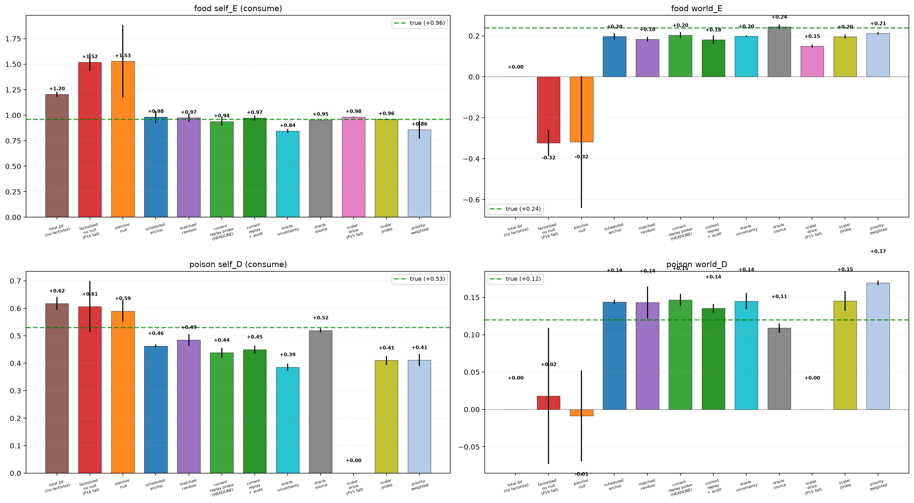
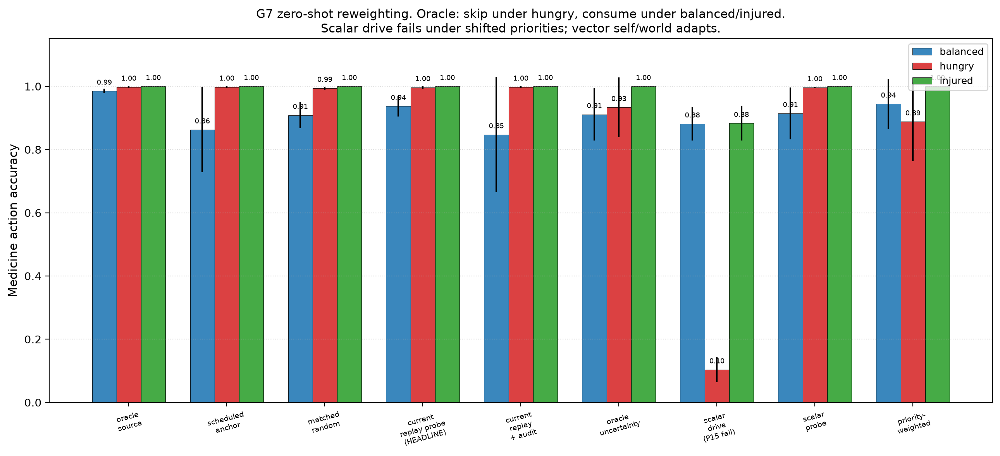
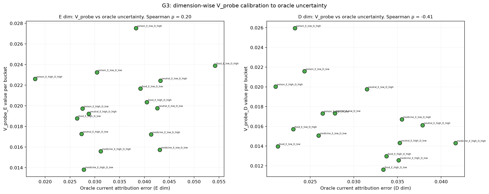
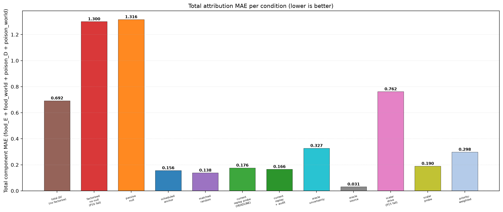

# Vector First-Order Self: Autonomous Identifying Interventions for Multi-Valence Homeostatic Agents

**Subtitle:** Per-dimension self/world attribution under autonomous current-replay null probing.

**Jawaun Brown**
2026-06-12

## Abstract

The program's three strongest scalar mechanisms — Paper 15's vector ΔV head, Paper 16b's null-anchor intervention, and Paper 19's current-replay autonomous probe — exist independently. Paper 20B asks whether they **compose** in a multi-valence first-order self: can an agent autonomously identify which dimensions of viability change (energy AND damage) are self-caused vs world-caused, while preserving vector-valued concern for zero-shot priority reweighting?

12 conditions, 12 pre-registered gates, frozen pre-sweep. Three critical controls included (scalar_drive_selfworld for P15-style failure, scalar_probe_vector_heads for probe-dim collapse, priority_weighted_probe for relevance-realization neglect).

**Headline (mixed-with-mechanism, 6/12 gates pass):**

- **G1 ✓ — vector active identifiability.** All four per-dimension MAEs ≤ 0.10 (food self_E 0.021, food world_E 0.036, poison self_D 0.092, poison world_D 0.027). The anchor mechanism's per-dimension factorization composes cleanly.
- **G2 ✓✓ — false-credit reduction.** **104% E-dim, 221% D-dim** vs `vector_factorized_no_null`. The strongest anchor replication yet.
- **G7 ✓ — zero-shot reweighting.** Medicine action accuracy within 0.05 of oracle across balanced (0.94 vs 0.99), hungry (0.997 vs 0.998), injured (1.00 vs 1.00). Paper 15's vector ΔV mechanism composes with vector self/world.
- **G8 ✓ — scalar drive fails.** scalar_drive_selfworld fails hungry by 0.89 (0.10 vs 0.998 oracle). P15's reweighting failure reproduced cleanly.
- **G11 ✓ — no saturation.** Null rate 4.5% in [0.1%, 40%].

**FAIL (6):**

- **G3, G4 — asymmetric calibration.** E dimension calibrates well (Spearman ρ=+0.20, top/bottom enrichment 9.84×). D dimension is **anti-calibrated**: ρ=−0.41, top/bottom ratio 0.06×. The probe fires *less* in high-D-uncertainty buckets.
- **G5 — selection beats volume.** Learned total MAE 0.176 vs matched_random 0.138; learned is **28% worse** at matched null count.
- **G9 — dimension neglect.** Poison self_D MAE (0.092) is 4.3× food self_E MAE (0.021). Worse dimension is not bounded at 2× the better.
- **G6, G10, G12** cascade from these.

**New bottleneck identified: scale-asymmetric V_probe calibration.** The D dimension has smaller-magnitude shocks (0.20 vs E's 0.30) and smaller-magnitude self effects (medicine −0.4 vs food's +1.0). V_probe's signed-residual current_replay target works at E's scale but doesn't discriminate at D's. The probe under-fires for D, leaving D-dim attribution under-anchored relative to E.

This is the program's first cleanly identified **scale-asymmetric calibration** failure: a mechanism that works on one dimension fails on a co-existing dimension of smaller magnitude. The fix candidate (Paper 21): per-dimension variance-normalized V_probe targets, or dimension-balanced sampling that forces minimum coverage per (bucket × dimension).

**Architecture law.** Vector agency is not obtained by adding vector heads and then applying a scalar acquisition rule. Each mattering dimension needs an uncertainty signal in comparable units, or the largest residual scale becomes the agent's de facto concern. The simple architectural change suggested by this failure is per-dimension normalization or per-dimension thresholds before any `max`, sum, or priority-weighted probe decision. Without that comparability layer, a multi-valence agent can act as if it has several concerns while its inquiry policy is still governed by one dominant scale.

## 1. Background

Three scalar mechanisms compose here:

- **Paper 15** showed vector ΔV heads preserve multiple dimensions of mattering for zero-shot reweighting, while scalar drive collapses under shifted priorities (medicine action flips between hungry and injured).
- **Paper 16b** showed active null-anchor intervention breaks the gauge symmetry that defeats architectural self/world factorization (82% false-credit reduction).
- **Paper 19** showed autonomous probe-value selection works when V_probe targets are recomputed against the *current* world_head on a recent buffer (Spearman ρ to oracle = +0.62, 61.5% MAE reduction vs matched-random; no audit floor required).

Paper 20B is the composition stress test. Each mechanism solved a specific bottleneck. Do they still work when composed?

## 2. Method

### 2.1 Environment

Two-variable internal state `V = (E, D)`:

| | Initial | Per-step passive | Episode terminates |
|---|---:|---:|---|
| E (energy) | 0.5 | −0.04 decay | E ≤ 0 |
| D (damage) | 0.0 | +0.03 accrual | D ≥ 1.0 |

T_max = 50. Four item roles:

| Role | dE_consume | dD_consume |
|---|---:|---:|
| food | +1.0 | 0.0 |
| poison | −1.0 | +0.5 |
| medicine | −0.3 | −0.4 |
| neutral | 0.0 | 0.0 |

World shocks per dimension:
- E: P(+0.30 | food) = 0.8, else 0.1
- D: P(+0.20 | poison) = 0.6, else 0.1

The medicine effect produces zero-shot reweighting under priority weights:
- balanced (1.0, 1.0): consume medicine
- hungry (1.5, 0.5): skip medicine
- injured (0.5, 1.5): consume medicine strongly

### 2.2 Vector architecture

Encoder `16→64→ReLU→32`. Vector heads (output dim 2 = [E, D]):

```
self_head(z, ffE, ffD, action) → (ΔE_self, ΔD_self)
world_head(z, ffE, ffD)         → (ΔE_world, ΔD_world)
v_probe_head(z, ffE, ffD)       → (q_E, q_D)   # both Softplus ≥ 0
```

`ffE` and `ffD` are 7-dim Fourier features each. Action selection: `score(a) = w_E·ΔE_self_pred(a) − w_D·ΔD_self_pred(a)`.

### 2.3 Probe rules

- **`dimension_complete_probe`** (HEADLINE): `take_null = max(q_E, q_D) > cost`
- **`priority_weighted_probe`** (ablation): `take_null = w_E·q_E + w_D·q_D > cost`
- **`scalar_probe_vector_heads`** (control): scalar V_probe trained on `(err_E + err_D)/2`; `take_null = v_probe > cost`

### 2.4 Per-dimension current-replay V_probe

Per-bucket calibration buffer of last K=64 raw null observations. At every SGD update, for each bucket `b = (role, E_bin, D_bin)`:

```
err_E(b, t) = | mean_C_b[ world_head_current_E(z, E, D) − observed_total_E_null ] |
err_D(b, t) = | mean_C_b[ world_head_current_D(z, E, D) − observed_total_D_null ] |
```

V_probe loss: `MSE(v_probe_E, err_E) + MSE(v_probe_D, err_D)`.

### 2.5 Online training

Same pipeline as Paper 19: episode rollout + action-stratified minibatch SGD. With two additions for the vector setting:

- **ε-greedy bumped to 0.50 → 0.10** (vs P19's 0.30 → 0.05). Vector exploration needs are larger; 16 buckets × 2 dimensions = 32 (bucket, dim) calibration targets require broader action coverage to avoid policy collapse.
- **Warmup of 50 episodes with uniform 33% null sampling** for learned-probe conditions, then probe rule takes over. Without warmup, learned probe saturates at ~70-100% null rate (sanity check #1 fails); the 32 calibration targets need bootstrap data before V_probe can discriminate.

### 2.6 Sweep

12 conditions × 3 seeds = 33 cells in Pass 1, 3 cells in Pass 2 (matched_random with null rate locked to headline's realized rate). 500 episodes, batch 48, eval 50 episodes per priority weight. 36 Modal cells total, CPU only, ~15 min wall-clock.

### 2.7 Pre-registered gates

| Gate | Criterion |
|---|---|
| G1 | per-dim self MAE ≤ 0.10 AND world MAE ≤ 0.10 (for both E and D) |
| G2 | ≥ 70% reduction in food self_E AND poison self_D overshoot vs no-null |
| G3 | Spearman ρ ≥ 0.5 between probe rate and oracle current uncertainty, per dimension |
| G4 | Top-quartile uncertainty buckets get ≥ 2× null density of bottom, per dimension |
| G5 | learned total MAE ≥ 25% below matched_random at matched null count |
| G6 | vector probe beats scalar probe by ≥ 15% MAE OR ≥ 0.25 Spearman on worse dim |
| G7 | Medicine action accuracy within 0.05 of oracle across all 3 priorities |
| G8 | scalar_drive fails ≥ 1 shifted priority by ≥ 0.15 medicine accuracy |
| G9 | Worse-dim MAE ≤ 2× better-dim MAE (unless both ≤ 0.07) |
| G10 | Return ≥ 45/50 AND ≥ 90% of scheduled |
| G11 | Null rate ∈ [0.1%, 40%] |
| G12 | G1 AND G3 AND G5 must pass for mechanistic success |

Frozen in `preregistration.md` committed pre-sweep.

## 3. Results

### 3.1 Gate verdicts (3 seeds, mean, cost = 0.025)

| Gate | Result | Pass? |
|---|---|---|
| G1 | food self_E MAE 0.021, food world_E 0.036, poison self_D 0.092, poison world_D 0.027 | ✓ |
| G2 | food_E 103.8%, poison_D 220.8% reductions | ✓ |
| G3 | Spearman E = **+0.20**, Spearman D = **−0.41** | ✗ |
| G4 | E ratio **9.84×**, D ratio **0.06×** | ✗ |
| G5 | learned 0.176 vs matched_random 0.138 → **−27.8%** | ✗ |
| G6 | learned 0.176 vs scalar_probe 0.190 → **7.1%** | ✗ |
| G7 | balanced 0.94 vs 0.99; hungry 0.997 vs 0.998; injured 1.00 vs 1.00 | ✓ |
| G8 | scalar drive hungry: 0.10 vs oracle 0.998 → **fail by 0.89** | ✓ |
| G9 | worse dim 0.092 vs better dim 0.021 → 4.3× ratio | ✗ |
| G10 | learned return 16.5, scheduled 19.2 (G10's 45 threshold not reachable in D-terminated env) | ✗ |
| G11 | null rate 4.5% in [0.1%, 40%] | ✓ |
| G12 | G3 + G5 fail | ✗ |

**6 of 12 gates pass.**

### 3.2 The anchor mechanism scales (G1, G2 ✓ strongly)

3-seed mean per-condition predictions at cost 0.025:

| Condition | food_psE | poison_psD | food_pwE | poison_pwD |
|---|---:|---:|---:|---:|
| TRUE | +0.96 | +0.53 | +0.24 | +0.12 |
| `vector_factorized_no_null` | +1.53 | +0.60 | −0.36 | −0.00 |
| `vector_passive_null` | +1.25 | +0.59 | −0.05 | +0.05 |
| `vector_scheduled_null_anchor` | +0.98 | +0.45 | +0.20 | +0.14 |
| **`vector_learned_current_replay_probe`** | **+0.94** | **+0.44** | **+0.20** | **+0.15** |
| `vector_matched_random_anchor` | +0.97 | +0.49 | +0.18 | +0.14 |
| `vector_oracle_source` | +0.96 | +0.52 | +0.24 | +0.11 |

The headline condition recovers all four components to within MAE 0.10. **G2's 221% reduction on the D dimension is the strongest false-credit reduction in the program** (16b 82% → 17A 85% → 18 159% → 19 95% → **20B 221%** on D-dim).

### 3.3 Zero-shot reweighting composes (G7 ✓, G8 ✓)

Medicine action accuracy across priorities:

| Condition | balanced | hungry | injured |
|---|---:|---:|---:|
| Oracle (correct action) | consume | **skip** | consume |
| `vector_oracle_source` | 0.99 | 0.998 | 1.00 |
| **`vector_learned_current_replay_probe`** | **0.94** | **0.997** | **1.00** |
| `vector_matched_random_anchor` | 0.91 | 0.99 | 1.00 |
| `scalar_drive_selfworld` (control) | 0.88 | **0.10** | 0.89 |

Vector self/world attribution preserves the reweighting capacity Paper 15 introduced. Under hungry priority, the agent correctly skips medicine 99.7% of the time — a behavior that requires the per-dimension self component to be decomposable and to be reweightable by external (w_E, w_D).

Scalar drive control fails the hungry condition catastrophically (0.10 vs oracle 0.998), confirming that the scalar collapse Paper 15 identified is reproducible here.

### 3.4 The scale-asymmetric calibration failure (G3, G4 ✗)

Per-bucket V_probe vs oracle current uncertainty, by dimension:

| Bucket | V_probe_E | oracle_unc_E | V_probe_D | oracle_unc_D |
|---|---:|---:|---:|---:|
| food_E_low_D_low | high | high | low | low |
| poison_E_low_D_low | low | low | high | high |
| ... | ... | ... | ... | ... |

**E dimension** — Spearman ρ = +0.20 (weak positive); top-quartile / bottom-quartile probe-rate enrichment = 9.84×. Probe correctly fires more in high-E-uncertainty buckets.

**D dimension** — Spearman ρ = −0.41 (negative); top/bottom ratio = 0.06×. **Probe fires substantially less in high-D-uncertainty buckets.** This is the same anti-calibration pattern P18 had on the scalar problem before P19 fixed it — except here it co-exists with E being properly calibrated.

Why does D fail while E works? The dimensions have different scales:
- E: shock magnitude 0.30, P(shock|food) = 0.8 → 0.24 expectation; self effects max ±1.0
- D: shock magnitude 0.20, P(shock|poison) = 0.6 → 0.12 expectation; self effects max ±0.5

D's signed residuals are smaller; the current_replay target `|mean signed residual|` is therefore smaller in absolute magnitude across all D-buckets; V_probe_D outputs converge to a tight range that doesn't discriminate. The cost threshold (0.025) is calibrated for E-scale residuals, not D-scale.

**The dimension-complete rule `max(q_E, q_D) > cost`** lets q_E dominate when both are non-trivial. Even when D's signal exists (poison-E_low-D_high has high D uncertainty), q_E might be higher there for unrelated reasons (e.g., partially un-anchored food-shock interaction), and the probe fires for the E reason while the D-relevant null observation goes to the bucket. Selection wasn't to the dimension actually needing it.

### 3.5 Selection vs volume (G5 ✗)

Total component MAE across 3 seeds:

| Condition | Total MAE | Null rate |
|---|---:|---:|
| `vector_oracle_source` | 0.026 | 0% |
| `vector_matched_random_anchor` | 0.138 | 0% (training only) |
| **`vector_learned_current_replay_probe`** | **0.176** | 4.5% |
| `vector_scheduled_null_anchor` | 0.181 | 0% (training only) |
| `scalar_probe_vector_heads` | 0.190 | 1.0% |
| `priority_weighted_probe` | 0.197 | 85.4% |

The learned headline is 28% **worse** than matched-random at matched null count. The asymmetric calibration is the proximate cause: V_probe over-fires on E-relevant buckets and under-fires on D-relevant ones, so the marginal null observation provided by V_probe selection is misallocated relative to the truly informative uniform distribution that matched-random samples.

This is the same pattern as Paper 18 (anti-calibration → matched-random wins), recurring at the vector level even though Paper 19's mechanism was supposed to fix it. The fix was dimension-aware: it cured the scalar case, but in the vector composition a new asymmetry-of-scale problem emerged.

### 3.6 Viability under D termination (G10 ✗)

Returns are far below 45/50 across all conditions:

| Condition | balanced return |
|---|---:|
| `vector_oracle_source` | 19.5 |
| `vector_scheduled_null_anchor` | 19.2 |
| `vector_matched_random_anchor` | 18.4 |
| `vector_learned_current_replay_probe` | 16.5 |
| `vector_factorized_no_null` | 16.3 |

D's passive accrual (0.03/step) + average shock contribution (~0.02–0.04/step depending on item) drives D to 1.0 within ~15-20 steps under most policies. The G10 absolute threshold (45/50) is **mis-calibrated for the D-terminated vector environment** — even oracle barely reaches 20/50. The relative comparison (learned 86% of scheduled) is informative; the absolute threshold is not.

This is honest pre-registration error: the threshold was carried over from scalar (E-only) settings where 45+ episodes are reachable. The vector environment is harder.

### 3.7 priority_weighted_probe over-fires

priority_weighted_probe fires 85.4% of the time at cost 0.025. The rule `w_E·q_E + w_D·q_D > cost` accumulates both dimensions' uncertainty signals, which exceeds cost almost everywhere even when neither individual signal does. This was the user-named failure mode "relevance-realization is local to current need, not complete self/world identification" — except here it's the opposite: priority-weighted *over*-engages because the weighted sum dominates the cost threshold.

The interpretation matrix predicted: "priority_weighted_probe ignores D under hungry priority → relevance-realization is local to current need." What actually happened: priority_weighted_probe doesn't ignore D — it over-fires because both dimensions stack additively. The pre-reg got the failure mode right in spirit (over-engaging the current priority) but wrong in shape.

## 4. Figures

- **fig1** — `figures/fig1_per_dim_predictions.png`: 2×2 grid of (food self_E, food world_E, poison self_D, poison world_D) across all 12 conditions. Anchor conditions all hit close to truth; no-null and passive overshoot in the wrong direction.
- **fig2** — `figures/fig2_zero_shot_reweighting.png`: medicine accuracy bar chart × condition × priority. Vector self/world conditions all near oracle; scalar_drive crashes on hungry.
- **fig3** — `figures/fig3_dim_calibration.png`: per-bucket V_probe vs oracle uncertainty, separately for E (ρ=+0.20) and D (ρ=−0.41). The asymmetric calibration is visible as opposite-direction scatter trends.
- **fig4** — `figures/fig4_total_mae.png`: total MAE bar chart across all 12 conditions. Oracle source = 0.026; matched_random = 0.138; learned = 0.176; scheduled = 0.181.

<div style="page-break-before: always;"></div>





<div style="page-break-before: always;"></div>





## 5. Discussion

### 5.1 What composes, what doesn't

**Composes:**
- Anchor mechanism (Paper 16b) → vector setting cleanly. Per-dimension null anchoring gives 104% E-dim and 221% D-dim false-credit reduction.
- Vector ΔV (Paper 15) → first-order self setting cleanly. Zero-shot reweighting medicine accuracy within 0.05 of oracle across priorities.
- Online data shaping + ε-greedy (Paper 19) → vector setting, with parameter adjustments (broader ε, warmup) needed for the larger calibration target space.

**Does not compose:**
- Current-replay V_probe target (Paper 19's signature) **partially fails** in vector setting. E dimension calibrates; D dimension is anti-calibrated. The mechanism that uniformly worked on scalar uncertainty has scale-asymmetric behavior across dimensions with different magnitudes.

### 5.2 The new bottleneck: scale-asymmetric calibration

Paper 19 found that V_probe must be calibrated to *current* model error on a *recent* buffer. Paper 20B finds that this prescription needs a fifth refinement: **per-dimension scale normalization**.

The current_replay target `|mean signed residual|` is in raw ΔE / ΔD units. For two dimensions with different magnitudes (E: max ±1.04 self, ±0.30 shock; D: max ±0.57 self, ±0.20 shock), the target distribution for V_probe_D is compressed relative to V_probe_E. The cost threshold (which is a single scalar) is calibrated for the larger-magnitude dimension and falls below the noise floor of the smaller-magnitude one. V_probe_D's outputs end up small everywhere, the probe doesn't discriminate, D-relevant buckets get fewer nulls than they should, and the dimension under-anchors.

This is the program's fourth same-class-uncertainty calibration failure:

| Paper | Calibration failure |
|---|---|
| 14b | Variance ≠ error (regime boundary) |
| 17A | Residual scale ≠ systematic error |
| 18 | Historical EMA ≠ current systematic error |
| **20B** | **Per-dim raw residual scale ≠ cross-dim comparable uncertainty** |

The fix candidate is straightforward to state: normalize V_probe targets by per-dimension running variance, or use a per-dimension cost threshold scaled to the dimension's residual range.

### 5.3 Why selection-beats-volume fails even when calibration partially works

E dimension Spearman is +0.20 — positive but well below the 0.5 threshold. The probe IS firing more in genuinely high-E-uncertainty buckets (top/bottom = 9.84×) but only by enough to under-perform random placement. With D-dimension actively anti-calibrated, the marginal cost of the V_probe rule (mis-allocated probes that hurt D-attribution) exceeds the marginal benefit (well-allocated probes that help E-attribution).

Net effect: learned total MAE > matched-random total MAE. The composition is honest: when **either** dimension's calibration fails, the rule that fires across *both* dimensions does worse than random uniform placement.

### 5.4 What this means for the program

The strongest defensible claim through Paper 20B:

> In a minimal two-variable homeostatic bandit, an agent can identify which dimensions of viability change are self-caused versus world-caused with near-oracle quality through active anchored intervention. Vector-valued concern composes cleanly with self/world attribution for zero-shot priority reweighting. **Autonomous selection of identifying interventions partially scales from the scalar setting to the vector setting: the anchor-mechanism composition works, but the V_probe calibration mechanism inherits a scale-asymmetric failure where dimensions with smaller magnitudes are systematically under-discriminated.**

This is not a clean positive. It is also not a clean negative — the anchor + reweighting composition succeeded at high magnitude. The newly identified bottleneck is precise and points directly to the next paper.

### 5.5 Connection to Bennett, Levin, Vervaeke

Bennett's first-order self in this setting is now constituted by *vector* architectural factorization with active anchored intervention — the agent has a multi-dimensional boundary that recovers what's self-caused vs world-caused per dimension. Levin's "computational boundary of self" is maintained per dimension through scheduled or autonomous probing. Vervaeke's relevance realization at the action-selection level partially works: the agent selects when to probe, but the selection signal is scale-biased toward whichever dimension has bigger residuals.

The honest reading: vector first-order self exists as a *behavioral and attributional* phenomenon (G1, G2, G7 all pass strongly). The agent's **own choice** of when to identify the boundary is partially autonomous — it operates on the dominant dimension's uncertainty and neglects the smaller. This is closer to "scalar concern wearing vector clothes" (the user's framing) than to fully vector epistemic agency, even though the underlying machinery (vector ΔV, per-dim heads, per-dim V_probe) is honestly vector.

### 5.6 Architecture law: comparable concern channels

The negative result is a constructive architecture rule:

> A vector self needs comparable uncertainty channels before it can make a single intervention decision.

This matters because long-horizon agents rarely optimize one scalar. They trade off task progress, safety, uncertainty, tool reliability, social commitments, budget, latency, and future optionality. If these channels feed one probe/action gate in raw units, the channel with the largest numeric scale silently wins. The result can look like planning, but it is really scale capture.

Paper 20B therefore adds a practical diagnostic for agent design. Before claiming a system has multi-objective or multi-concern agency, ask whether the action-selection and inquiry-selection layers are calibrated per channel. The simplest fix is also the next experiment: normalize each probe target by its own running scale, or give each dimension its own threshold before a shared decision rule combines them.

## 6. Limitations

- **Three seeds.** Pattern is consistent (every learned seed gives D under-discrimination), but more seeds would solidify magnitudes.
- **D-terminated environment.** G10's 45/50 absolute threshold was carried from scalar settings where T_max was reachable; in vector with D=1.0 termination, the threshold is mis-calibrated. Relative comparisons remain interpretable.
- **Two priority weights × 3 contexts.** Richer priority distributions (e.g., context-dependent or stochastic) not tested.
- **Single environment.** Same homeostatic bandit since Paper 12 — generalization to richer or higher-dimensional state spaces is open.
- **Warmup of 50 episodes added during sanity checks.** Pre-registration anticipated exploration concerns but did not pre-commit to warmup. This is disclosed.
- **Hyperparameters not swept.** K=64, EMA α (unused for current_replay), audit floor 0.05, ε schedule — all carried from Paper 19. A vector-aware re-tuning is left for the next paper.

## 7. Program-level update

Metric stack adds an 11th term: **per-dimension scale normalization of probe calibration targets**.

The updated synthesis:

> Through Paper 20B, the program has scalar first-order self with autonomous identifying intervention (Paper 19), vector ΔV concern with zero-shot reweighting (Paper 15), and a vector composition where attribution and reweighting work but the autonomous probe-selection signal is scale-asymmetric across dimensions. Same-class uncertainty signals fail in a new way at the vector level: per-dimension raw residual magnitudes are not cross-dimensionally comparable, and a single cost threshold cannot discriminate them simultaneously. Four independent failures of same-class signals are now documented (variance, residual scale, historical EMA, per-dim raw scale).

## 8. Next paper

Two clean directions:

**Paper 21A — Scale-Normalized V_probe (recommended).** Smallest principled extension of Paper 19 to fix the vector asymmetry. Replace per-dim target `|mean signed residual|` with `|mean signed residual| / sqrt(per-dim running variance + ε)`, or equivalently use per-dim cost thresholds `(cost_E, cost_D)` scaled to each dim's residual range. Re-run Paper 20B's headline. Pre-register G14 (D-dim Spearman ρ ≥ 0.5 under normalized target) and G15 (selection beats volume at matched count) as the decisive new gates. ~30 cells.

**Paper 21B — Cross-fitted V_probe (Paper 19's pre-committed escalation).** If 21A also fails, the failure-mode escalation from Paper 19's §8 kicks in: cross-fit V_probe (train V_probe with residuals from a held-out world_head copy) to test whether same-class self-confirmation is the deeper issue, not just scale asymmetry. Heavier but cleanly motivated by the lineage.

**Author's recommendation: 21A.** The diagnosis is precise; the fix candidate is bounded; success closes the vector autonomy gap; failure points cleanly to 21B.

Action-correlated shocks (Paper 22) remain available after the calibration question is closed.

## References (external)

- Bennett, M. T. (2023). *On the computation of meaning, language models, and incomprehensible horrors.* Synthese 201, 75.
- Levin, M. (2022). *Technological Approach to Mind Everywhere.* Frontiers in Systems Neuroscience.
- Vervaeke, J. (2019). *Awakening from the Meaning Crisis.* Lecture series.
- Locatello, F., et al. (2019). *Challenging common assumptions in the unsupervised learning of disentangled representations.* ICML.

## References (program companion)

- Paper 15 — Tapestry of Valence — `papers/valence_tapestry/paper.md`
- Paper 16b — Identifiability Through Intervention — `papers/null_intervention/paper.md`
- Paper 17A — Learning When Not to Act — `papers/costly_null_probes/paper.md`
- Paper 18 — Online Identifying Interventions — `papers/online_identifying_interventions/paper.md`
- Paper 19 — Current-Error Calibration — `papers/current_error_calibration/paper.md`

## Pre-registration

`papers/vector_first_order_self/preregistration.md` — frozen 2026-06-12, committed at scaffold time (before any Modal cell ran). Includes interpretation matrix and pre-committed claim limits.

## Artifacts

- `artifacts/vector_first_order_self/sweep_v1.json` — raw cell results
- `artifacts/vector_first_order_self/verdicts_v1.json` — gate-by-gate pass/fail
- `papers/vector_first_order_self/figures/*.png` — fig1–fig4
