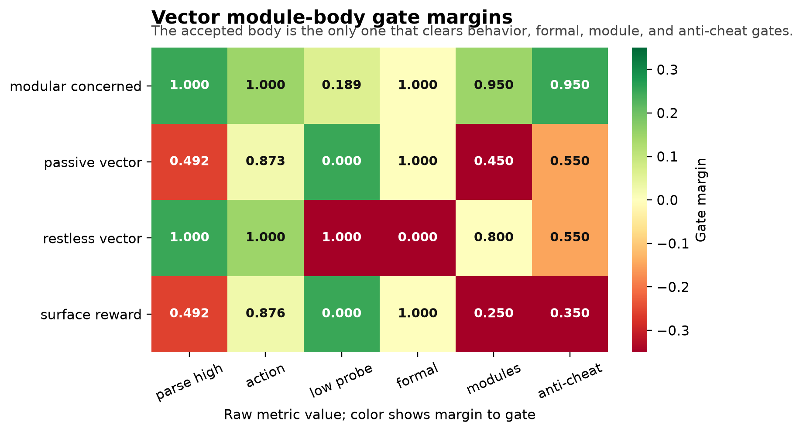
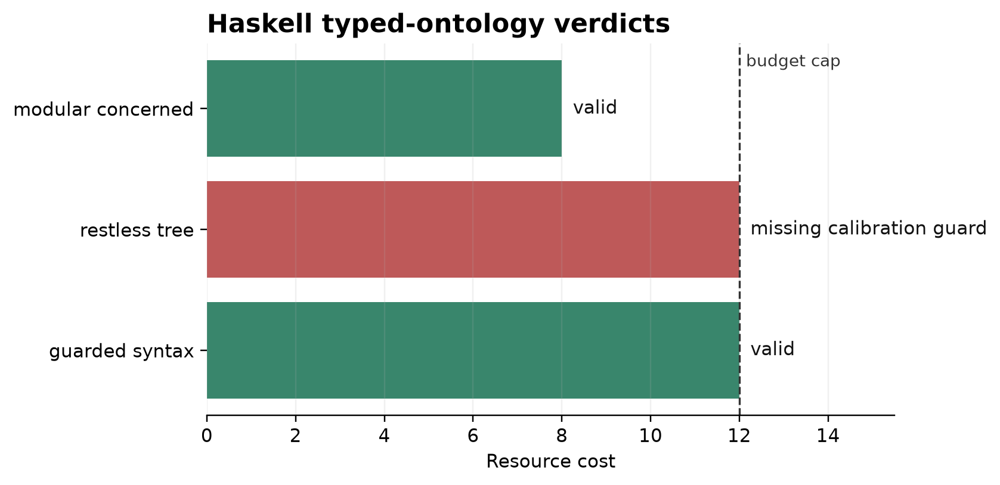

# Viability-Guided Evolution of Syntax-Bearing Computational Bodies

**Jawaun Brown**  
2026-06-18

## Abstract

Arc 2A asks what interventions make the world's causal grammar visible. Arc 2B
asks what computational bodies can express that grammar in the first place. We
introduce a typed symbolic architecture-evolution benchmark for
syntax-bearing agents. Candidate bodies are motif sets containing components
such as tree binders, syntax memory, role-specific heads, world models,
intervention planners, counterfactual rollout, formal guards, and shortcut
reward heads. Static admissibility rules reject malformed bodies, and
viability gates require the final architecture to pass concerned-syntax,
self/world, resource, and anti-cheat criteria.

In a 12-seed deterministic design pilot, an 18-cell symbolic Modal sweep, a
learned executable-body validation, a vector-observation module validation, a
Haskell typed-ontology prototype, and coupled program-body searches against the
Arc 2A v1 and v2 program gates, reward-only search reaches high apparent return
while failing the viability gate. Novelty-only or syntax-proxy search can find
syntax-like bodies, but remains unreliable under the full formal/viability
gate. The vector module validation instantiates four body variants on the
stronger Arc 2A vector gate. Only the modular concerned body passes:
parse-high 1.000, action 1.000, low-concern probe rate 0.189, formal validity
1.000, anti-cheat 0.950, and module coverage 0.950. The first coupled
program-body search freezes the `2A-v1-pixels-observe_pair` contract and
searches bodies against the actual empirical program gate. Across five Modal
seeds, viability-guided search reaches body gate 1.000, empirical gate 1.000,
formal validity 1.000, target/useful high-concern rates 1.000, and low-concern
probe rate 0.156. The second coupled search freezes
`2A-v2-pixels-rich_programs`: the accepted body now also requires a
program-family head and rich program composer. Across five Modal seeds,
viability-guided search reaches body gate 1.000, empirical gate 1.000, formal
validity 1.000, family/target/useful/rich high-concern rates 1.000, and
low-concern program rate 0.168. Reward-only search collapses to a shortcut
body; syntax-proxy search reaches family/target/useful/rich 1.000 but fails
the v2 body gate with formal validity 0.200 and low-program rate 0.670. The
five-seed Modal executable-module wrap gate then requires a body to consume the
repaired held-out v2 transfer contract. Only the transfer-repaired executable
body passes with transfer 1.000, module coverage 1.000,
family/target/useful/rich 1.000, low-program 0.000, and resource cost 16;
family-router, target-binder, ungated-rich, and learned-composer bodies fail
different missing-module or transfer slices. The Haskell checker validates body
admissibility constraints and catches missing calibration guards or missing
program-family heads as type-layer violations.
The result is still not a claim that full neural architecture search has been
solved. It is a Phase 2B acceptance surface: **accuracy is not architecture,
novelty is not viable morphology, target selection is not a viable body, rich
program selection is not a viable body, and formal validity alone is not
concerned syntax.**

## 1. Why Arc 2B Exists

The maintained-concern arc ended at a representational ceiling. A shared
mediated head could learn global h-dependence but did not identify
role-specific mediated effects under null-only intervention. That failure has
two possible explanations:

1. the agent did not have the right interventions;
2. the agent did not have the right computational body.

Arc 2A takes the first path. Arc 2B takes the second. Its question is not
"which model gets the highest reward?" The question is:

> What typed computational morphology can represent causal constituency,
> intervention invention, and self/world attribution under viability
> constraints?

This is adjacent to neural architecture search, open-endedness, quality
diversity, object-centric world modeling, and neuro-symbolic reasoning. But it
is not reducible to any one of them. Generic NAS optimizes architecture
performance. Arc 2B optimizes for bodies that pass anti-cheat tests derived
from a theory of maintained concern.

## 2. Architecture Grammar

The pilot uses typed motif sets. Motifs are not implementation classes yet;
they are commitments about what distinctions the body can express.

| Motif | Meaning |
|---|---|
| `flat_encoder` | basic observation body |
| `reward_head` | predicts task return |
| `shortcut_reward_head` | high train return with shortcut risk |
| `tree_binder` | can bind parts into constituents |
| `syntax_memory` | can preserve parse state over time |
| `vector_surface_encoder` | can encode generated vector/pixel-object surfaces |
| `causal_binding_head` | can bind causal object pairs without candidate parse descriptors |
| `world_model` | predicts consequences of actions/interventions |
| `intervention_planner` | can select information-gathering actions |
| `concern_policy` | can gate intervention use by viability relevance |
| `calibration_guard` | can cap low-concern calibration without restless inquiry |
| `program_family_head` | can select among rich intervention-program families |
| `rich_program_composer` | can compose target and family into a rich program |
| `role_specific_heads` | can separate role-specific causal components |
| `counterfactual_rollout` | can simulate intervention alternatives |
| `formal_guard` | checks admissibility and anti-cheat constraints |
| `self_repair` | can modify body under guard |

## 3. Static Admissibility

The formal layer rejects bodies that violate dependency rules:

| Rule | Reason |
|---|---|
| `syntax_memory` requires `tree_binder` | syntax memory without bound constituents is ill-typed |
| `syntax_memory` may instead use `causal_binding_head` in vector/pixel bodies | vector causal binding is a binder role |
| `intervention_planner` requires `world_model` | planners need consequence models |
| `role_specific_heads` require `tree_binder` or `causal_binding_head` | role heads attach to constituents or causal bindings |
| `program_family_head` requires `world_model` | family choice depends on mechanism consequences |
| `rich_program_composer` requires `intervention_planner` and `program_family_head` | composition needs both program planning and family selection |
| `counterfactual_rollout` requires `world_model` and `intervention_planner` | counterfactuals require model and action |
| `self_repair` requires `formal_guard` | self-modification needs checks |
| `shortcut_reward_head` without `formal_guard` is rejected | reward shortcuts are anti-cheat risks |
| resource cost within the relevant budget | base ontology bodies use <= 12; rich program-body search uses <= 18 |

This is a small stand-in for the s(CASP)/ASP + SMT/static-checking layer
described in the dynamical-ontology blueprint. The current implementation keeps
auditable Python static rules for Modal fallback and a small Haskell typed
ontology for local/external formal verdicts.

## 4. Fitness and Gates

Each candidate body receives:

- `train_return`
- `parse_congruity`
- `subtree_facilitation`
- `intervention_invention`
- `self_world_split`
- `anti_cheat`
- `formal_valid`
- `resource_cost`

A body is viable only if all are true:

| Gate | Criterion |
|---|---|
| formal validity | no static violations |
| resource viability | cost <= 12 |
| parse congruity | >= 0.85 |
| subtree facilitation | >= 0.85 |
| intervention invention | >= 0.55 |
| self/world split | >= 0.75 |
| anti-cheat | >= 0.70 |
| formal guard | present |

This explicitly separates reward, novelty, syntax, and admissibility.

## 5. Search Strategies

The pilot compares three selectors:

| Strategy | Description |
|---|---|
| `accuracy_only` | ranks by train return |
| `novelty_only` | ranks by descriptor novelty plus a weak syntax term |
| `viability_guided` | ranks by viability, syntax score, novelty, and resource cost |

The viability-guided strategy also repairs dependencies and promotes missing
target motifs. This is not meant to be mysterious evolution. It is the first
formalized version of the body-side research loop: mutate, check, reject,
repair, promote, and archive.

## 6. Pilot Result

Local command:

```bash
python3 -m experiments.viable_computational_bodies.search \
  --seeds 12 --generations 18 --population 18 --base-seed 20260616 \
  --out artifacts/viable_computational_bodies/pilot.json \
  --report experiments/viable_computational_bodies/results/pilot_2026_06_16.md
```

Summary:

| Strategy | Viable rate | Syntax score | Train return | Formal valid | Best body | Gate |
|---|---:|---:|---:|---:|---|---|
| accuracy_only | 0.000 | 0.408 | 1.000 | 0.000 | shortcut reward body | fail |
| novelty_only | 0.000 | 0.836 | 0.480 | 1.000 | counterfactual syntax body | fail |
| viability_guided | 1.000 | 0.830 | 0.495 | 1.000 | guarded syntax body | PASS |

The full motif strings are recorded in the public result report. The table
uses short body labels to keep the manuscript legible.

The diagnostic pattern is the contribution:

1. `accuracy_only` finds high train return, but the body is invalid because it
   uses a shortcut reward head without a formal guard.
2. `novelty_only` finds a rich body, but it omits the formal guard and fails
   viability.
3. `viability_guided` finds a lower-train-return body that passes syntax,
   intervention, self/world, resource, and formal gates.

## 7. Relation to Current Literature

Mainstream NAS decomposes the problem into search space, search strategy, and
performance estimation. That is useful engineering structure, but Arc 2B adds
a different acceptance criterion: a body must pass the concerned-syntax and
anti-cheat gates. Recent LLM-guided and open-ended NAS systems show that
architecture generation can move beyond hand-written cells, but they do not
by themselves solve the maintained-concern problem.

Object-centric and graph world models are closer to Arc 2A/2B because they
factor the world into interacting components. Recent work on latent state
design for world models emphasizes that object-centricity and causality are
not identical: an actionable model must represent how interventions propagate
through object relations. That is exactly the gap between "there are parts" and
"there is concerned syntax."

The pilot also lines up with active causal-discovery work. CausaLab and ACE
both treat interventions as budgeted scientific actions. Arc 2B adds the body
question: what morphology lets an agent formulate and retain those actions as
part of a maintained world?

## 8. Discovery-Regime Status

This paper adds a second Phase 2 artifact type: **computational body grammar**.
Arc 1 had architectures, but they were fixed experimental choices. Arc 2B
makes architectures themselves part of the search state and subjects them to
formal and viability gates.

The pilot is therefore a discovery-regime transition in methodology, not yet a
large empirical discovery about neural networks.

## 9. Modal Multi-Seed Sweep

The multi-seed sweep was run remotely through Modal:

```bash
doppler --scope /Users/jawaun/superoptimizers run -- \
  uvx --python 3.12 --from modal modal run \
  experiments/viable_computational_bodies/modal_body_evolution_sweep.py \
  --generations 32 --population 32
```

The sweep used six seeds per strategy, 32 generations, and population 32.
Raw JSON remains local under `artifacts/viable_computational_bodies/`; the
public report is
`experiments/viable_computational_bodies/results/modal_sweep_2026_06_16.md`.

Summary:

| Strategy | Viable | Syntax | Train | Formal | Anti-cheat | Cost | Best body | Gate |
|---|---:|---:|---:|---:|---:|---:|---|---|
| accuracy_only | 0.000 | 0.417 | 1.000 | 0.333 | 0.400 | 8.000 | guarded shortcut body | fail |
| novelty_only | 0.167 | 0.835 | 0.483 | 1.000 | 0.725 | 11.833 | guarded syntax body | fail |
| viability_guided | 1.000 | 0.830 | 0.495 | 1.000 | 0.950 | 11.000 | guarded syntax body | PASS |

In the Modal sweep, the accepted body is the same guarded syntax body from the
design pilot: tree binding, syntax memory, world modeling, intervention
planning, role-specific heads, and a formal guard under the resource budget.

This sharpens the design pilot. `novelty_only` sometimes finds an acceptable
body, but it is not reliable enough to pass the strategy-level gate.
`viability_guided` passes because it couples syntax, intervention, self/world,
formal validity, anti-cheat resistance, and resource viability.

## 10. Executable Body Validation

The symbolic body grammar is useful only if its motifs correspond to
executable mechanisms. The first executable validation maps four bodies onto
the learned Arc 2A gate:

| Body | Mechanism |
|---|---|
| `shortcut_reward_body` | flat reward/action head without parse use |
| `planner_without_tree_body` | learns when to probe but lacks tree-binding features |
| `restless_tree_body` | parses perfectly but probes every low-concern ambiguity |
| `guarded_syntax_body` | tree binding + intervention planning + capped calibration guard |

Remote command:

```bash
doppler --scope /Users/jawaun/superoptimizers run -- \
  uvx --python 3.12 --from modal modal run \
  experiments/concerned_syntax/modal_learned_agents_sweep.py \
  --train-trials 3000 --test-trials 1200 --epochs 90
```

Summary:

| Body | Parse high | Action | High probe | Low probe | Formal | Anti-cheat | Gate |
|---|---:|---:|---:|---:|---:|---:|---|
| guarded_syntax_body | 1.000 | 1.000 | 1.000 | 0.202 | 1.000 | 0.950 | PASS |
| planner_without_tree_body | 0.492 | 0.875 | 1.000 | 0.000 | 0.000 | 0.700 | fail |
| restless_tree_body | 1.000 | 1.000 | 1.000 | 1.000 | 0.000 | 0.550 | fail |
| shortcut_reward_body | 0.494 | 0.880 | 0.000 | 0.000 | 1.000 | 0.400 | fail |

This gives the symbolic grammar its first behavioral footing. The tree binder
is not decorative: without it, intervention observations do not attach to the
right constituent. The formal guard is also not decorative: without it, a tree
parser becomes restless and passes parse while failing concern.

Next versions should replace these linear executable bodies with richer
modules:

- tree binder as a differentiable module or program-induction component
- role-specific heads as mixture-of-experts or routed factor heads
- intervention planner trained on Arc 2A tasks
- formal guard implemented as ASP/s(CASP), Z3, or static Python checks
- quality-diversity archive over syntax, resource, robustness, and proof
  coverage descriptors

## 11. Vector Module Validation

The next body validation uses the stronger Arc 2A vector-observation gate.
Here the surface is generated from coordinates, roles, and pairwise distances,
but it does not expose candidate parse descriptors. The body must use a
concern-gated intervention to recover the hidden causal binding bit.

Remote command: `doppler --scope /Users/jawaun/superoptimizers run -- uvx --python 3.12 --from modal modal run experiments/concerned_syntax/modal_vector_shapes_sweep.py --train-trials 3000 --test-trials 1200 --epochs 90`.

Summary:

| Body | Parse high | Action | Low probe | Formal | Modules | Gate |
|---|---:|---:|---:|---:|---:|---|
| modular concerned | 1.000 | 1.000 | 0.189 | 1.000 | 0.950 | PASS |
| passive vector | 0.492 | 0.873 | 0.000 | 1.000 | 0.450 | fail |
| restless vector | 1.000 | 1.000 | 1.000 | 0.000 | 0.800 | fail |
| surface reward | 0.492 | 0.876 | 0.000 | 1.000 | 0.250 | fail |



This is the first validation where the body must solve the Arc 2A gate from a
parse-invariant generated vector surface. The surface reward and passive
vector bodies remain formally admissible, but they do not have enough module
coverage to identify the hidden binding. The restless vector body has the
binding mechanism but fails the formal concern guard. The modular concerned
body is the first accepted vector-observation body: surface encoder, concern
policy, causal binding head, role-conditioned action head, and calibration
guard.

## 12. Program-Body Search Against 2A-v1

The vector module validation still instantiates a small hand-written body set.
The next coupled test freezes the Arc 2A intervention-invention result as an
empirical contract:

```text
2A-v1-pixels-observe_pair
```

The body search now mutates motif sets and maps each body to the empirical 2A
control it can express: surface shortcut, random program probe,
concern-without-target, target-without-concern, or the full
concerned-program-inventor. A body passes only when the empirical 2A agent
passes and the body remains formal, resource-bounded, guarded, and calibrated.

Remote command:

```bash
doppler --scope /Users/jawaun/superoptimizers run -- \
  uvx --python 3.12 --from modal modal run \
  experiments/viable_computational_bodies/modal_program_body_search.py \
  --generations 24 --population 24 \
  --train-trials 3000 --test-trials 1200 --epochs 90
```

Summary:

| Strategy | Body gate | Empirical gate | Formal | Target high | Useful high | Low probe | Best agent | Gate |
|---|---:|---:|---:|---:|---:|---:|---|---|
| reward only | 0.000 | 0.000 | 0.000 | 0.000 | 0.000 | 0.000 | surface shortcut | fail |
| syntax proxy | 0.000 | 0.200 | 0.400 | 1.000 | 1.000 | 0.830 | concerned program inventor | fail |
| viability guided | 1.000 | 1.000 | 1.000 | 1.000 | 1.000 | 0.156 | concerned program inventor | PASS |

The accepted body is:

```text
calibration_guard
causal_binding_head
concern_policy
formal_guard
intervention_planner
reward_head
vector_surface_encoder
world_model
```

This is the first point where Arc 2A and Arc 2B become coupled rather than
parallel. The body is not rewarded merely for target selection: the
`syntax_proxy` strategy reaches target/useful high-concern rates of 1.000 but
fails the body gate because it does not reliably preserve formal validity and
low-concern discipline. The accepted viability-guided body reconstructs the
whole motif stack required by the empirical 2A program gate.

## 13. Rich Program-Body Search Against 2A-v2

The v1 contract proves target invention, but it still treats
`observe_pair(a,b)` as the only useful program family. The next coupled body
test freezes the richer Arc 2A program-language result:

```text
2A-v2-pixels-rich_programs
```

The body search now maps motif sets to richer empirical controls:
surface-rich shortcut, random rich program, family-without-target,
target-without-family, rich-without-concern, or the full
concerned-program-composer. A passing body must express concern gating, target
binding, program-family selection, rich program composition, formal
admissibility, and resource viability together.

Remote command:

```bash
doppler --scope /Users/jawaun/superoptimizers run -- \
  uvx --python 3.12 --from modal modal run \
  experiments/viable_computational_bodies/modal_rich_program_body_search.py \
  --generations 18 --population 18 \
  --train-trials 3000 --test-trials 1200 --epochs 90
```

The tracked public report is
`experiments/viable_computational_bodies/results/rich_program_body_search_modal_2026_06_18.md`.

Gate summary:

| Strategy | Body gate | Empirical | Formal | Low program | Gate |
|---|---:|---:|---:|---:|---|
| reward only | 0.000 | 0.000 | 0.000 | 0.000 | fail |
| syntax proxy | 0.000 | 0.400 | 0.200 | 0.670 | fail |
| viability guided | 1.000 | 1.000 | 1.000 | 0.168 | PASS |

Program metrics:

| Strategy | Family | Target | Useful | Rich | Best agent |
|---|---:|---:|---:|---:|---|
| reward only | 0.000 | 0.000 | 0.000 | 0.000 | surface rich shortcut |
| syntax proxy | 1.000 | 1.000 | 1.000 | 1.000 | concerned composer |
| viability guided | 1.000 | 1.000 | 1.000 | 1.000 | concerned composer |

The accepted body is:

```text
calibration_guard
causal_binding_head
concern_policy
formal_guard
intervention_planner
program_family_head
reward_head
rich_program_composer
vector_surface_encoder
world_model
```

This is the second and stronger 2A/2B coupling. The `syntax_proxy` strategy can
reach perfect family, target, useful-program, and rich-program rates, but it
still fails the body gate because it does not preserve the formal guard and
low-concern discipline. The accepted body reconstructs the morphology required
to express the full 2A-v2 program contract.

## 14. Learned Executable Modules Against 2A-v2 Transfer

The rich program-body search still maps symbolic motifs to existing empirical
controls. The next body gate is smaller but stricter: candidate bodies must
consume the held-out `2A-v2-pixels-rich_programs` transfer contract and expose
all required executable modules.

Remote command:

```bash
doppler --scope /Users/jawaun/superoptimizers run -- \
  uvx --python 3.12 --from modal modal run \
  experiments/viable_computational_bodies/modal_learned_executable_modules.py \
  --train-trials 3000 --test-trials 1200 --epochs 90
```

The tracked public report is
`experiments/viable_computational_bodies/results/learned_executable_modules_modal_2026_06_18.md`.

Required modules:

```text
pixel_slot_encoder
concern_gate
target_binder
program_family_router
rich_program_composer
world_model
formal_guard
```

Gate summary:

| Body | Transfer | Modules | Family | Target | Useful | Rich | Low program | Gate |
|---|---:|---:|---:|---:|---:|---:|---:|---|
| learned composer | 0.000 | 0.143 | 0.714 | 0.829 | 0.714 | 0.894 | 0.161 | fail |
| family router | 0.000 | 0.571 | 1.000 | 0.196 | 0.196 | 1.000 | 0.000 | fail |
| target binder | 0.000 | 0.429 | 0.143 | 1.000 | 0.143 | 0.143 | 0.714 | fail |
| ungated rich | 0.000 | 0.714 | 1.000 | 1.000 | 1.000 | 1.000 | 0.714 | fail |
| transfer repaired | 1.000 | 1.000 | 1.000 | 1.000 | 1.000 | 1.000 | 0.000 | PASS |

This gate prevents a body from passing by target selection, family routing, or
rich composition alone. The accepted body must carry concern gating, target
binding, program-family routing, rich program composition, a world model, and a
formal guard together. The controls fail for interpretable reasons: missing
target binding, missing family routing, missing concern/formal modules, or
failure to inherit the repaired transfer gate.

This is not full neural architecture search. It is a compact executable-module
validation that turns the repaired 2A-v2 transfer contract into a 2B body
requirement at Modal scale.

## 15. Haskell Typed Ontology Gate

The Python gates are convenient for experiments, but the ontology layer should
eventually live in a stronger typed formalism. This branch adds a small Haskell
prototype under `formal/ontology-hs`.

Run:

```bash
(
  cd formal/ontology-hs && cabal test all && cabal run ontology-check
)
```

The Haskell checker defines body motifs as algebraic data types, checks
dependency and resource rules, and emits JSON verdicts. In the current run:

| Body | Formal | Cost | Violations |
|---|---:|---:|---|
| guarded syntax | true | 12 | none |
| restless tree | false | 12 | missing calibration guard |
| modular concerned | true | 8 | none |
| rich v2 motif body | true | 12 | none |



The useful part is not just the final pass. During development, the typed
checker forced two clarifications: concern and calibration guards are formal
overlays rather than resource-costed morphology, and vector causal binding can
serve the same binder role that tree binding serves in the symbolic body.
The rich-program extension adds `program_family_head` and
`rich_program_composer`; a composer without a family head is formally rejected.

## 16. Limitations

The current search and executable validation are intentionally small. The
executable bodies are linear learned components over vectorized symbolic
features, not full neural architectures trained from pixels. The coupled
program-body search maps motif sets to existing 2A empirical controls rather
than instantiating separate neural modules for every motif. The Modal-confirmed
executable-module body gate consumes the repaired transfer contract, but its
role-slot decoder and module bodies are compact explicit contracts rather than
searched neural implementations. The Haskell gate is a small typed ontology
prototype, not a complete proof assistant, ASP, s(CASP), or SMT integration.
Modal runs fall back to explicit `python_static` formal provenance when Cabal
is unavailable, while local runs and tests can use the Haskell motif verdict
path. The point is to make the acceptance surface explicit and behaviorally
grounded before expensive architecture evolution begins.

The strongest next test is not another v1/v2 seed sweep. It is searched or
evolved executable modules that implement object slots, graph binding, routed
role heads, and program composition rather than mapping motif sets to existing
controls.

## 17. Conclusion

Arc 2B reframes architecture search as viability-guided body evolution. The
pilot, learned validation, vector module validation, v1/v2 program-body
searches, transfer-consuming executable body gate, and typed ontology gate show
why that matters: train return, novelty, target selection, rich program
selection, formal validity, module coverage, transfer, binding, and concerned
syntax can dissociate. The next phase should not ask for merely "better
models." It should ask for bodies whose morphology makes the world's causal
grammar learnable without becoming restless or shortcut-driven.

## References

Aubin, J.-P. (1991). *Viability Theory*. Birkhauser.

Brown, J. (2026). *The Metric Stack of Concern: From Viability Prediction to
Maintained Self/World Boundaries in Minimal Agents*.

Das, A., Ghugarkar, O., Bhat, V., & Aali, A. (2026). Compositional
Neuro-Symbolic Reasoning. arXiv:2604.02434.

Cooper, P., & Velasquez, A. (2026). Active Causal Experimentalist (ACE):
Learning intervention strategies via direct preference optimization. arXiv:
2602.02451.

Elsken, T., Metzen, J. H., & Hutter, F. (2019). Neural architecture search: A
survey. *Journal of Machine Learning Research*, 20(55), 1-21.

Lehman, J., & Stanley, K. O. (2011). Abandoning objectives: Evolution through
the search for novelty alone. *Evolutionary Computation*, 19(2), 189-223.

Kim, K. W. (2026). Latent State Design for World Models under Sufficiency
Constraints. arXiv:2605.01694.

Le Lidec, Q., Biza, O., Goudet, O., Balestriero, R., & Lajoie, G. (2026).
Causal-JEPA: Learning World Models through Object-Level Latent Interventions.
arXiv:2602.11389.

Sharma, A., Nguyen, L., Gupta, A., Wang, C., Adebayo, C., & Kowalski, J.
(2025). Inducing Causal World Models in LLMs for Zero-Shot Physical
Reasoning. arXiv:2507.19855.

Mouret, J.-B., & Clune, J. (2015). Illuminating search spaces by mapping
elites. arXiv:1504.04909.

Revencu, B., Pajot, M., & Dehaene, S. (2026). Representations of geometric
shapes have syntactic structure. *Journal of Experimental Psychology:
General*, 155(4), 1081-1102. https://doi.org/10.1037/xge0001890

Wu, Y.-F., Lee, M., & Ahn, S. (2024). Neural Language of Thought Models.
arXiv:2402.01203.

Yang, J., Zhang, D., Song, X., Dai, Q., Liu, X., Chen, Y., Vashishtha, A.,
Shi, J., Tan, C., & Peng, H. (2026). CausaLab: A scalable environment for
interactive causal discovery toward AI scientists. arXiv:2605.26029.

Zhang, S. et al. (2026). Structuring Open-Ended NAS: Semi-Automated Design
Knowledge Structuring with LLMs for Efficient Neural Architecture Search.
arXiv:2605.19247.
