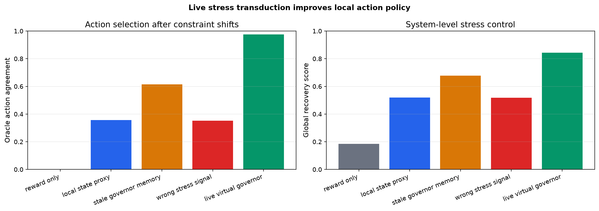
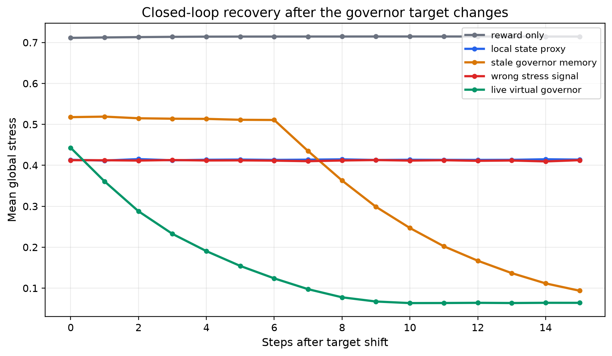
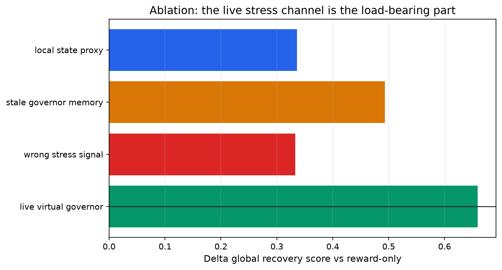

# Virtual-Governor Stress Signals for Local Action Recovery

**Jawaun Brown**

## Abstract

The virtual-governor preprint is useful because it names a signal architecture: global constraint violations become local incentives. This paper turns that phrase into a bounded neural diagnostic. Small policies act in a three-dimensional controlled state whose target changes during long rollouts. Five architectures receive the same oracle action labels but different policy features: reward-only, local-state proxy, stale governor memory, wrong stress signal, and live virtual-governor stress. The result tests whether the live stress-transduction channel is load-bearing for recovery after shifts.

## 1. Diagnostic

The task is deliberately finite. A policy observes a local feature vector and chooses one of six actions. Each action moves the system state and the oracle chooses the action that most reduces distance to the current global target. The target changes during evaluation, so a policy must carry the governing stress into action, not merely memorize a frequent target.

## 2. Result

The live virtual-governor condition reached action accuracy 0.976, mean stress 0.133, and global recovery score 0.843. Reward-only scored 0.184; the recovery-score delta was 0.659. The wrong-stress control scored 0.517; stale governor memory scored 0.678.

The wrong-signal and stale-memory controls are the important controls. They test whether any extra channel helps, or whether the channel must faithfully carry current global stress.

## Figures

## 3. Architecture Law

The simple architecture change is a stress-transduction channel: represent the live system-level constraint violation in a form the local action policy can consume. This is a machine-agency version of the virtual-governor idea, but the evidence remains bounded to this finite control task.

## 4. Scope

This result does not show consciousness, biological governance, or open-ended alignment. It shows that a live global-stress signal can be a load-bearing action feature under target shifts, while stale, wrong, local-only, and reward-only variants expose the proxy risks.

## 5. Next Step

Transfer the same stress-transduction ablation to long-horizon tool agents: hidden constraint, delayed commitment surface, tool repair, and a live governor signal that can be ablated, delayed, or corrupted. The causally grounded agents benchmark should treat this as a candidate Suite C/Suite E bridge: re-engagement plus commitment surface.

## References

- Lyons, B., Pio-Lopez, L., & Levin, M. (2026). *Alignment is to a virtual governor: A theory of coordination in diverse intelligence*. Preprints.org. doi:10.20944/preprints202607.0220.v1. Not peer reviewed.
- `papers/architecture_laws_machine_agency/paper.md`
- `papers/long_horizon_bottleneck/paper.md`
- `papers/causally_grounded_agents_benchmark/paper.md`
- `papers/structure_compatible_generalization/inferred_transformations_intervention.md`
