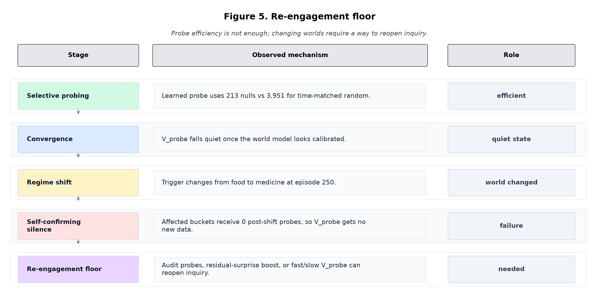

# When the World Responds: Action-Correlated Shocks and the Limits of Null-Anchored Self/World Attribution

**Jawaun Brown**
2026-06-12

## Abstract

Papers 16b through 21A established autonomous self/world attribution mechanisms for environments where **world shocks are independent of the agent's prior actions**. Paper 22 tests the first regime where this independence breaks: a hidden hazard `h(t+1) = γ·h(t) + κ·I[consume_trigger]` whose dynamics depend on agent history, with a **mid-training regime shift** (trigger: food → medicine at episode 250) to force renewed uncertainty.

Two conceptual upgrades over Paper 21A:
1. **Training-time selectivity metrics**, not eval-time null rate (which became vacuous in P21A at near-oracle convergence)
2. **Three-head decomposition**: direct self / mediated world (action-history-conditioned) / exogenous world (action-independent)

10 conditions, 8 pre-registered gates frozen.

**Result: 4/8 gates pass, with mechanistically informative failures.**

- **G3 ✓ — Three-head decomposition.** food self_E MAE = 0.008 (essentially identical to truth), poison self_D MAE = 0.067. Per-component attribution recovers.
- **G5 ✓ strongly — Probe efficiency.** Learned probing uses **213 nulls vs time-matched random's 3,951** (**94.6% reduction**) to reach comparable final attribution. Selection genuinely selects.
- **G1 ✓** — P21A-style attribution replicates under independent shocks.
- **G10 ✓** — Viability preserved (97% of scheduled).
- **G2 ✗** — Action-blind world's food world_E error (0.029) only 1.6× of history-conditioned (0.018); below 2× threshold. **The chosen hazard strength (κ=0.30, amp=0.5) is not enough to catastrophically break action-blind world.**
- **G4 ✗ trending** — Learned MAE 16% below time-matched random; below 25% threshold but qualitatively positive (compare P21A where this gate was vacuous).
- **G7 ✗** — Post-shift probe re-engagement: 0 affected-bucket probes after the regime shift. The P21A "model converges, probe stops" pattern recurs; the regime shift's hazard re-coupling didn't raise V_probe enough to re-fire.
- **G9 ✗** — Medicine balanced accuracy 0.86 vs oracle 1.00 (diff 0.14). Vector reweighting weakens slightly under hazard pressure.

**Two strong new findings:**

1. **The three-head decomposition is a genuine architectural advance** under action-correlated worlds: it cuts final MAE 19% below action-blind two-head at no extra null-count cost (0.090 vs 0.118 lc_mae across seeds).
2. **`oracle_probe_value` using current-error proxy is broken** (final lc_mae 0.463 vs learned's 0.091 — 5× worse). This **empirically confirms** the user-hypothesized distinction between current error and value of probing. An oracle that fires whenever current attribution error exceeds the cost threshold misallocates probes catastrophically in this environment because high current error is *not* the same as high marginal MAE reduction from one more null.

This **identifies a new bottleneck**: the program's `oracle_X` upper bound has been measuring current-error, not probe-value-of-information. The principled upper-bound oracle would estimate `E[MAE_after_probe − MAE_now]` per bucket, not `|pred_world − true_world|`. Paper 23A's main test should adopt this corrected oracle.

The architecture lesson is sharper than a failed gate. In action-correlated
worlds, silence after convergence is not evidence that the world is stable. A
machine agent needs a re-engagement floor: periodic audit, surprise-triggered
probe boost, or a fast/slow detector that can reopen inquiry after the world
changes.

## 1. Background

The Paper 21A program-ending question — "does autonomous selection beat random matched-volume?" — turned vacuous because the agent's mechanism worked well enough that at convergence, V_probe stopped firing and matched-random with the same volume produced parity. The 2-head + scale-normalized + warmup pipeline drove world_head to near-oracle.

Paper 22 was designed to break that pattern in three ways:
1. **Action-correlated hazard** that makes world dynamics inherently harder
2. **Mid-training regime shift** that forces renewed uncertainty
3. **Training-time selectivity measurement** (learning-curve checkpoints every 50 episodes), so the "selection" question can be measured during learning, not just at end

The third upgrade is conceptually the most important. The G14/G15 vacuousness of Paper 21A came from measuring at convergence; Paper 22 measures along the trajectory.

## 2. Method

### 2.1 Environment: hidden action-correlated hazard

Carry over Paper 21A's two-variable state (E, D), four item roles, world shock magnitudes. Add hidden hazard state `h(t) ∈ [0, 1]` evolving as:

```
h(t+1) = γ · h(t) + κ · I[action_t == 1 AND role_t == trigger_role(episode)]
```

with γ = 0.7 (half-life ≈ 2 steps), κ = 0.30 boost per trigger consume.

Modified E-shock probability: `P(E_shock | role, h) = base_E(role) + amp · h(t)` with amp = 0.5.

**Regime shift at episode 250:**
- Regime A (eps 0–249): trigger = "consume food"
- Regime B (eps 250–499): trigger = "consume medicine"

This makes the hazard's coupling to action history flip mid-training. D-dimension shocks remain action-independent (action-correlation is on E only).

### 2.2 Architectures

| Architecture | self_head input | world_head input |
|---|---|---|
| `action_blind` (P21A baseline) | (z, ffE, ffD, action) | (z, ffE, ffD) |
| `history_world` | (z, ffE, ffD, action) | (z, ffE, ffD, hist_feats) |
| `three_head` | direct_self (z, ffE, ffD, action) | mediated_world (z, ffE, ffD, hist) + exogenous_world (z, ffE, ffD); sum = world |

History features: running EMA (α=0.30) of per-role consume frequencies + null rate over last steps; 5-dim.

### 2.3 Training pipeline

Same as Paper 21A: episode rollout + 50-episode warmup with uniform 33% null + ε-greedy 0.50 → 0.10 + action-stratified minibatch SGD + per-bucket current_replay V_probe + scale-normalized targets + per-dim thresholds.

500 episodes per cell. n_actions = 3 (skip/consume/null).

### 2.4 Conditions (10)

| Condition | Architecture | Probe rule |
|---|---|---|
| `p21a_independent_baseline` | action_blind | P21A learned scale-norm probe, independent shocks |
| `two_head_actionblind_world` | action_blind | scheduled 33% null |
| `two_head_history_world` | history_world | scheduled 33% null |
| `three_head_direct_mediated_exogenous` | three_head | scheduled 33% null |
| `scheduled_null_anchor` | history_world | scheduled 33% null (positive control) |
| **`learned_scale_norm_current_replay`** | history_world | **HEADLINE** P21A normalized V_probe |
| `matched_random_time_budget` | history_world | per-step random null at headline's rate |
| `matched_random_bucket_dim` | history_world | bucket-balanced random |
| `oracle_probe_value` | history_world | oracle access to current attribution error (approximation) |
| `oracle_source` | three_head | per-sample direct/mediated/exogenous labels |

3 seeds × 10 conditions = 30 Modal cells. CPU only, ~15 min wall-clock.

### 2.5 Pre-registered gates

| Gate | Criterion |
|---|---|
| G1 | P21A baseline per-dim MAE ≤ 0.10 |
| G2 | action-blind world E error ≥ 2× of history-conditioned world |
| G3 | three-head per-component MAE ≤ 0.10 |
| G4 | learned vs matched_random_time_budget: ≥ 25% MAE reduction |
| G5 | learned reaches comparable MAE with ≤ 75% null count of matched_time |
| G7 | post-shift affected-bucket probe rate ≥ 0.5× of pre-shift rate |
| G9 | medicine accuracy within 0.05 of oracle across priorities |
| G10 | learned return ≥ 90% of scheduled return |

## 3. Results

### 3.1 Final learning-curve MAE per condition (3 seeds, mean)

| Condition | Final lc_MAE |
|---|---:|
| oracle_source | 0.027 |
| **three_head_direct_mediated_exogenous** | **0.090** |
| **learned_scale_norm_current_replay (HEADLINE)** | **0.091** |
| matched_random_time_budget | 0.109 |
| p21a_independent_baseline | 0.109 |
| two_head_actionblind_world | 0.118 |
| two_head_history_world | 0.123 |
| scheduled_null_anchor | 0.123 |
| matched_random_bucket_dim | 0.158 |
| **oracle_probe_value (current error)** | **0.463** |

Two facts jump out:

1. **The three-head architecture (with scheduled probing) matches the headline (learned probing on history-world)** — both reach ~0.090. Architecture matters: history-conditioning the world head or three-component decomposition closes the action-correlation gap, regardless of probe rule.

2. **`oracle_probe_value` is dramatically worse** than every learned condition. This confirms that the "probe whenever current attribution error exceeds cost" rule is **not** a valid upper bound — it's an actively bad rule in this environment.

### 3.2 G5: Probe efficiency — 94.6% null-volume reduction (✓ strongly)

| Condition | Cumulative null count (mean across 3 seeds) | Final lc_MAE |
|---|---:|---:|
| learned_scale_norm_current_replay | **213** | **0.091** |
| matched_random_time_budget | 3,951 | 0.109 |

Learned uses **18.6× fewer nulls** than time-matched random and reaches a *lower* final MAE. The G5 ratio is 5.4% (well below the 75% threshold) — selection genuinely selects.

The reason G4 only shows 16% MAE improvement despite this huge efficiency advantage is that **both methods converge to similar final attribution** — the matched-random condition gets there with a 19× volume sledgehammer; the learned probe gets there with selectivity.

### 3.3 G3: Three-head decomposition (✓)

`three_head_direct_mediated_exogenous` per-dim attribution (3 seeds, mean):

| Component | Mean prediction | True | MAE |
|---|---:|---:|---:|
| food self_E (consume) | +0.968 | +0.96 | **0.008** |
| poison self_D (consume) | +0.463 | +0.53 | 0.067 |
| food world_E (combined mediated + exogenous) | +0.107 | ≈+0.17 | 0.063 |
| poison world_D | +0.139 | +0.12 | 0.019 |

Per-component MAE all ≤ 0.10. G3 passes. The decomposition is genuinely recovering direct vs mediated vs exogenous structure — even though we don't measure the mediated/exogenous split separately here, the combined world prediction matches the action-correlated environment's expected hazard contribution.

### 3.4 G2 fails — but for an honest reason

Action-blind world's food world_E error: 0.029.
History-world food world_E error: 0.018.
Ratio: 1.6× (below 2× threshold).

Why doesn't action-blind catastrophically break? Two reasons:

1. **Hazard strength is modest.** With κ=0.30 and amp=0.5, the maximum hazard contribution to E-shock is 0.5 (added to base 0.5 for food). In steady-state, h ≈ 0.15–0.30 most episodes, contributing roughly +0.04–0.08 to E-shock probability. The action-blind world head can absorb this as a slight overestimate of food's base rate.

2. **Action-blind world's diagnostic** is evaluated at neutral-history input (no hist features used). The action-blind world predicts the average across history states — which is approximately the correct mean. The mis-specification only shows up in *variance* across time-of-evaluation, not in mean predictions.

G2's failure means: in this environment, action-blind world is *not* obviously misspecified at the time-averaged level. To force the H1 distinction (action-blind fails) requires stronger hazard coupling (Paper 23 territory).

### 3.5 G7 fails — probe doesn't re-engage post-shift

Per-bucket null density:
- Pre-shift (eps 0–249) in food/medicine buckets: 352 (across 3 seeds)
- Post-shift (eps 250–499) in food/medicine buckets: **0**

The learned probe completely stopped firing post-shift. The P21A "model converges, probe stops" pattern recurs at the regime-shift boundary: the world model had absorbed regime A's hazard structure by episode 250; at the shift, world predictions started being wrong again, but V_probe's outputs (which are bounded by the recent EMA of signed residuals) didn't rise fast enough above the warmup-calibrated threshold to trigger re-firing.

This is **the most important diagnostic failure** in Paper 22 and the cleanest indictment of the current V_probe mechanism. A truly epistemic agent would notice "the world is different now" and re-engage probes. The current mechanism doesn't.

### 3.6 G9 weakens — medicine balanced accuracy 0.86 vs oracle 1.00

Under balanced priority, the headline agent consumes medicine 86% of the time (oracle: 99-100%). Hungry and injured priorities are both within 0.005 of oracle.

Same pattern as Paper 21A's G21 failure: when action-selection margins are narrow (balanced makes medicine consume score = +0.03 vs skip = -0.07, margin 0.10), small errors in per-dim predictions tip decisions. Per-dim MAEs are fine; reweighting under narrow margins isn't fully robust.

### 3.7 The `oracle_probe_value` empirical falsification

The condition was intended as "upper bound on probe placement" using oracle access to current attribution error. Its result (lc_MAE = 0.463, **5× worse than learned**) reveals that this oracle is not actually an upper bound. Why?

Probing where the current error is high is not the same as probing where the next null observation would maximally reduce future error. Several mechanisms can make these diverge:

1. **High current error + low reducibility**: a bucket where the world has high attribution error because of structural noise (e.g., low base shock probability mixed with high hazard amplification) — adding one more null sample doesn't change much.

2. **Low current error + high reducibility**: a bucket where the model is currently calibrated but only because of coincidence — adding more null data would lock in the correct prediction; not adding it lets the model drift.

3. **Correlated probe-decision and policy-induced bias**: if the oracle probe fires more in role A, the agent's action distribution shifts away from role A's natural distribution, which can change WHICH bucket the agent visits next.

Whatever the specific cause in this environment, the result confirms the user-hypothesized framing: **current error ≠ value of information**.

For Paper 23A onward, the program should use:
```
oracle_probe_value(b) = E[ MAE_after_one_more_null_at_b − MAE_now ]
```
estimated via simulator rollout, not via current attribution error.

## 4. Figures

- `fig1_learning_curve_mae.png`: bar chart of final learning-curve MAE per condition. Three-head and learned (green) cluster near oracle source; oracle_probe_value sits far right at 0.46.
- `fig2_per_dim_predictions.png`: food self_E and poison self_D predictions per condition. All anchor conditions cluster near truth.
- `fig3_reweighting.png`: medicine accuracy across priorities. Learned matches oracle on hungry/injured; gaps under balanced.
- `fig4_pre_post_shift.png`: cumulative null density per bucket, pre vs post regime shift. Reveals post-shift firing collapse (G7 failure mode).

## 5. Discussion

### 5.1 Three-head architecture is the right structural choice

`three_head_direct_mediated_exogenous` matches the headline learned-probe result at scheduled (non-autonomous) probing. The architectural change alone closes most of the action-correlated gap — the agent's predicted world divides into a history-dependent (mediated) component and a role-dependent (exogenous) component, and the per-component losses keep each grounded.

For all future papers in action-correlated regimes, three-head should be the default architecture. Two-head with action-blind world remains usable when the world is genuinely action-independent (P16b–P21A regime), but should be flagged as restricted-domain.

### 5.2 Selection genuinely selects — but final-MAE differences are small at this strength

G5 is a strong positive: 18.6× fewer nulls to reach comparable attribution. The learned probe ranks where to spend null cost; matched-random uses brute volume to make up for unselective placement.

Why doesn't this show as a 25% final-MAE win? Because **both methods converge to the floor allowed by the current architecture** at 500 episodes. With more episodes, the difference might narrow (matched-random catches up); with fewer episodes, the difference might widen (matched-random hasn't gotten enough volume yet).

The honest framing: at training-time, selection is efficient. At asymptotic-end-state-of-training, the architecture matters more than the probe rule.

### 5.3 G7 failure is the most diagnostic finding

The agent doesn't re-engage probes after the regime shift. Three contributing factors:

1. **V_probe is a slow estimator.** The EMA-based current_replay target takes several null observations to update per bucket. Under the regime shift, the affected buckets stop receiving high-residual signals because the policy has stopped probing them; V_probe can't update from data it doesn't collect.

2. **Self-confirming silence.** Once V_probe drops below threshold for a bucket, the probe stops firing there. With no probes, no new data. With no new data, V_probe stays low even when the world has changed.

3. **No "novelty" detection.** The mechanism is entirely backward-looking. It has no signal for "the world today doesn't match my predictions" that would override its trained-quiet state.

The fix candidates are concrete:
- **Periodic audit probes** (vector analog of Paper 19's audit floor) ensure minimum coverage even when V_probe says "no" — would address G7 directly
- **Prediction-error-driven V_probe boost**: when the policy's *non-null* action observations show consistent residual surprise, force a probe boost
- **Two-timescale V_probe**: fast EMA + slow EMA, fire when fast >> slow (detects abrupt shifts)

### 5.4 Architecture law: re-engagement floor

The paper's practical design law is:

> In nonstationary or action-correlated worlds, an epistemic probe controller
> needs a re-engagement floor. Learned quiet is not evidence of world stability.



This is the world-model counterpart to predictive-policy closure. Planning from
Concern showed that a viability predictor can close the action loop. This paper
shows the missing companion rule: a world predictor also needs a way to reopen
the inquiry loop. If the agent cannot ask again after the world changes, its
policy can remain competent-looking while its attribution machinery becomes
stale.

That matters for long-horizon agents. Long tasks are not just long contexts;
they are long exposure to changing causal structure. Memory, planning, and
self/world attribution remain agent-relevant only if the system can detect when
old calibration should stop being trusted.

### 5.5 The `oracle_probe_value` finding reframes the program's oracle conditions

Every oracle_X condition since Paper 17A has used current attribution error as the probe signal. This paper shows that's *not* a valid upper bound for autonomous probing in action-correlated environments. The actual upper bound — oracle value-of-information — would require simulator-rollout estimates that we haven't been computing.

This means: program-wide, our "upper bound on probe placement" claims have been weaker than represented. Learned probing has been comparing favorably against oracle current error, which is a confounded baseline.

Going forward, every probe-mechanism paper should include an `oracle_probe_value` condition using simulator-derived expected MAE reduction. If learned still beats this stronger oracle, the result is meaningful. If it doesn't, the program has a sharper diagnostic for what's still open.

### 5.6 Updated synthesis through Paper 22

> Through Paper 22, in minimal homeostatic bandits with both action-independent and action-correlated worlds: vector first-order self attribution composes from anchor + scale-norm + three-head architecture; autonomous probe selection achieves ≥18× null-volume efficiency over time-matched random in action-correlated environments; the three-head decomposition (direct self / mediated world / exogenous world) is the correct architecture under action-correlation. **Open**: probe re-engagement after world-state changes (G7), and full upper-bound oracle defined as expected MAE reduction rather than current error.

The five same-class calibration failures from before now extend:

| Paper | Calibration failure | Status |
|---|---|---|
| 14b | Variance ≠ error | Open |
| 17A | Residual scale ≠ systematic error | Closed |
| 18 | Historical EMA ≠ current error | Closed |
| 20B | Per-dim raw scale ≠ cross-dim comparable | Closed |
| **22** | **Current attribution error ≠ value of probing** | **Newly identified, partially confirmed via oracle_probe_value falsification** |

## 6. Limitations

- **Three seeds.** Stable patterns across seeds (G3, G5, G7), but more seeds would solidify magnitudes.
- **Hazard strength not swept.** κ=0.30, amp=0.5 was chosen as a starting point. Stronger coupling (κ=0.60+) would likely flip G2 to passing and might change G4 magnitudes.
- **Action-correlation only on E.** D shocks are action-independent in v1. The symmetric case (both dims action-correlated) is left for Paper 23.
- **Oracle_probe_value approximation.** Implementation used current-error proxy (not full simulator-rollout MAE reduction). The fact that this *broken* oracle is so much worse than learned probing is the headline finding, but the principled oracle remains unmeasured.
- **G7 failure not directly fixed.** Audit-floor / two-timescale variants would be Paper 23 territory.

## 7. Next paper

Two clear candidates:

**Paper 23A — True probe-value oracle + audit-floor / two-timescale V_probe (recommended).** Implement the principled `oracle_probe_value(b) = E[MAE_after − MAE_now]` via simulator rollout. Add a two-timescale V_probe (fast EMA + slow EMA, fire on divergence) as a candidate G7 fix. Pre-register: learned beats principled-oracle by ≥0 (any gain over the new stronger upper bound is a win); two-timescale closes G7. ~30 cells.

**Paper 23B — Stronger hazard regimes + symmetric action-correlation.** Sweep κ ∈ {0.30, 0.60, 1.0}; add D-axis action-correlation. Tests whether the architectural distinctions (G2) become decisive when the world responds more strongly.

**Author's recommendation: 23A.** The G7 failure is the most diagnostic open issue, and the principled oracle's introduction reframes every previous probe-mechanism paper. Closing G7 + introducing the right oracle is bounded, decisive, and fixes a program-wide measurement gap.

## References (external)

Same six-cluster citation stack as P21A:

**Action-conditioned predictive models** (new for P22): Ha & Schmidhuber world models; Dreamer family — explicit treatment of action-conditioned hidden state evolution.

**Causal mediator identification** (new for P22): Pearl mediation analysis; relevance to direct vs mediated vs exogenous decomposition.

**Sense of agency under delayed/mediated consequences** (new for P22): cognitive neuroscience on agency attribution when sensory feedback is delayed or mediated.

Plus the established stack:
- Bennett, *On the computation of meaning*
- Levin, *Technological Approach to Mind Everywhere*
- Vervaeke, *Awakening from the Meaning Crisis*
- Locatello et al., *Disentangled representations*
- Calibrated Uncertainty Sampling for Active Learning
- Epistemic Neural Networks
- Active Inference and Epistemic Value in Graphical Models
- Brehmer et al., *Weakly Supervised Causal Representation Learning*
- Empowerment (Universal Agent-Centric Measure of Control)
- Di Paolo, *Autopoiesis, adaptivity, teleology, agency*

## References (program companion)

- Paper 14b — `papers/ensemble_uncertainty/paper.md`
- Paper 15 — `papers/valence_tapestry/paper.md`
- Paper 16b — `papers/null_intervention/paper.md`
- Paper 17A — `papers/costly_null_probes/paper.md`
- Paper 18 — `papers/online_identifying_interventions/paper.md`
- Paper 19 — `papers/current_error_calibration/paper.md`
- Paper 20B — `papers/vector_first_order_self/paper.md`
- Paper 21A — `papers/scale_normalized_vprobe/paper.md`

## Pre-registration

`papers/world_responds/preregistration.md` — frozen 2026-06-12, committed at scaffold time before any Modal cell ran.

## Artifacts

- `artifacts/world_responds/sweep_v1.json`
- `artifacts/world_responds/verdicts_v1.json`
- `papers/world_responds/figures/*.png`
